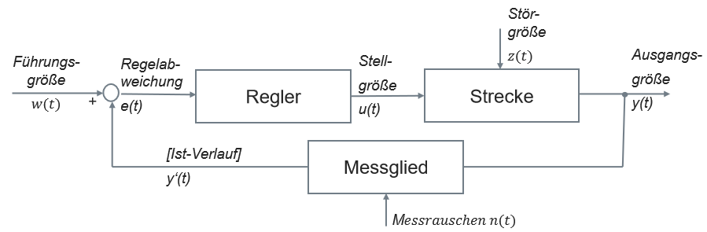

# Einleitung und Grundlagen

## Technisches System

Black Box Betrachtung

- nur das äußere Verhalten wird betrachtet
- Input & Output abhangig von Raum & Zeit
  - Materie, Energie, Informationen
- Produktionsprozess zwischen Input & Output:
  - Stoffumwandlung, Energieumwandlung, Informationsumwandlung

## Ziel der Regelungstechnik

## Steuerung

> Vorteil: Besseres Führungsverhalten - explizite Einstellung  
> Nachteil: Istwert wird nicht mit dem Sollwert verglichen

Beispiel:  
Lüftung mit Stufen (keine Automatik)

Führungsgröße w(t): Einstellung Lüfterstärke (1 bis 5)  
Stellegröße u(t): Strom für Gebläse  
Störgröße z(t): Übergangwiderstand  
Ausgangsgröße y(t): Luftstrom  

## Regelung

> Vorteil: Istwert wird mit dem Sollwert verglichen  
> Nachteil: technisch aufwendiger, keine direkte Kontrolle  

Beispiel:  
Klimaautomatik

Führungsgröße w(t): Einstellung Temperatur (20°C)  
Regelabweichung e(t): Abweichung zwischen Sollwert und Istwert (4°C)  
Stellgröße u(t): Strom für Gebläse
Störgröße z(t): offenes Fenster
Ausgangsgröße y(t): Lufttemperatur (Istwert 17°C)  
Messrauschen n(t): Position des Sensors  
Ist-Verlauf y'(t): Lufttemperatur (gemessen 16°C)

## Zwei Freiheitsgrade Regelung

> Entweder ist die Steuerung oder die Regelung aktiv  
> Vorteil: Kombination aus Steuerung und Regelung  
> Nachteil: technisch aufwendiger  

Beispiel:
Tempomat  
Führungsgröße w(t): Einstellung Geschwindigkeit (120 km/h)  
Stellgröße u(t): mittlere Beschleunigung  
Störgröße z(t): Steigung
Ausgangsgröße y(t): Geschwindigkeit (Istwert 100 km/h)

Bei Regelung:  
Regelabweichung e(t): Abweichung zwischen Sollwert und Istwert (20 km/h)

Bei Steuerung:  
Regelung wird deaktiviert und Wert vom Gaspedal übernommen
Stellgröße u(t): folgt Führungsgröße (Gaspedal)

## Zusammenfassung

