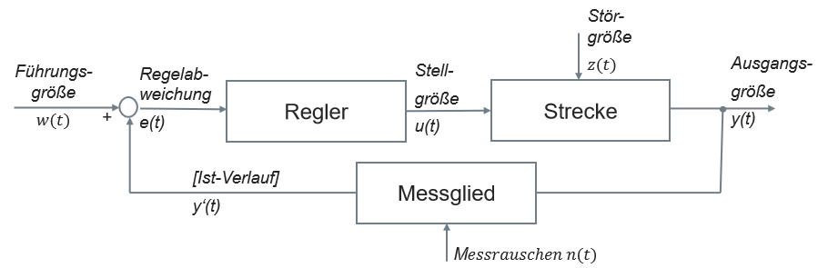
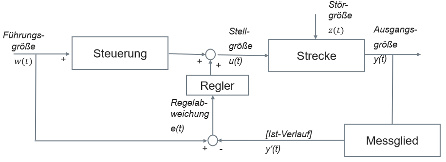
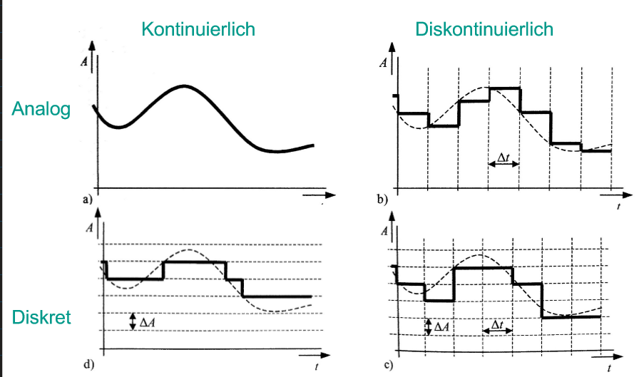
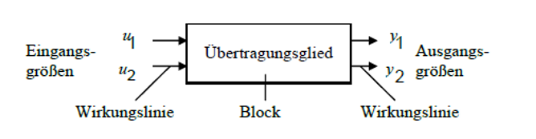
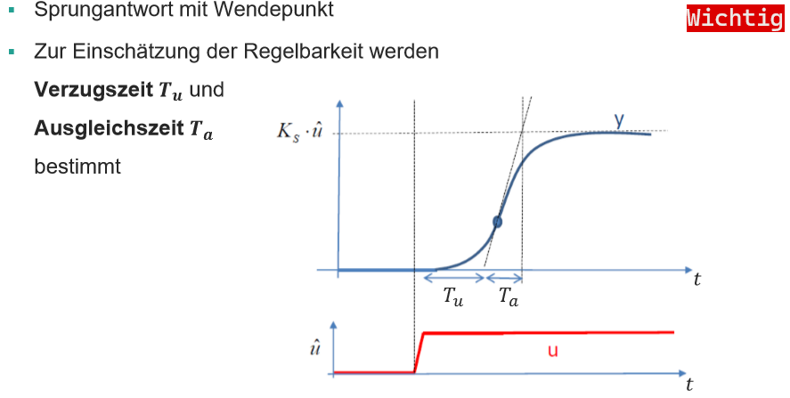
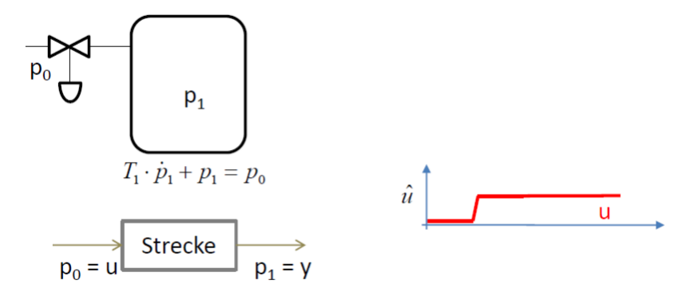
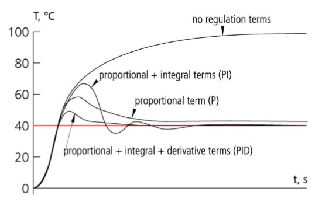

# Klausurvorbereitung

## [Einleitung und Grundlagen](einleitung_grundlagen.md)
Blockschaltbilder sollte man Zeichnen können (geschlossener Regelkreis, 2-Freiheitsgraderegelung)  
### Was ist eine Führungsgröße?  
Die eingegebener Zielwert z.B. Fluhöhe Quadrocopter 30m  

### Was ist eine Stellgröße?
Der Wert für die Aktoren z.B. Strom zum erreichen einer Drehzahl (5000 U/min beim Rotor)

### Was ist eine Regelabweichung?
Die Abweichung zwischen den Soll(Führungsgröße 50m) und gemssener Istwert (30m)  

### Was ist ein betrachtete System?  
Black Box Betrachtung
- nur das äußere Verhalten wird betrachtet
- Input & Output abhangig von Raum & Zeit
	- Materie, Energie, Informationen 
- Produktionsprozess zwischen Input & Output:
	- Stoffumwandlung, Energieumwandlung, Informationsumwandlung

### Was ist eine Regelung?  

Beispiel:  
Klimaautomatik

Führungsgröße w(t): Einstellung Temperatur (20°C)  
Regelabweichung e(t): Abweichung zwischen Sollwert und Istwert (4°C)  
Stellegröße u(t): Strom für Gebläse    
Störgröße z(t): offnes Fenster    
Ausgangsgröße y(t): Lufttemperatur (Istwert 17°C)  
Messrauschen n(t): Position des Sensors  
Ist-Verlauf y'(t): Lufttemperatur (gemessen 16°C)

### Was ist der Vorteil und Nachteil einer Regelung?  
> Vorteil: Istwert wird mit dem Sollwert verglichen  
> Nachteil: technisch aufwendiger, keine direkte Kontrolle  

### Was ist eine Zwei-Freiheitsgrade-Regelung?  

> Entweder ist die Steuerung oder die Regelung aktiv  
> Vorteil: Kombination aus Steuerung und Regelung  
> Nachteil: technisch aufwendiger  

Beispiel:
Tempomat  
Führungsgröße w(t): Einstellung Geschwindikgeit (120 km/h)  
Stellegröße u(t): mittlere Beschleunigung  
Störgröße z(t): Steigung     
Ausgangsgröße y(t): Geschwindigkeit (Istwert 100 km/h)

Bei Regelung:  
Regelabweichung e(t): Abweichung zwischen Sollwert und Istwert (20 km/h)

### Was ist der Unterschied zwischen einer Zwei-Freiheitsgrade-Regelung und Regelung?  
Die Regelabweichung wird deutlich schneller abgebaut.

## [Elementare Übertragungsglieder & Grundlagen Messtechnik](uebertragungsglieder.md)
### Nennen Sie 3 elementare Übertragungsglieder.  
P-Glied (proportional), I-Glied (integral), D-Glied (differential)  

### Was ist ein vollständiges Messergebnis?  
Messergebnis $\pm$ Messabweichung  

### Wonach unterscheidet man Messgeräte Kategorien?
Präzisionsmessgeräte, Feinmessgeräte, Betriebsmessgeräte

### Unterschied Präzession und Validität?
Präzision: Reproduzierbarkeit der Messergebnisse  
Validität: Güte der Messergebnisse  

### Erklären Sie warum der Unterschied zwischen präzise / nicht valide und präzise / valide interessant ist.
- Bei Wiederholung der Messung kann Unterschied nicht erkannt werden  

### Wie ermittelt man eine Messabweichung?
Abschätzung der Abweichung aus:
- Datenblatt des Herstellers
- Daten von der Kalibrierung
- Daten aus früheren Messungen

### Woraus setzt sich die Messabweichung zusammen bei indirekter Messung?
abhängig vom Einfluss auf einzelne Messparameter des Gesamtergebnisses

### Was ist der Unterschied zwischen Messgröße und Messwert?
Messgröße: physikalische Größe der Messung (Masse, Länge, Temperatur, Zeit)
Messwert: mit Abweichung behaftetes Abbild der Messgröße

### Welche Probleme gibt es bei der Abtastung beim Oszilloskop?
Balance zwischen zu ausreichenden Daten (keine Unterabtastung) und nicht zu vielen Daten (Datenvolumen)

## [Untersuchung der Systemdynamik](systemdynamik.md)

### Verlauf analoges Signal geben => Umwandlung in Wert / Zeitdiskretes Signal    

### Wie funktioniert ein Thermoelement?
nutzt thermoelektrischen Effekt

### Wie wird der thermoelektrische Effekt genutzt um eine Temperatur zu messen?   
- zwei Metalle am Ende verschweißt
- unterschiedliche elektrische Potentiale
- kann als Spannung gemessen werden

Vorteile:
- passiver Sensor (ohne Hilfsenergie)
- weiter Temperaturmessbereich
- robust

Nachteile:  
- kleine Messspannung  
- unerwünschte Thermospannungen im Messkreis  
- konstante Vergleichsstellen erforderlich 

### PTC **selbstregulierender** Effekt  (Kaltleiter)
Bei steigender Temperatur steigt der Widerstand.
Bei steigendem Widerstand wird der Stromfluss begrenzt was die Temperatur nicht weiter steigen lässt.

### Unterschied PTC/NTC (Kaltleiter / Heißleiter)

PTC (Positive Temperature Coefficient):
- Widerstand <u>steigt</u> bei steigender Temperatur exponentiell
- positiver Temperaturkoeffizient

NTC (Negative Temperature Coefficient):
- Widerstand <u>sinkt</u> bei steigender Temperatur exponentiell
- negativer Temperaturkoeffizient

### Unterschied Widerstandsthermometer zu Thermoelement?
Thermoelement:
- zwei verschiedene Metalle  
- Spannung wird gemessen  
- für größeren Temperaturbereich einsetzbar als Widerstandsthermometer  

Widerstandsthermometer:
- ein Metall
- Widerstand wird gemessen
- Hohe Reproduzierbarkeit
- Metall bestimmt messbaren Temperaturbereich
- annähernd lineare Kennlinie

### Wie funktioniert ein potentiometrischer Sensor? 
1. Schleifer auf Widerstand mit konstanter Spannung
1. Ausgangsspannung linear vom Weg abhängig

Vorteil:
- linear
Nachteil: 
- Verschleiß durch Reibung

### Wie funktioniert ein induktiv Sensor?
Magnetischer Fluss einer stromdurchflossenen Spule abhängig von Induktivität.
Änderung des Abstands ändert Induktivität

Vorteil:
- berührungslos (kein Verschleiß) 
Nachteil:
- nicht linear

### Unterschiede inkrementelle Messung und absolutes Messverfahren?
inkrementelle Messung:
- 2 Lineale für die Richtung 
- 0 Punkt (Referenzmarke)
 

absolutes Messverfahren (Code-Lineal):
- keine Referenzmarke
- direkte Postionsinformation

### Welche Möglichkeiten hat man bei einem Plattenkondensator die Kapazitätsänderung zu kontrollieren?  
- Abstand
- Dielektrikum (Volumen für das elektrische Feld)
- Wirksame Fläche

## [Regelkreise und Übertragungsglieder](regelkreise.md)
Wirkungsplan

### Wofür ist ein Aktor zuständig?
Umsetzung des elektrischen Regelsignals in eine physikalische Stellgröße
Der Aktor ist das einzige Element welches tatsächlich in das Regelsystem eingreift. 

### Sensoren und Aktoren sind beides Wandler. Was unterscheidet sie?
Der Sensor erfasst eine nichtelektrische physikalische Größe.
Der Aktor erzeugt eine nichtelektrische physikalische Größe.

### Erklären Sie die Wirkungsweise eines piezoelektrischen Bauteils
Mechanische deformation erzeugt eine proportionale elektrische Spannung.
Anlegen einer elektrischen Spannung erzeugt eine mechanische Deformation.

### Mikroelektronik Vor- und Nachteile  
Vorteile:
- hohe Dynamik
- genaue Positionierung
- geringe Geräuschbelastung für Menschen
- keine elektromagnetisches Feld im Außenbereich

Nachteile:
- größere Geräuschbelastung für manche Tiere
- Kräfte gering (mit anderen Systemen lösbar)

### Beispiele für Einsatz von Piezoelementen
- Piezoinjektion
- Klopfsensor
- Piezofeuerzeug
- Druckkopf vom Tintenstrahldrucker
- 3d Drucker
- **D**igitel **L**ight **P**rocessing Beamer

### Nennen Sie Beispiele für fluid mechanische Aktoren  
Pneumatikzylinder, Hydraulikzylinder, Pneumatischer Muskel

### Vor- und Nachteile von fluid mechanischen Aktoren
Vorteile:
- hohe Kräfte möglich
- Orts- und Neigungsunabhängig
Nachteile:
- Verschleiß durch Bewegung

## [Regelstrecken](regelstrecken.md)
### Ausgleich einer Regelstrecke einzeichnen

### Was ist die Verzugszeit bei einem $PT_1 \space System$
- keine Verzugszeit
- Wendepunkt liegt im Ursprung

## [Regler](regler.md)
### Ist es möglich mit nur einem P-Glied (auch kein I-Glied in Strecke) eine stationäre Genauigkeit zu erreichen?
Nein, da der Sollwert durch die Messabweichung nie erreicht werden.

### Unterschied zwischen P PI und PID Regler
- P = Proportional  
- I = Integral  
- D = Differential  
### Graphen von Reglern beschriften
  

