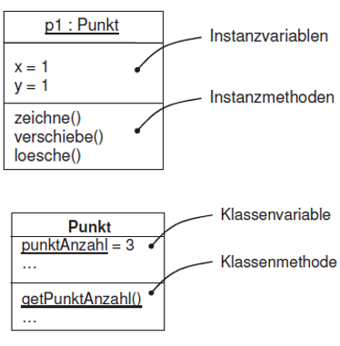
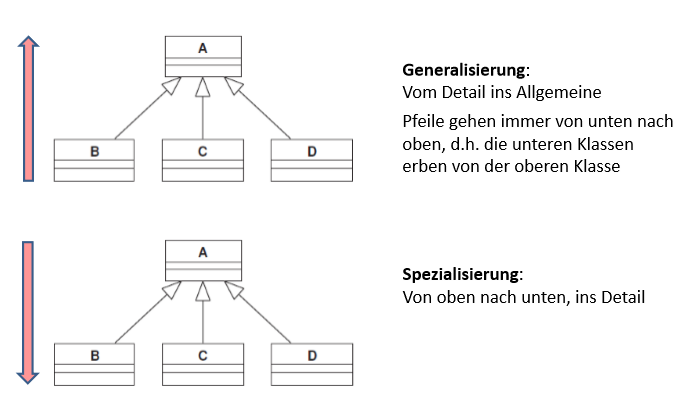

# Klausurvorbereitung

# Skipt 1
## Was ist das Hauptziel der Entwicklung von Java?
- Entwicklung vollständiger Betriebssystementwicklung
- inkl. virtuelle CPU
- unterschiedliche Einsatzzwecke
## Wesentliche Ziele der Java-Technology?
- Plattforunabhängigkeit
1. Quellcode in Bytecode kompiliert
1. auf Zielsystem von der JRE
	- in Maschienensprache übersetzt
	- ausgeführt

> Bytecode ist Zwischencode zwischen Programmiersprache und Maschinensprache

> für jedes ausführende Gerät muss eine passende JRE installiert sein

## Was ist der Unterschied zwischen JDK und JRE?
JDK enthält JRE 
- JDK enthält Entwicklertools wie Compiler, Debugger, Profiler, etc.
JRE enthält nur die Laufzeitumgebung

# Skript 4
## Was ist ein Algorithmus?
- eindeutige Handlungsvorschrift zur Lösung eines Problems
- besteht aus endlich vielen Einzelschritten

## Was ist = ?
ein Zuweisungsoperator

# Skript 5
## Was ist ein einfacher Datentyp?
- nicht weiter zerlegbar (atomar)
- vordefinierter Standardtyp
- primitives in Java
- haben keine Methoden
- nicht als Klasse realisiert

## Was ist eine Klasse?
Verbund von Daten und Methoden

# Skript 6

## Worum geht es bei OOP?
- Objekte / Dinge / Konzepte der realen Welt zu beschreiben
- miteinander ein Programmsystem bilden
- durch Zusammenwirken ein Problem lösen
## Was sind Objekte?
- Instanzen von Klasse
- Beschreiben die wesentlichen Aspekte 
## Was sind Klassen?
- Klassen stellen allgemeine Baupläne für Objekte dar
- werden von realen Objekten abstrahiert
- haben einen Namen, Datenfelder, Methoden
- sind wie Datentypen zu verwenden
- werden zu Laufzeit für die Erzeugung von Objekten verwendet 

## Start für ein Java-Programm?
```java
public class Main {
	public static void main(String[] args) {
			//System.out.println("Hello World!");
		}
	}
```

## Wann verwendet man den new-Operator?
Um ein neues Objekt zu erzeugen
- wickelt die Speicherreservierung im Heap ab

# Skript 7
Was ist Abstraktion?
- auf das wesentliche konzentrieren
- komplexe Zusammenhänge, Dinge vereinfachen

## Was bedeutet Kapselung?
- Objekt besteht aus Daten und Methoden als eine Einheit
- Objekt verwaltet seine Daten selbst
- soll ein Objekt seine Daten ändern muss es Methoden aufweisen
- Methoden können von anderen Objekten aufgerufen werden
- Methoden die von anderen Objekten aufgerufen werden können sind Schnittstellenmethoden

## Was ist Information Hiding?
- nach außen sichtbare Methoden sind ``public``	
- nach innen sichtbare Methoden sind ``private``
	- versteckt inneres Verhalten

## Was gilt in OOP grundsätzlich?
- Programme basieren auf Klassen aus dene Objekte zu Laufzeit erzeugt werden
- Objekte leben im Heap (Teil von RAM)
- Objekte haben Daten und Methoden
- Methoden haben automatisch Zugriff auf alle Datenfelder des Objekts
- Methoden dienen dazu Datenfelder eines Objekts zu verwalten & verändern
- Datenfelder sind i.d.R. ``private```

## Was sind Datenfelder?
- legen Zustand des Objekts fest
- Zustand wird durch Methoden verändert

## Was sind Methoden?
- bewirken Zustandsänderungen
- geben Werte aus

## Was sind Objekt und Klassendiagramme?
  
Oben = Objektdiagramm  
Unten = Klassendiagramm  

## Vererbungshierarchie


# Skript 10
