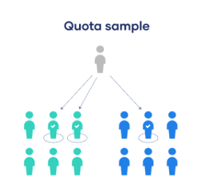

# Statistik

## Statistik als Wissenschaft

### Mittelwerte
Mittelwerte bewahren uns davor den Überblick zu verlieren

### Statistik als Wissenschaft
Statistik ist die Wissenschaft vom Argumentieren mit empirischen Zahlen.

Ziele der Statistik:
- Auffinden von Strukturen in Datenstätzen
- Erleichterung der Kommunikatuion (visualisierung)
- treffen von fundierten Entscheidungen
- Vorhersagen
- Verbindung zwischen Theorie umd Empirie
- aufzeigen notwendiger Daten

### Big Data

Anhaltspunkte die zu beachten sind:
- volume (Datenvolumen)
- velocity (Geschwindigkeit)
- variety (Quellen, Datentypen)
- veracity (Wahrheit)
- value (Mehrwert der Daten)

> Daten müssen ver der Analyse strukturiert werden.

### Statistik und der Computer
- manche Techniken mit Stift und Papier
- Statistik ist eine High-End-Wissenschaft und benötigt Software um effektiv zu sein
- Computer macht berechnungen
- Menschen übernehmen die Argumentation
- Elementare Analyse mit Spreadsheet (Excel, usw.)

### Deskriptive und induktive Statistik

Ziele der deskriptiven Statistik sind Daten zu:
- beschreiben 
- zusammenfassen
- darstellen

Reduzierung der Datenmenge auf das wichtigste

> Daten sollten reduziert werden

Ziele der induktiven Statistik sind:
- schließen von Daten auf allgemeine Prinzipien (Beobachtungen)
- schließen auf unbeobachtes (statische Inferenz)

Aufstellen von allgemeingültigen Regeln und Prinzipen

### Schlussfolgerungen

Es gibt 2 Arten von Schlussfolgerungen:
- deduktiv:
	- top-down-Logik
	- basierend auf einem Prinzip

> Beispiel: bekannte Krankheit heilen

- induktiv:
	- bottom-up-Logik
	- basierend auf beobachteten Daten

> Beispiel: Impfstoff für unbekannte Krankheit erforschen

## Population und Variablen

Daten sind das Ergebnis von Beobachtungen wie:
- Zählvorgänge
- Messvorgänge
- komplexe Vorgänge

### Population, Variablen und Werte
Population ist die gesamtheit von Objekten (Elemente, Einheiten).

> Zielpopulation ist die Polulation für die man sich interessiert

Variable ist ein interessantes Merkmal (oder Attribut) eines Objektes

> Bei jedem Objekt nimmt die Variable einen Wert an

Beispiel:
Population = Kaufverträge
Objekt = Kaufvertrag
Variable = Betrag des Vertrages

Beispiel:

    Liste<Kaufvertrag> Kaufverträge{
        Kaufvertrag (Betrag des Vertrages)
        Kaufvertrag (Betrag des Vertrages)
    }

### Skalierung von Variablen 

Es gibt qualitative und quantitative Variablen.

#### kategorial (nominalskaliert) / qualitativ 
Von dem Wert lässt sich nur bestimmen ob er gleich ist oder nicht (z.b. boolesche Werte)

> Beispiel: true/false

#### Rangvariable (ordinalskaliert) / qualitativ
Werte können angeordnet werden.

> Beispiel: 1, 2, 3, 4, 5

> bei qualitativen Variablen ist ein Vergleich nur mit == und != möglich

#### metrisch (quantitativ)
Ergebis von einem Mess- oder Zählvorgang.

> Beispiel: Anzahl an Objekten in einer Population

- intervallskalierte Variablen wie z.B. Temeratur in Grad Celsius 
- verhältnisskalierte Variablen wie z.B. Temeratur in Kelvin, Prozent, Punkteanzahl in einer Klausur

> Bei quantitaive Variablen ist ein Vergleich mit >, <, >=, <=, == und != möglich
> Die meisten Variablen sind verhältnisskaliert 

Metrische Variablen nennt man...
- diskret, falls sie nur isolierte Werte annehmen können (Ganze Zahlen)
- stetig, falls sie beliebige Werte in einem Intervall annehmen können (Rationale Zahlen)

Die unterscheidung diskret/stetig ist wichtig für die Diagrammwahl.

diskret | stetig |
---------|---------
 Balkendiagramm | Stamm Blatt Diagramm 
 Säulendiagramm | Boxplot 
 Kreisdiagramm | Histogramm

### Probleme bei der Definition von Variablen und Population
- Was ist eine geeignete Population?
- Wie kann eine Population definiert werden?
- Wie kann ein Objekt definiert werden?
- Unterscheidung Zielpopulation und Stichprobenpopulation

- Welche Variablen müssen definiert werden?
- Wie wird der Wert einer Variablen gemessen?

Grundanforderungen

Validität: 
     
	Eine Messung ist valide, wenn sie tatsächlich das misst, was sie messen soll und somit glaubwürdige Ergebnisse liefert.

Reliabilität: 

    Die Reliabilität bezieht sich darauf, ob deine Forschung bei wiederholter Durchführung zuverlässige Ergebnisse liefert.

Objektivität: 

    Eine Forschung ist objektiv, wenn keine ungewollten Einflüsse durch involvierte Personen entstehen.

### Validität & Reliabilität
- nicht leicht zu erfüllen
- interesse ist meistens bei Variablen mit <u>**nicht**</u> direkt messbarem Wert (latente Variablen)
- Forschung operationalisiert via manifeste Variablen (messbare Variablen) 

Beispiel für latente Variablen:
- Erwartungen eines Kunden
- Bonität eines Kunden
- Einstellung einer Person im Bezug auf die Umwelt

## Datensammlung

Grundstrategien:
- Beobachtung (Zählvorgänge, ...)
- Befragung (Fragebogen, Umfrage, ...)
- Experiment (AB-Test, Placebo-Test,...)

## Stichproben aus der Population
### Totalerhebung vs. Stichprobe
Totalerhebung(Zensus): Sammlung der Daten aus der gesamten Population
Teilerhebung(Stichprobe): Sammlung der Daten aus einer Teilpopulation

> Eine sorgfältige geplante Stichprobe kann besser sein als eine Totalerhebung.

### Was ist eine gute Stichprobe?

#### Zufallsstichprobe

Jede Stichprobe $n \in N$ ist eine reine Zufallsstichprobe, wenn jedes $n$ die gleich Chance hat, gezogen zu werden.

Vorteile:
- garantiert Repräsentativität
- erlaubt die Benutzung von induktiver Statistik

#### andere Stichprobe

- Zufallsstichprobe mit Schichtungsvariablen / stratified sampling

- Klumpen Stichprobe /  cluster sampling

- Stichprobe "aufs Geratewohl(auf gut Glück)" / convenience smapling
es wird einfach der genommen der am einfachsten zu erreichen war

- Quotenten Stichprobe / quota sampling
es wird versucht eine Qute der Zielpopulation zu erreichen

### Probleme bei der Stichprobe
- Telefonumfrage
- Antwortverweigerung
- preinliche Fragen
- Length Sampling Bias

> Was ist "Length Sampling Bias"?

> Beispiel im Supermarkt: Wenn man alle 10 Min einen Kandidaten an der Kasse befragt,
> ist die Chance einen mit vielen Produkten zu erwischen höher da er mehr Zeit an der Kasse verbringt.

### Repräsentativität
- Ziel: repräsentative Daten für Zielpopulation sammeln 
- Stichprobenfehler kontrollierbar
- nicht repräsentativ: Zusammenhang Auswahl-Chance & interessierte Variable

## Analyse von Daten

### Mögliche Fehler
- fehlerhafte Eingabe
- fehlende Werte
- Datum- & Zeitformat
- Inkonsistenzen

## Empirische Verteilung
$n$ beobachtungen einer Variable $X$:

$x_1, x_2, ..., x_n$

$k$ unterschiedliche Werte:

$a_1, a_2, ..., a_k$

**Absolute Häufigkeit**: Anzahl Beobachtungen von $a_j$ = $h(a_j)$
**Relative Häufigkeit**: $h(a_j) / n$ = $f(a_j)$
emprische Verteilung / Häufigkeitsverteilung = Liste Werte $a_j$ mit jeweiliger zugehöriger Häufigkeit 

