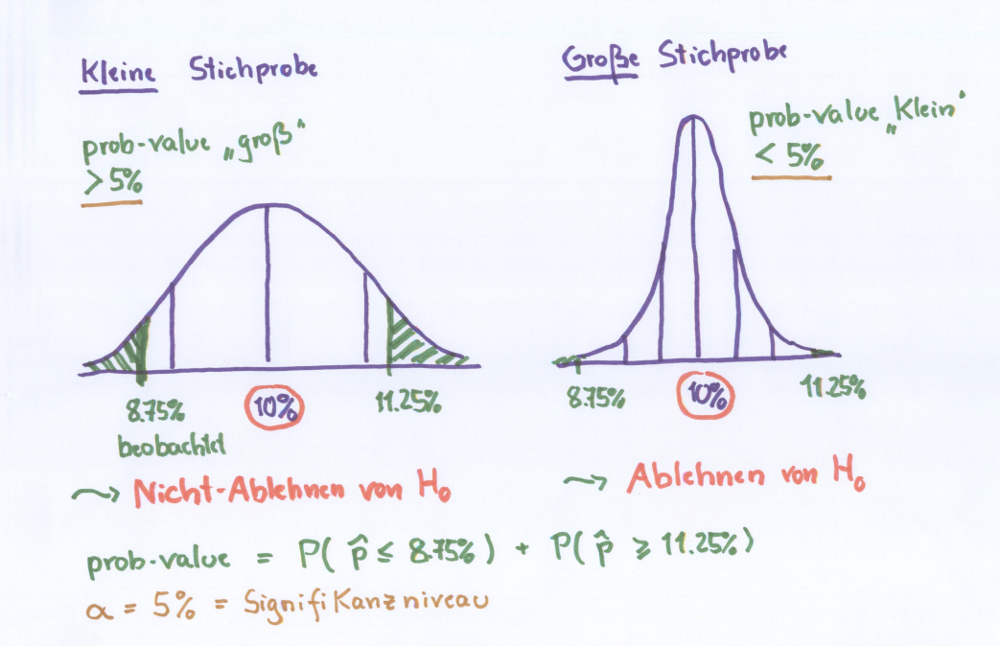
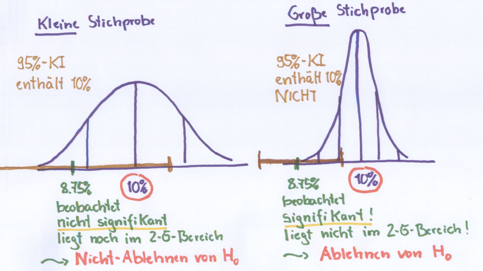

# Statistische Inferenz
>Benutzt empirische Daten (Beobachtungen) um über *unbekannte Verteilungen* (oder unbekannte Parameter) zu lernen

> *unbekannte Verteilungen* charakterisiert gesamte Population

<!-- TODO überprüfen -->
[Beboachtungen und stochaistische Modelle](wahrscheinlichkeiten.md#beboachtungen-und-stochaistische-modelle)

## Schätzung 
Methoden der statistischen Inferenz
- Punktschätzung von Parametern
- Intervallschätzung von Parametern
- Testen von Hypothesen über Parameter

### Punktschätzung 
unbekannte Parameter einer Verteilung wird mit einer einzigen Zahl ("Punkt") geschätzt

Vorteile:
- leicht verständlich
- leicht zu vermitteln

Nachteile:
- immer falsch
- zeigt nicht an wie genau die Schätzung ist

Besser Konfidenzintervall and Stelle Punktschätzer

### Intervallschätzung
unbekannte Parameter einer Verteilung wird mit einem Konfidenzintervall (Intervall von Zahlen) geschätzt

> Konfidenz = Vertrauen

Definition Konfidenzintervall:
- Verteilung $X$ hat einen unbekannten Parameter $\theta$
- Geplant ist eine Zufallsstichprobe von $n$ Einträgen von $X_1, ..., X_n$
- Intervall $[C1, C2] = [C1($X_1, ..., X_n$)]$   

$1-\alpha$ = Konfidenzniveau (Meist $1-\alpha = 0.95$)  
$\alpha$ = Irrtumswarscheinlichkeit (2,5% pro Seite)  
$\theta$ = unbekannter Parameter (ein Wert aus den möglichen Werten) 
&#8203;

> Vor Stichprobe => Zufallsintervall  
> Nach Stichprobe => Intervall wurde beobachtet => Konfidenzintervall

> warscheinlichkeit, dass Zufallsintervall den wahren Wert $\theta$ enthält, soll groß

### Konfodenzintervall $p$

Standardisierung:
$P \left( -1,96 \leq \frac{\hat{p}-p}{\sqrt{(\frac{p(1-p)}{n})}} \leq 1,96 \right) = 0.95$  
&#8203;
Wenn $p$ unbekannt ist, verwenden wir $\hat{p}$  
$P \left(\hat{p} -1,96 \space \sqrt{\frac{\hat{p}(1-\hat{p})}{n}} \leq p \leq \hat{p} + 1,96 \space \sqrt{\frac{\hat{p}(1-\hat{p})}{n}} \right) = 0.95$ 
&#8203;
Intervall:

$\left[\hat{p} -1,96 \space \sqrt{\frac{\hat{p}(1-\hat{p})}{n}}, \space \hat{p} + 1,96 \space \sqrt{\frac{\hat{p}(1-\hat{p})}{n}} \right]$ 
&#8203;
> Formelsammlung S. 8

Anmerkungen:
- Jeder Wert im Konfidenzintervall => plausible Schätzung für unbekannten Parameter
- Präziseres 95% Konfidenzintervall => $n$ erhöhen (4 faches für doppelte Genauigkeit) 
- Höheres Konfidenzniveau (Bsp. 95% => 99,7%) =>  1.96 duruch 3 ersetzten (wg 3 $\sigma$) => Konfidenzintervall wird länger / ungenauer

### Schätzung von $\mu$ in einer Normalverteilung

$\left[\hat{\mu}-1,96\frac{\sigma}{\sqrt{n}}, \space \hat{\mu}+1,96\frac{\sigma}{\sqrt{n}} \right]$
&#8203;

> Standardabweichung von $\hat{\mu} = \bar{X}$ => $\frac{\sigma}{\sqrt{n}}$ 
> Standardabweichung eines Punktschätzers => Standardfehler

### Approximative Konfidenzintervalle
Approximative 95% Konfidenzgrenzen für unbekannte Parameter $\theta$  

$\theta \pm 2* Standardfehler \space von \space \hat{\theta}$  

$\hat{\theta}$ = Punktschätzer für $\theta$
&#8203;

## Testen von Hypothesen 
Definition:  
$H$ = Hypothese
$p$ = typischer Wert  
$\hat{p}$ = Beobachtung (in einer Stichprobe)

Nullhypothese:
- Kein Zusammenhang oder Effekt zwischen Beobachtung und typischer Wert
- mögliche entstande Unterschiede nur Zufall 

Alternativhypothese (Forschungshypothese):
- Zusammenhang zwischen Beobachtung und typischer Wert
- mögliche entstande Unterschiede kein Zufall 
- repräsentiert die Vermutung

Beispiel:  
Einschaltquote, typischer Tag = 10%   
Beobachtung heute (Stichprobe) = 350 von 4000 = 8,75%  

Nullhypothese $H_0$   
"$p$ ist gleich 10%"

Forschungshypothese $H_1$  
"$p$ ist nicht gleich 10%"

Entscheidung über $H_0$:
- Ablehnung von $H_0$ (Unterschied zu groß => **signifikant**)
	- empirische Bestätigung von $H_1$ 
	- Vertrauen in $H_1$ 

- Nicht ablehnen von $H_0$ (Unterschied zu klein => **nicht signifikant**) 
	- **nicht** Bestätigung von $H_0$
	- **nicht ablehnen** von $H_1$

> Bewertungs des Unterschieds => stochastisches Modell

### 3 Möglichkeiten:
#### prob Value
> Wahrscheinlichkeit das gemessene Ergebnis der Stichprobe zustande gekommen sein könnte, falls die Nullhypothese stimmt  

Warscheinlichkeit dies zu beobachten muss min. so weit von den erwarteten 10% sein wie die 8,75% (Stichprobenumfang **relevant**)

=> 8,75% (10% - 1,25%) < 10% < 11,25% (10% + 1,25%)  

#### Kritischer Bereich

TODO S50.

#### Konfidenzintervall

1. $\sigma$ von Verteilung nehmen
1. zu $2 \sigma$ Bereich erweitern (links und rechts) (braun in der Grafik)  
1. Bereich zu $\hat{p}$ verschieben (8,75%)
1. Beurteilung ob 10% noch im $2 \sigma$ Bereich (braun) liegt

- wenn im Bereich: **nicht ablehen**
- wenn außerhalb Bereich: **ablehen**
