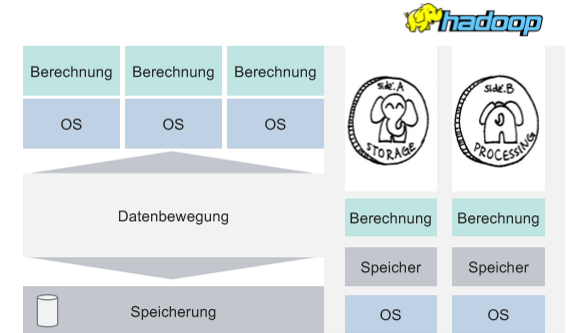
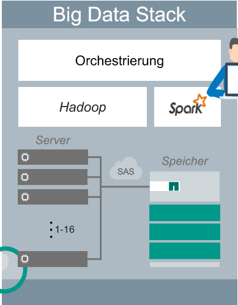

# Hadoop
- Open-Source-Softwareplattform bestehend aus verschieden Komponenten (Services)
- verteilte Speicherung mit digital attached Storage erweiterbar
- verteilte Verarbeitung sehr großer Datenmengen

Stellt eine Reihe von Anweisungen bereit, mit denen Daten auf vielen Servern organisiert und verarbeitet werden

## Herausforderungen

#### Bandbreite
Entscheidung ob es effizienter ist die Daten lokal zu verarbeiten oder über das Netzwerk zu verteilen

#### Zuverlässigkeit der Skalierung
Redundanz ist Kernkomponente beim verteilten speichern von Daten mit Hadoop

#### IOPS
IOPS = Input/Output Operations per Second
IOPS sollen pro GB verglichen werden (2TB = 2000 GB)

## Schema
Nutzt vorteile von Schema on Write (strukturierte Daten) und Schema on Read (unstrukturierte Daten)
### Schema on Read (unstrukturierte Daten)
- Daten werden in beliebiger Form gespeichert (präskriptives Modellieren)
- Parser beinhaltet das Schema beim Lesen der Daten

### Schema on Write (strukturierte Daten)
- Daten werden in einem zuvor definierten Schema gespeichert (deklaratives Modellieren)

#### Hadoop Infrastruktur

## Ökosystem
- HDFS (Hadoop Distributed File System)
- YARN (Managed Ressourcen - "Welche Ressourcen sind verfügbar?"; Herzschlag des Clusters)
- Apache Ambari (Management-Interface)
- Zookeeper (Welcher Server ist Main? Down? Up?)
- MapReduce (Datenverarbeitung)
- Spark (in-memory Datenverarbeitung)

### Externe Datenbanken
- MySQL
- Cassandra
- MongoDB

### Query Engines
- Hue 
- Drill (schreibt SQL Queries)
- Apache Phoenix

### Welche Elemente gehören zur Security MapReduce-Platform?
- Knox
- Sentry

## Hadoop Distributed File System (HDFS)
- skalierbares Dateisystem
- Speicherung von Daten auf mehreren Servern

## MapReduce
- Framework für verteilte Berechnungen
- JobTracker verteilt Aufgaben auf (mehrere) TaskTracker
- Anzahl TaskTracker abhängig von Cluster-Struktur

> Gibt nicht die roh Daten weiter sondern aggregiert wie viele Datensätze vorhanden sind (z.B. Array Länge)
{.is-info}

#### Ablauf Job:
1. Client startet Job
1. YARN entscheidet auf welcher Maschine der Job ausgeführt wird
1. Auf der Maschine wird Applikation Master gestartet (ist verantwortlich für alle MapReduce Aufgaben im Cluster und im Netzwerk)
1. Application Master fordert Ressourcen vom Node Manager an
1. Node Manager startet MapReduce Taskmanager auf Processing Nodes nahe dem Ablageort der Daten (Daten sind schwerfällig)

#### Funktionsweise MapReduce
- Map: Daten werden in Key-Value Paare umgewandelt
- Key-Value Paare aggregieren zu Key-Tupel-Paaren
- Nutzt Array Kardinalität um zu zählen wie oft ein Key vorkommt
- Reducer aggregiert Ergebnisse von verschiedenen Map Task

### Was ist der Applikation Master?