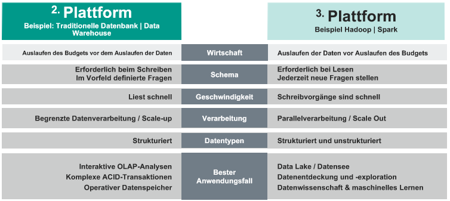
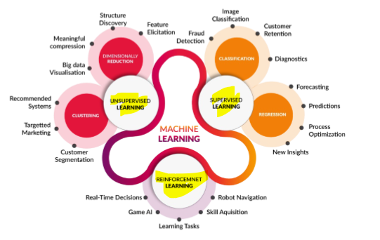

# Klausurvorbereitung

> Warum fragen können aufgrund fehlender Daten nie beantwortet werden
> Es können nur was fragen beantwortet werden
{.is-info}

## Mehr, Unscharf, Korrelation

- mehr: detailliertere Datensammlung
- unscharf: Genauigkeit wird aufgegeben um mehr Datenpunkte auszuwerten
- Korrelation: Anstatt nach Korrelation (Zusammenhang) zu suchen wir nach Kausalität gesucht (Warum passiert etwas?)

## Fundamentals

> LOB (Line of Business) = Geschäftsbereich
.{is-info}

### Definition von Big Data?

Wirtschaftliche Gewinnung von Erkenntnissen aus qualitativen und unterschiedlich strukturierten Informationen, in ungekannten Umfang.

5 V's von Big Data?

- Datenmenge (Volume)
  - Anzahl von Datensätzen
- Datenvielfalt (Variety)
  - Fremd- & eigene Daten
- Geschwindigkeit (Velocity)
  - Generierung und Übertragung der erzeugten Daten
- Unsicherheit (Veracity)
  - Zusammenhänge, Bedeutungen, Muster
- Wert (Value)
  - Mehrwert aus größeren Datenmengen gewinnen

### Was ist das fünfte V?

- Wert der Daten

### Wachstum von Big Data?

mit Hilfe von:

- Mobilgeräten & Internet um Daten zu sammeln
- Geschäftsmodellen welche Daten sammeln (z.B. Google, Facebook)
- Sensoren (Veränderungen in der Umgebung)

### Unterschiede zwischen 2nd und 3rd Platform?

2nd Platform (Scale-Up):

- klassische Datenbanken
- Datawarehouse / in Memory
- Skalierbare Sicherung

3rd Platform (Scale-out):

- Analytik und Visualisierung
- NoSQL Datenbanken
- Hadoop

### Herausforderungen von Big Data?

50% der Unternehmen scheitern bei der Umsetzung von Big Data Projekten

- wird als Technologie betrachtet nicht als Unternehmenstransformation
- Ökosystem ist fragmentiert und entwickelt sich schnell weiter
- Technologien erfordern neue Rollen und Fähigkeiten

### Datenanalyse?

1. Vorbereiten (Abrufen, Bereinigen, Umwandeln)
1. Untersuchen (Exploration, Visualisierung)
1. Modell (Mining, Entdeckung)

### Bereiche und Rollen von Big Data?

- Business Facing => Business Analyst
- Applications => Application Developer, Data Scientist
- Infrastructure => Architecture, It Admin, Program Manager

### Prozess der Integration von Big-Data-Analysefunktionen im Unternehmen

⠀| Wave 1 | Wave 2 | Wave 3
-|-|-|-
Use case | Refine | Explore | Enrich
Response time | Batch: Hours | Interactive: Minutes | Real-Time: Seconds
Data Sources | Volume | Variety | Velocity

### Reifegrade der Unternehmen?

### Definition von Anwendungsfällen?

### Big Data Architekturen?
<!-- TODO ! Abklären S. 138/139-->
### Nachteile der Strukturen?

### Wann verwendet man Object Storage?

bei unstrukturierten Daten

### Wert von Object Storage?

- verteilter Zugriff auf Inhalte
- Unstrukturierte Datenworkloads
- Kapazität > 100 TBs

z.B. Patientenakte (Audio, Bilder, Text)

### Abgrenzung zwischen SQL und NoSQL?

MySql:

- Datenkonsistenz
- Verfügbarkeit

MongoDb:

- Verfügbarkeit
- Partitionierung

### Idee für Big Data Anwendungsfall?

- Dynamische Preisgestaltung
- Kundenbindung
- Kundenverhalten

### Wichtigsten Domänen für Data Science?

## Hadoop

[siehe Hadoop](./hadoop.md#hadoop)

### Nenne Hadoop Komponenten?

[Komponenten](/fom/semester-3/big-data/hadoop.md#ökosystem)

### Welche Elemente gehören zur Security MapReduce-Platform?

- Knox
- Sentry

## Was ist das Hadoop Distributed File System (HDFS)?

- skalierbares Dateisystem
- Speicherung von Daten auf mehreren Servern
- Redundanz durch Replikation

## Read / Write Prozess bei HDFS

Read:

1. Die Client-API errechnet den Block-Index
basierend auf dem Offset des Datei-Zeigers
und stellt eine Anfrage an den NameNode
1. Der NameNode antwortet, welche
DatenKnoten eine Kopie dieses Blocks haben
1. Der Client kontaktiert die DatenKnoten direkt,
ohne den Umweg über den NameNode
1. Die DataNodes lesen die Blöcke
1. Die DataNodes antworten dem
Client über den Erfolg der Ausführung

Write:

1. Der Client kontaktiert den NameNode, der
eines der Replikate als das primäre bestimmt.
1. Die Antwort des NameNode enthält
wer das primäre und wer die
sekundären Replikate sind.
1. Der Client schiebt seine Änderungen an alle
DataNodes in beliebiger Reihenfolge; diese Änderung
wird in den Puffer jedes DataNode gespeichert.
1. Der Client sendet eine "Commit"-Anforderung an den
primären, der einen Auftrag zur Aktualisierung
bestimmt und dann diesen Auftrag an alle
anderen Secondaries weitergibt.
1. Nachdem alle Secondaries den Commit
abgeschlossen haben, antwortet der Primary dem
Client über den Erfolg.
1. Alle Änderungen der Blockverteilung und
Metadatenänderungen werden in eine
Protokolldatei auf dem NameNode gesichert.

## Was ist MapReduce?

- Framework für verteilte Berechnungen
- JobTracker verteilt Aufgaben auf (mehrere) TaskTracker
- Anzahl TaskTracker abhängig von Cluster-Struktur

### Schema on Read (unstrukturierte Daten)

- Daten werden in beliebiger Form gespeichert (präskriptives Modellieren)
- Parser beinhaltet das Schema beim Lesen der Daten
- NoSQL

### Schema on Write (strukturierte Daten)

- Daten werden in einem zuvor definierten Schema gespeichert (deklaratives Modellieren)
- SQL

### RDD (Resilient Distributed Dataset)

Resilient: unverwüstlich
Distributed: verteilt
Dataset: Datensatz

- kann Dateifehler handeln über Parität & Redundanz
- sieht für den Nutzer als 1 Datenset aus
- Datenset = Key-Value Paare
- Parameter kann eine Lambda Funktion sein

### Was ist der Unterschied zwischen RDD und HDFS?

RDD:

- wird aus langsamer Datenquelle wie HDFS erzeugt
- existiert im Arbeitsspeicher
- kann mit Code transformiert werden
- verhindert Schreib- und Lesezugriffe auf langsame Datenquelle

HDFS:

- verteilt Daten auf mehrere Nodes
- ist ein Dateisystem
- managed Redundanz

## Maschine Learning

### Unterschied zwischen Maschine Learning und Deep Learning?

- Deep Learning ist ein Teilbereich von Maschine Learning

### Welche Besonderheit hat Deep Learning?

- hidden Layer

### Hot Spot Analyse

### Unterschied zwischen Random Forrest und Decision Tree?

Random Forrest:

- Art Schwarmintelligenz
- erzeugt hochwertige Modelle
- schnell zu trainieren
- langsam in der Vorhersage (im Vergleich zu anderen ML Algorithmen)
- schwer zu interpretieren

Decision Tree:

- einfach zu verstehen und zu implementieren
- nicht leistungsstark für komplexe Daten

### Unterschied zwischen Modellparameter und Hyperparameter?

Modellparameter:

- werden während des Trainings ermittelt
- beeinflussen die Vorhersage
- Gewichte
- Bias

Hyperparameter:

- werden vor dem Training festgelegt
- beeinflussen die Leistung des Modells (z.B. Anzahl der Schichten, Anzahl der Neuronen, Anzahl der Epochen)

### Beschreibung ML-Pipeline

1. Daten sammeln
1. Daten homogenisieren
1. Richtigen ML Algorithmus wählen und Modell trainieren
1. Ergebnisse bewerten
1. Daten visualisieren

### Was ist der Unterschied zwischen Supervised und Unsupervised Learning?

Supervised Learning:

- gelabelte Daten
- Ziel: Vorhersage
- z.B. Klassifikation, Regression

Unsupervised Learning:

- unlabeled Daten
- Ziel: Struktur erkennen
- z.B. Clustering, Assoziationsanalyse

### Instanzbasierte Algorithmen

[Instanzbasierte Algorithmen](/fom/semester-3/big-data/maschine_learning.md#instanzbasierte-algorithmen)

## Text Mining

### Wann verwendet man Precision und Recall?

- [Precision](/fom/semester-3/big-data/text_mining.md#gütemaße): Misst den Anteil der tatsächlich relevanten Dokumente (True Positives) in den gefundenen Dokumenten
  - zu hohe Precision kann Indiz für overfitting sein
- [Recall](/fom/semester-3/big-data/text_mining.md#gütemaße): Bruchteil aller relevanten Dokumente, die gefunden wurden

### Was ist Overfitting?

- Modell passt sich zu stark den Trainingsdaten an
- Modell ist nicht generalisierbar

### Was sind Probleme beim One-Hot-Encoder?

- Wörterbuch wird sehr groß

### Welche Operatoren können zur Suche verwendet werden?

- AND
- OR
- NOT
- IN
- NEAR

### Was ist der Unterschied zwischen CBOW und Skip-Gram?

CBOW:

- versucht Wort vorherzusagen anhand umliegenden Wörtern

Skip-Gram:

- versucht umliegende Wörter vorherzusagen anhand eines Wortes

> WordToVec kombiniert CBOW und Skip-Gram
{.is-info}
