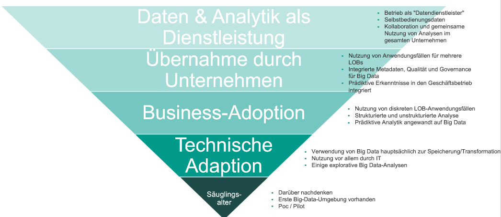
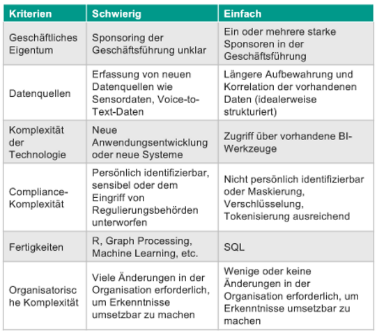
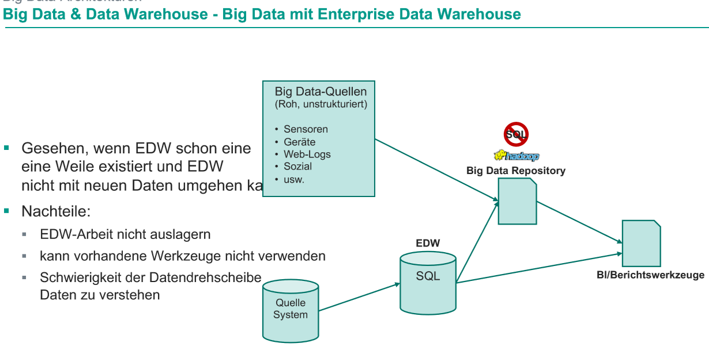
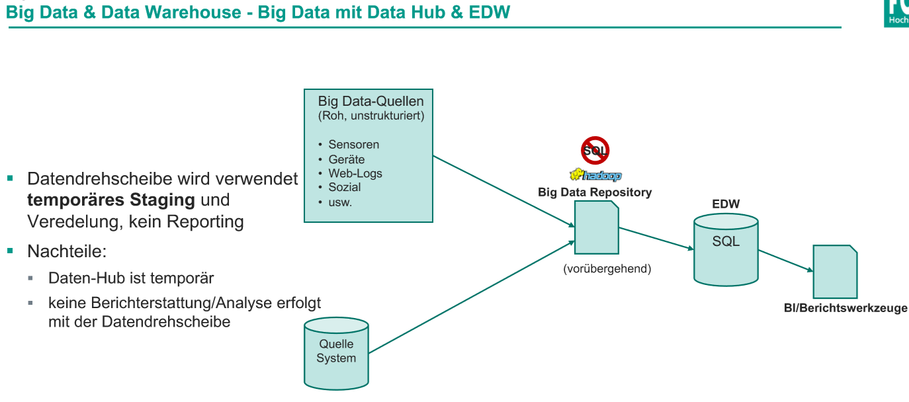
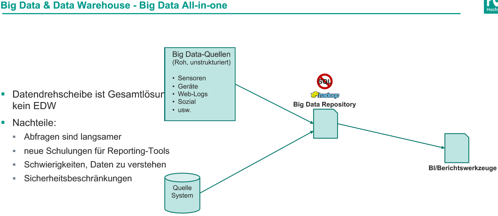
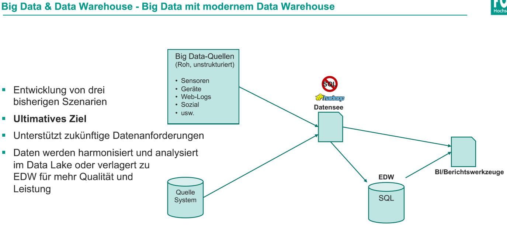

# Klausurvorbereitung

## Mehr, Unscharf, Korrelation
- mehr: detailliertere Datensammlung
- unscharf: Genauigkeit wird aufgegeben um mehr Datenpunkte auszuwerten
- Korrelation: Anstatt nach Korrelation (Zusammenhang) zu suchen wir nach Kausalität gesucht (Warum passiert etwas?)

## Fundamentals

> LOB (Line of Business) = Geschäftsbereich
.{is-info}
### Definition von Big Data?
Wirtschaftliche Gewinnung von Erkenntnissen aus qualitativen und unterschiedlich strukturierten Informationen, in ungekannten Umfang.

5 V's von Big Data?
- Datenmenge (Volume)
	- Anzahl von Datensätzen
- Datenvielfalt (Variety)
	- Fremd- & eigene Daten
- Geschwindigkeit (Velocity)
	- Generierung und Übertragung der erzeugten Daten
- Unsicherheit (Veracity)
	- Zusammenhänge, Bedeutungen, Muster
- Wert (Value)
	- Mehrwert aus größeren Datenmengen gewinnen

### Wachstum von Big Data?
mithilfe von:
- Mobilgeräten & Internet um Daten zu sammeln
- Geschäftsmodellen welche Daten sammeln (z.B. Google, Facebook)
- Sensoren (Veränderungen in der Umgebung)

### Unterschiede zwischen 2nd und 3rd Platform?
2nd Platform (Scale-Up):
- klassische Datenbanken
- Datawarehouse / in Memory
- Skalierbare Sicherung

3rd Platform (Scale-out):
- Analytik und Visualisierung
- NoSQL Datenbanken
- Hadoop

### Herausforderungen von Big Data?
50% der Unternehmen scheitern bei der Umsetzung von Big Data Projekten

- wird als Technologie betrachtet nicht als Unternehmenstransformation
- Ökosystem ist fragmentiert und entwickelt sich schnell weiter
- Technologien erfordern neue Rollen und Fähigkeiten

### Datenanalyse?
1. Vorbereiten (Abrufen, Bereinigen, Umwandeln)
1. Untersuchen (Exploration, Visualisierung)
1. Modell (Mining, Entdeckung)

### Bereiche und Rollen von Big Data?
- Business Facing => Business Analyst
- Applications => Application Developer, Data Scientist
- Infrastructure => Architecture, It Admin, Program Manager

### Reifegrade der Unternehmen?

### Definition von Anwendungsfällen?

### Big Data Architekturen?
<!-- TODO ! Abklären S. 138/139-->
### Nachteile der Strukturen?

### Wann verwendet man Object Storage?
bei unstrukturierten Daten
### Wert von Object Storage?
- verteilter Zugriff auf Inhalte
- Unstrukturierte Datenworkloads
- Kapazität > 100 TBs

z.B. Patientenakte (Audio, Bilder, Text)

### Abgrenzung zwischen SQL und NoSQL?
MySql:
- Datenkonsistenz
- Verfügbarkeit

MongoDb:
- Verfügbarkeit
- Partitionierung
### Idee für Big Data Anwendungsfall?
- Dynamische Preisgestaltung
- Kundenbindung
- Kundenverhalten
### Wichtigsten Domänen für Data Science?
