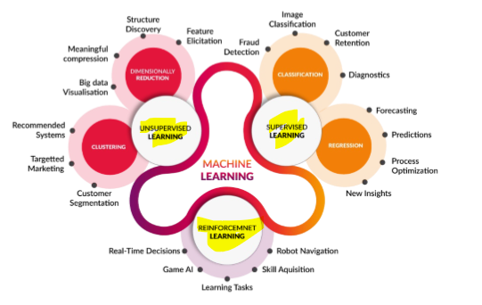
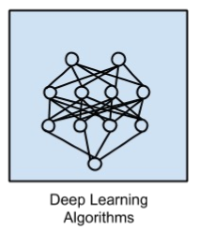

# Maschine Learning

Ki => "Menschliche Intelligenz, ausgestellt von Maschinen"

- schwache KI: "Löst konkrete Anwendungsfälle"  
- starke KI: "Löst generelle Probleme"  
  - AGI(Artificial General Intelligence): "Löst alle Probleme" => Menschen Unterschätzen Intelligenz von Maschinen

ML => "Ein Ansatz, um künstliche Intelligenz durch Systeme zu erreichen, die aus Erfahrung lernen können, um Muster in einer Datenmenge zu finden"

DL => "Eine Technik zur Implementierung von Machine Learning"

- Baut Neuronale Netze auf (Modell verändert sich durch Iterationen)
- Deep: Input Daten werden mit Serie aus nicht-linearen Funktionen verändert

  

Unsuperivsed Learning:

- Daten ohne Label  

Supervised Learning:

- Daten mit Label  

Reinforcement Learning:

- mit Belohnung und Strafe  

## Beginn

Pipeline:

1. Daten sammeln
1. Daten homogenisieren
1. Richtigen ML Algorithmus wählen und Modell trainieren
1. Ergebnisse bewerten
1. Daten visualisieren

## Algorithmen

### Instanzbasierte Algorithmen

Lernmodell mit Entscheidungsproblem mit Instanzen  von Trainingsdaten welche als wichtig angesehen werden.

- baut Datenbank auf und vergleicht neue Daten mit Datenbank
- Ähnlichkeitsmessung für neu hinzugefügte Daten
- Speicherbasiserbes Lernen
  - Text Mining
  - Spracherkennung
  - Klassifikation

Beispiele:

- k-Nearest Neighbors (kNN)
- Locally Weighted Learning (LWL)

### Decision Tree

Baut ein Baumstruktur-Entscheidungsmodell auf welches auf tatsächlichen Werten von Attributen basiert.

- Entscheidungsbaum
- wird Daten für Klassifikation und Regression trainiert
- oft schnell und genau

Beispiele:

- Classification and Regression Tree (CART)
- Iterative Dichotomiser 3 (ID3)

### Deep Learning Algorithmen

Modernes Update von Künstlichen Neuronalen Netzen.

- Aufbau großer und komplexer Neuronaler Netze
- häufig semi-supervised Lernprobleme
- große Datenmengen mit wenig gelabelten Daten

Beispiele:

- Convolutional Neural Network (CNN)
- Deep Belief Network (DBN)

## Data Preprocessing

Daten müssen in ein Maschinen verständliches Format gebracht werden.
Daten sind oft unvollständig, fehlerhaft oder ungenau.

Techniken:

- Fehlwert-Imputation
  - Hot-Deck => ersetzt fehlende Werte mit Hilfe andere Zeilen z.B. durch Mittelwert
  - Cold-Deck => ersetzt fehlende Werte auf Basis der eigenen Zeile z.B. durch Interpolation (Schritte)
- Kodierung kategorialer Variablen
- Merkmal Skalierung
  - Wenn die Daten zusammen passen sollten normalisiert werden (zb. 0-1, Rangvariablen)
  - Wenn die Daten auseinander liegen sollten standardisiert werden (zb. Kontinuierliche Werte)

> Die Vorverarbeitung ist ein wesentlicher Bestandteil des Machine Learning Prozesses.
{.is-info}

### Datensätze

#### Trainingsdatensatz

Datenstichprobe für die Anpassung des Modells

#### Testdatensatz

Datenstrichprobe zur Bewertung von Modellanpassung

#### Validierungsdatensatz

Datenstrichprobe zur Bewertung von Modellanpassung während der Abstimmung der Hyperparameter

Darf nicht mit Modellkonfiguration in Verbindung stehen, da sonst Flexibilität des Modells nicht mehr gewährleistet werden kann. => **Overfitting**

> Der Validierungsdatensatz ist optional.
{.is-info}

#### Overfitting

Modell wurde zu stark an Trainingsdaten angepasst und kann nicht generalisiert und auf neue Daten angewendet werden. (Erkennt nur noch Trainingsdaten)

Erkennen:  
Starker Unterschied zwischen Trainings- und Testdatensatz Evaluationsergebnisse existiert.  
Trainingsdatensatz besser => Overfitting

## Asimov's Gesetze

1. Ein Roboter darf keinen Menschen verletzen
1. Ein Roboter muss den Menschen gehorchen
1. Ein Roboter muss eigene Existenz schützen

## Datenmodellierung

### Unterschied zwischen Random Forrest und Decision Tree?

Random Forrest:

- Art Schwarmintelligenz
- erzeugt hochwertige Modelle
- schnell zu trainieren
- langsam in der Vorhersage (im Vergleich zu anderen ML Algorithmen)
- schwer zu interpretieren

Decision Tree:

- einfach zu verstehen und zu implementieren
- nicht leistungsstark für komplexe Daten

## Evaluation

Hohe Verzerrung + Hohe Varianz ist schlecht korrigierbar

### k-Fold Cross Validation

1. Datensatz wird in k gleich große Teile geteilt
1. k-1 Teile werden für Training verwendet
1. 1 wechselnder Teil wird für Test verwendet
1. Schritt 2-3 werden k mal wiederholt

### Hyperparameter

- wird vor Beginn des Trainings festgelegt
- Abstimmung für Modell
- beeinflusst die Leistung des Modells

### Modellparameter

- wird während des Trainings festgelegt
- Schlüssel für Algorithmen (z.B. Gewichte und Bias)
- Parameter werden Geschätzt oder Gelernt

## Neuronale Netze

Daten von einem Input-Layer werden über Hidden-Layer zu einem Output-Layer weitergeleitet.
Nodes im Hidden-Layer haben nicht nur Zustand an/aus sondern einen Wert zwischen 0 und 1.