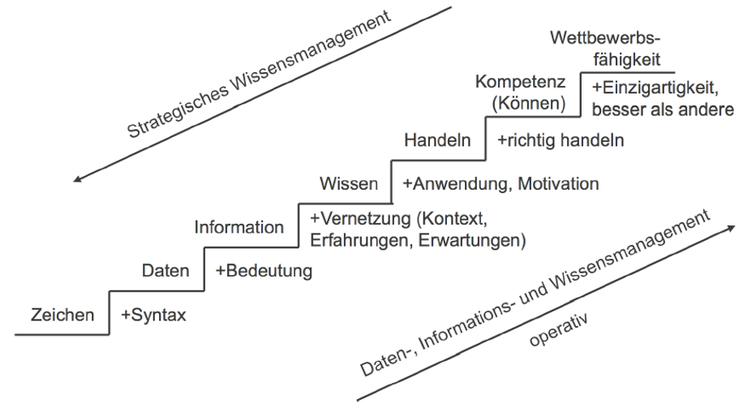
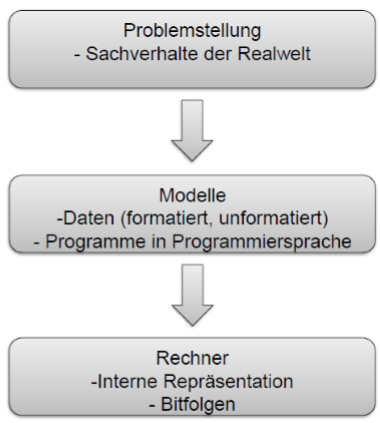

# IT-Infrastruktur

## Informatik

Begriffsverschmelzung aus Information und Automatik.

> Informatik ist die Wissenschaft der systematischen Verarbeitung von Informationen, insbesondere der automatischen Verarbeitung mit Hilfe von Digitalrechnern
{.is-info}

## Wirtschaftsinformatik

Begriffsverschmelzung aus Wirtschaft und Informatik.

> Wissenschaft die sich mit der Entwicklung und Anwendung von Informations- und Kommunikationssystemen in Wirtschaftsunternehmen befasst
{.is-info}

## Was ist IT-Infrastruktur?

Alles was zum Betrieb der IT notwendig ist.

- Gebäude
- Hardware (Rechner, Netzwerke)
- Software (ERP, Datenbanken)
- Daten (Konfiguration, Nutzdaten)

> Ein Ausfall hat häufig Auswirkungen auf den gesamten Betrieb
{.is-warning}

Wortbedeutung

- Infra = unter
- Struktur = Aufbau

IT-Infrastruktur ist immer abhängig von der Perspektive.

## Industrie 4.0

Industrie 4.0 ist die Bezeichnung für die umfassende Digitalisierung der industriellen Produktion.
Schlüsseltechnologie ist das Internet.

Beispiele für neue Technologien:

- Cloud Computing
- Big Data
- künstliche Intelligenz / Machine Learning
- Autonome Roboter
- IOT
- AR/VR

### Smart Factory

Smart Factory ist eine selbstorganisierende Produktionsumgebung.
Eingriff von Mensch ist nicht erforderlich.

Wichtigste Komponenten:

Basis: Cyber Physical System (CPS) + Big Data
Kommunikation: Internet of Things (IOT) + embedded Systems
Ziel: Mass Customization (kundenindividuelle Massenproduktion)

### Internet of Things

Objekte aller Art sind mit dem Internet verbunden. M2M-Kommunikation (Maschine zu Maschine)

### Künstliche Intelligenz / Maschine Learning

Erforschung eines "intelligenten" Problemlösungsverhaltens.

Maschine Learning ist ein Teilgebiet der Künstlichen Intelligenz.
Erkennen von Mustern in vorliegenden Datenbeständen.
Eigenständiges erarbeiten von Lösungen durch:

- Relevante Daten extrahieren
- Vorhersagen treffen
- Wahrscheinlichkeiten für Eintritt von Ereignissen bestimmen
- Anpassung an neue Situationen
- Prozesse auf Basis erkannter Muster optimieren

## VUCA-Welt

Es ist eine Denk- und Herangehensweise für die Lösung der Probleme unserer digitalen und dynamischen Welt.

### Volatility / Volatilität

- Häufig und umfassend veränderndes Marktumfeld  
- teils völlig neuen Anforderungen an Produkt und Dienstleistung  

### Uncertainty / Unsicherheit

- Marktveränderungen können nicht vorhergesagt werden
- Erfahrungswerte aus der Vergangenheit sind nicht mehr aussagekräftig
- schnelle Entscheidungen mit begrenzten Erfahrungen

### Complexity / Komplexität

- komplexe Zusammenhänge die nicht weiter zerteilt werden können
- führt zu stagnation der Entwicklung

### Ambiguity / Mehrdeutigkeit

- Informationen können unterschiedlich gedeutet werden
- es schwierig richtige Entscheidungen basierend auf den mehrdeutigen Informationen zu treffen

## Wichtige Begriffe

### Daten

Information ein einer maschinell verarbeitbaren Form.
Basisdaten:

- Zeichen
- Wahrheitswerte
- Zahlen
- ...

Datenstrukturen => Daten + Operationen

> Daten werden durch Messengen / Beobachtungen / ... gewonnen  
{.is-info}

### Information

"In" - "Formation"

- Aussage über Gegenstände, Sachverhalte, ...  
Eigenschaften
- kann erzeugt werden / verloren gehen
- kann übertragen / gespeichert / verwandelt werden

Unterscheidung:

- kontinuierliche Daten (z.B. Temperatur)
- diskrete Daten (z.B. Personenanzahl)
Umwandlung von kontinuierlich Werte in diskrete Werte = wegwerfen von Information => Digitalisierung

Umsetzung:

- erfolgt über die Interpretation

Bedeutung:

- Bedeutung abhängig vom Betrachter
- Kontext is wichtig

Darstellung:

- keine eindeutige Darstellung möglich

Weitergabe:

- Sprache
- Gestik, Mimik
- Schrift
- Bild / Film
- ...

> Informationen sind eine Teilmenge an Wissen welche mittel Signalen von Sender zu Empfänger übertragen wird
{.is-info}

### Wissen

- ist mit Ziel und Zweck verbunden
- Bildet Grundlage für Entscheidungen
- explizites Wissen: steht bewusst zur Verfügung
- implizites Wissen: ist nicht unmittelbar verfügbar

### Informationsverarbeitung

EDV (elektronische Datenverarbeitung) => Sammelbegriff für elektronische Datenverarbeitung  
DV (Datenverarbeitung) => organisierter Umgang mit Daten mit Ziel Informationen über Datenmenge zu gewinnen / Daten transformieren

### Algorithmen

- Allgemeinheit => löst vielzahl von Problemen
- Eindeutigkeit => eindeutige Beschreibung
- Ausführbarkeit => jeder Schritt muss ausführbar sein
- Endlichkeit => endliche Anzahl von Schritten
- Terminierbarkeit => endliche Laufzeit
- Deterministisch => gleiche Eingabe = gleiche Ausgabe
- Determinismus => zu jeden Zeitpunkt besteht höchstens eine Möglichkeit der Fortsetzung

> Fachbegriff für eine geregelte Prozedur zur Lösung definierter Probleme
{.is-info}

### Programm

Abfolge von Befehlen

## Hardware

Siehe [Hardware](/fom/semester-1/hardware-grundlagen/klausurvorbereitung.md#von-neumann-architektur)
