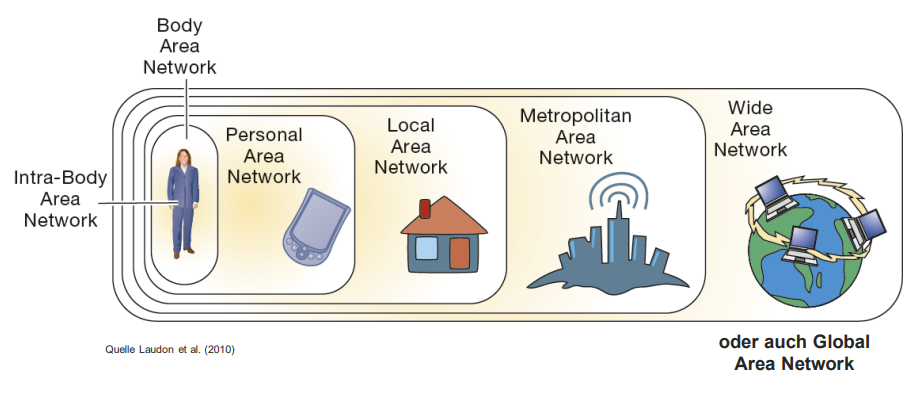
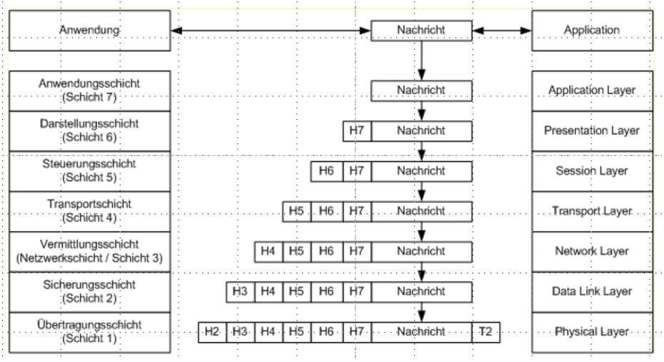
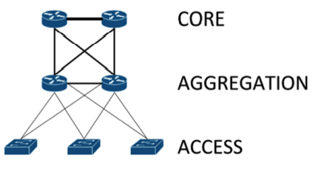

# Rechenzentrumsbetrieb

## Rechenzentrum

Zu einem Rechenzentrum gehören:

- Gebäude mit IT-Infrastruktur
- Organisation (Firma)
- zentrales Rechenwerk (Rechner & für den Betrieb notwendige Komponenten)

> Standarisierung ist im BSI-IT Grundschutzkatalog (IT-Grundschutz) definiert.
{.is-info}

### Aufgaben eines Rechenzentrums

- Netzbetrieb & Netzdienste
- Serverbetrieb
  - Applikationen
  - Anwendungen
  - Datenbanken
- Beratung & Unterstützung der Anwender
- Systemtechnik
  - Wartung & Instandhaltung der Geräte
  - Installation & Konfiguration
  - Verkabelung
- Systemverwaltung
  - Administration Soft- & Hardware
  - Datensicherheit & Datenschutz
  - Monitoring
- Operation
  - 1st Level Support
  - Wechsel von Druckerpatronen

### Herausforderungen

- Platzproblematik => Packungsdichte
- Kühlproblematik => Wärmeabfuhr
- Sicherheitsproblematik => Zugangskontrolle
- Stromproblematik => Stromversorgung
- Ausfallsicherheit => Redundanz & Frühwarnsysteme
- Managementproblematik => Überblick über die IT-Infrastruktur

### Komponenten eines Rechenzentrums

- Serverraum
- Telekommunikation
- Batterien
- Notstromaggregate
- Löschanlage
- Kühlaggregate
- Wärmerückgewinnung
- Kühlwasservorrat
- Gebäudesicherung
- Kontrollzentrale

#### Serverraum

- Unterbringung der Server

Aufgaben:

- Recheneinheiten
- Applikationsserver
- Datenbankserver

Eigenschaften:

- besonders Abgeschirmt (z.B. Brandschutz)
- thermische Organisation (z.B. kalte, heiße Gänge, Doppelböden)
- standardisierte Komponenten (z.B. Racks)

> besitzen keinen ständigen besetzten Arbeitsplatz
{.is-info}

##### Airflow (Kalte und heiße Gänge)

Abluft wird zentral Abgeführt und gekühlt

> Eine Sauerstoffreduktion bremst die Ausbreitung von Feuer
{.is-info}

##### Racks

- Haltevorrichtung für Serverkomponenten:
  - USV
  - Raid-Array
  - Patchpanel
  - Server
  - Monitor
  - Power Strip
- Höhe wird in Höheneinheiten (HE) angegeben
- Breite wird in Teilungseinheiten (TE) angegeben
- Redundante Stromanbindung (verschiedene Stromkreise)
- Isoliertes Management Netzwerk

##### Server

- Software (Dienst)
- Hardwarekomponente (dediziert)

Fokus:

- Dauerbetrieb - mission critical
- Hochverfügbarkeit - Redundanz
- Hochperformanz - Gerätschaften

###### Serverklassen

x86/x64 Commodity Server

- kostengünstig
- hohe Kompatibilität
- einfacher Austausch
- Probleme bei Skalierung

Proprietäre Server

- IBM Power, Oracle Exalogic
- lange Entwicklung
- viele Features
- hohe Verfügbarkeit
- hohe Skalierbarkeit
- hohe Taktfrequenz
- wenige Betriebssysteme

###### Organisation

Shared Hosts => mehrere Aufgaben auf einem Server
Dedicated Hosts => ein Aufgabe auf einem Server

- dedicated to Service => Server erfüllt nur eine Aufgabe
- dedicated to Customer => Server ist nur für einen Kunden

Dediziert => hohe Sicherheit, Performance, spezielle Software
Appliances => Server und Applikationen werden gemeinsam betrieben

###### Zuordnungsebenen

Anwendungsebene => Kunde erhält nur ein Web-Server (AS)
Betriebssystemzuordnung => Kunde erhält Betriebssystem (VM)
Hardwarezuordnung => Kunde erhält dedizierten Server (HW)

###### Speicher-Medien

siehe [Speichersysteme](/fom/semester-1/hardware-grundlagen/Klausurvorbereitung2#speichersysteme)

siehe [RAID](/fom/semester-1/hardware-grundlagen/Klausurvorbereitung2#RAID)

#### Telekommunikation

##### Vermittlung

Leitungsvermittlung:

- physischer Übertragungsweg zwischen Datenstationen
- Unabhängig von Daten
- langsamer Verbindungsaufbau
- schlechte Auslastung der Kapazität

Paketvermittlung:

- Zerlegung der Daten in einzelne Pakete
- jedes Paket bekommt Adress- und Steuerungsinformationen
- Empfänger setzt Daten zusammen
- keine durchgängige direkte Verbindung zwischen Teilnehmern
- Kapazität kann besser genutzt werden

##### WAN

WAN steht für WIDE AREA NETWORK

Teilnehmeranschlussleitung:

- verbindet Teilnehmer / kleine Gewerbe mit Teilnehmervermittlungsstelle
- analoge Twisted-Pair-Kabel / digitale Glasfaserkabel

Verbindungsleitung:

- verbindet Teilnehmer-/ Fernvermittlungsstellen
- typisch Glasfaserkabel

Vermittlungsstellen:

- Teilnehmervermittlungsstelle => nimmt Anrufe entgegen, leiten Anrufe an Teilnehmer
- Fernvermittlungsstelle => vermitteln Anrufe bis zur Teilnehmervermittlungsstelle

> Telefonnetz basiert auf Leitungsvermittlung
{.is-info}

##### Netzwerke

Entfernung | Ausdehnung | Name | Beispiel
-|-|-|-|
1m | Armlänge | PAN | Bluetooth, AdHoc WLAN
10m | Raum | LAN | Raum
100m | Gebäude | LAN | alle Räume im Gebäude
1km | Campus | LAN | zusammenhängende Gebäude
10km | Stadt | MAN | eine Stadt
1000km | Land | WAN | ein Land
10000km | Kontinent | WAN | ein Kontinent
100000km | Planet | WAN | ganzes Internet

##### Schichtenmodell

Auflösung der Gesamtsituation in hierarchisch strukturierte Ebenen, die als Schichten angeordnet werden

- unmittelbare Kommunikation findet nur mit direkt darüber / darunter liegenden Schicht statt
- gleiche Schichten kommunizieren über Protokolle

OSI

Nr | Ebene
-|-
7 | Anwendungsebene (Application Layer)
6 | Darstellungsebene (Presentation Layer)
5 | Sitzungsebene (Session Layer)
4 | Transportebene (Transportation Layer)
3 | Netzwerkebene (Network Layer)
2 | Leitungsebene (Data Link Layer)
1 | Physikalische Ebne (Physical Layer)

Vorteile:

- Unabhängig von Hard-/ Software
- Änderungen/ Anpassungen von Diensten sind einfach möglich

Prinzip:

- Daten (Payload) werden via Schnittstellen über Ebenen transportiert
- Protokollschichten fügen Daten weitere Transportinformationen (Header, Trailer) hinzu, welche für den Transport relevant sind
- Auf der Empfängerseite werden pro Schicht nur die relevanten Transportinformationen (Header, Trailer) ausgewertet und entfernt

TCP/IP:

- logische Basis des Internets
- vier Schichten Familie
  - Anwendungsschicht (z.B. HTTP, POP, IMAP)
  - Transportschicht (z.B. TCP, UDP)
  - Internetschicht (z.B. IP, ICMP)
  - Verbindungsschicht (z.B. ARP, Kupferkabel)
- zusammenfassung herstellerneutragen Anwendungs- und Transportprotokollen

##### Netzwerk Hardware

###### Repeater

- verstärkt Signale
- erweitert Reichweite

###### Bridge

- bückt zwei Netzwerksegmente physisch miteinander auf Layer 2

###### Hub

- leitet alle eingehenden Signale an alle Anschlüsse weiter (Stern-Verteiler)
- kann zu Netzwerkkollisionen kommen

###### Switch

- leitet eingehenden Signale gezielt an Teilnehmer weiter
- vermeidet Netzwerkkollisionen
- speichert MAC Adressen der Teilnehmer

###### Router

- Netzwerkgerät was Datenpakete zwischen verschieden Netzwerken verschickt z.B. zwischen LAN und WAN

###### WLAN-Router / Multifunktionsgeräte

- erweitert Router-Funktionalität
  - Firewall
  - DHCP
  - DNS
  - VFu

###### Netzwerktopologien

- Bus
  - alle Teilnehmer sind über einen gemeinsamen Bus verbunden
&nbsp; 
&nbsp;   
- Stern
  - Endgeräte sind über einen zentralen Knoten verbunden
  - Endgeräte sind nicht **direkt** miteinander verbunden
- Ring
&nbsp; 
&nbsp; 
  - jedes Endgerät ist mit zwei Nachbarn verbunden
  - wanderndes Packet steuert Sendeerlaubnis
&nbsp; 
&nbsp; 
- Baum
  - jedes Gerät ist mit einem Verteiler verbunden
  - Verteiler sind untereinander verbunden
&nbsp; 
&nbsp; 
- Mesh
  - Endgeräte sind mit mehreren Nachbarn verbunden
  - sicherste Topologie
&nbsp; 
&nbsp; 
- Zellen-Netzwerk (drahtlos)
  - mehrere Access Points decken überlappend Bereiche ab
&nbsp; 
&nbsp; 
- Diffusionsnetz (Broadcast)
  - Datenpakete werden überall im Netzwerk verteilt
  - Empfänger entscheidet ob er Datenpakete verarbeitet
  - Kollisionen sind möglich
  - einfach und schnell
  - bei zu vielen Sendern -> Blockade möglich
&nbsp; 
&nbsp; 
- Teilstreckennetz
  - Datenpakete werden über einen oder mehre Teilstrecken gesendet
  - Dazwischen liegende Knoten nehmen aktiv an der Datenübertragung teil
  - keine Blockade möglich
  - jede Station muss Nachbarn kennen
  - Realisierung über Token-Passing
    - Token wird vom Sender zum Empfänger in bestimmen Reihenfolge weitergegeben
    - nur der Knoten mit dem Token darf senden
    - nur an leeren Token dürfen Daten angehängt werden
    - Empfänger entfernt Daten vom Token, und leitet leeren Token weiter

##### Übertragungsmedien

- Kupfer-/ Koaxialkabel
  - einfache Handhabung
  - aufwendige Installation
  - Sonderfall Twisted Pair
    - elektromagnetische Störungen wirken sich auf beide Leiter aus, und Signal wird aus der Differenz ermittelt
- Funkstrecken
  - beeinträchtigte Übertragungsgeschwindigkeit durch Wettereinflüsse
  - einfache Verlegung
  - begrenzte Funkfrequenzen
- Glasfaser-/ Lichtwellenleiter
  - keine elektromagnetischen / witterungsbedingten Störungen
  - hohe Übertragungsgeschwindigkeit
  - aufwendige Fertigung
  - werden paarig verlegt
  - Signal unterliegt Dämpfung und muss über lange Strecken mit einem Repeater verstärkt werden

##### Rechenzentrenarchitektur

- Baumstruktur

  - Bottleneck zwischen den Ebenen
  - Code-Schicht übernimmt Routing zu allen Dienste (Storage, Internet usw.)
  - gut skalierbar
- End-of-Row
  - Aggregation und Core Layer für eine Reihe von Servern gebündelt
- Top-of-Rack
  - Aggregation und Core Layer für einen Rack gebündelt
- Leaf-Spine
  - Vermaschung von Leaf and Spine Layer
  - reduziert Flaschenhälse
  - hohe Kosten
  - jeder Switch ist nur 1 Hop entfernt

#### Batterien

- It Equipment => Leistung von Servern, Storage und Netzwerkgeräten
- Total Facility Power = Gesamtleistung aller IT Geräte + Overhead (Klimaanlage, Beleuchtung, etc.)

> Größte Gefahr für Rechenzentrum ist Stromausfall
{.is-info}

Folgen vom Stromausfall:

- Datenverlust
- Transaktionen werden nicht abgeschlossen
- Ausfall von Geschäftsprozessen

USV (Unterbrechungsfreie Stromversorgung):

- Kaskadierend
  - wenige Stunden Akku

USV muss ausreichend für:

- bestimmte Zeit weiter zu betreiben
- Server, Storage und Netzwerkgeräte kontrolliert herunterzufahren  

Probleme:

- Kapazität der USV häufig zu hoch ausgelegt
- Erneuerung der Akkus

Klassen:

- Klasse 1: Online USV => keine Umschaltzeit, stetig online, hoher Verschleiß
- Klasse 2: Netzinteraktive USV => geringe Umschaltzeit (verkraftbar für Server)
- Klasse 3: Offline USV => hohe Umschaltzeit

> je höher die Klasse, desto höher der Preis
{.is-info}
&nbsp; 
&nbsp; 
> USV überbrücken Zeit bis Notstromaggregate verfügbar sind
{.is-info}

#### Notstromaggregate

Zweck von Notstromaggregaten:

- Stromversorgung für IT Geräte bei Stomausfall
- Unterstützung bei Spannungsspitzen

Probleme von Notstromaggregaten:

- Anlaufzeit
- Wartungsaufwand
- hoher Platzbedarf
- Treibstoff verbrauch / vorrat

#### Löschanlage

- Brandprävention
  - Menschliches Fehlerverhalten vermeiden
  - frühzeitige Erkennung mit Sensoren
  - Vermeidung brennbarer Stoffe
  - Alternde Komponenten ersetzen (Steckerleisten, Kabel, etc.)

- Brandbekämpfung
  - Feuerlöschanalanlage mit Gas
  - Gas kann erst nach verlassen der Gefahrenstelle eingeleitet werden
  - Feuerwehr muss informiert werden

> Brände sind die zweitgrößte Gefahr für Rechenzentren
{.is-info}

#### Kühlaggregate

- jede Komponente saugt gekühlte Luft an, und gibt warme Luft ab
- die Abluft der Komponenten wird Kühlaggregaten zugeführt, und gekühlt
- gekühlte Luft wird den Komponenten zugeführt
- Alternativ: Wasserkühlung => Wasser kann Wärme besser leiten als Luft
- Abwärme kann als Wärmequelle für Heizung genutzt werden

[siehe Kalte- und Warme Gänge](#airflow-kalte-und-heiße-gänge)

#### Wärmerückgewinnung

- Abwärme kann als Wärmequelle für Heizung genutzt werden

#### Kühlwasservorrat

- zum Schutz vor Ausfall wird Vorrat an Kühlwasser bereitgestellt

#### Gebäudesicherung

- Böse Leute draußen halten
- Zugangskontrolle
- Videoüberwachung
- Berechtigungskonzept
  - Rollen
  - Zeitliche Beschränkung
  - Räumliche Beschränkung

#### Kontrollzentrale

Service Operations Center (SOC):

- VoIP
- AD
- Exchange

> Nicht nur Verfügbarkeit sondern auch Qualität der Dienste überwacht
{.is-info}

Network Operations Center (NOC):

- überwacht Netzwerk
- EDV Sicherheit, Firewall, etc.
