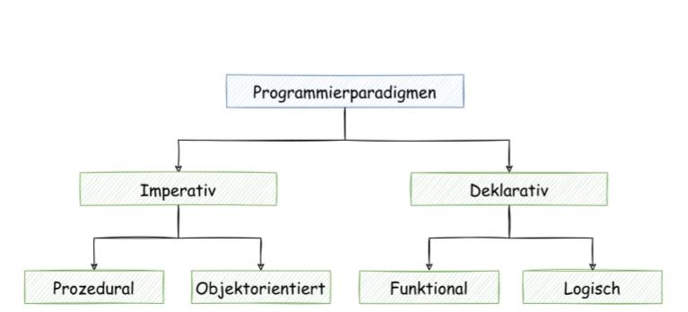
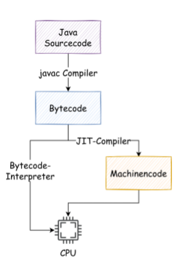

# Scriptsprachen allgemein

## Paradigmen


## Compiler & Interpreter
#### Compiler
- Übersetzung von Programmcode in Maschinencode
- Übersetzung erfolgt vor Ausführung
- Überprüft Syntax 
#### Interpreter
- Quellcode bleibt bis zur Ausführung unbearbeitet
- Analyse des Quellcodes nur zur Laufzeit
- Programm das für Befehle passende Codeabschnitte ausführt

### Was ist ein Bytecode-Interpreter?
- liest Bytecode zur Laufzeit und übersetzt in ausführbaren Code
- ist Plattformspezifisch (x86, x64, ARM, Windows, Linux, Mac)
- Instruktionen werden einzeln verarbeitet (ohne Cache)
### Was ist ein JIT Compiler?
- compiliert mehrfach verwendeten Code in Maschinencode und speichert das Kompilat im Cache



## Typisierung
-  bestimmt die Art wie Variablen an Datentypen gebunden werden

typisiert | nicht typisiert
---------|----------
an Datentyp gebunden | nicht an Datentyp gebunden  

```
	int a = 5; // typisiert
	a = 5 // nicht typisiert
```
  
statisch | dynamisch
---------|----------
Typisierung bekannt bei Kompilierung | Typisierung bekannt bei Laufzeit

```
	int a = 5; // typ ist bekannt bei Kompilierung  
	a = locator.create(); // typ ist abhängig von create() Laufzeitergebis

```

  
stark | schwach
---------|----------
keine Implizierte Typumwandlung | Implizierte Typumwandlung
  
```
	add(5,3) // 8 (unterstützen beide)
	add("5",3) // schwach => "53", stark => Fehler
```

explizit | implizit
---------|----------
Typ im Quellcode | Typ durch Kontext
  
```
	String a = "abc";
	var a = "abc";
```

optional | erzwungen
---------|----------
kann man Angeben | muss man Angeben

```
	// optional + erzwungen
	function sub(a: number, b: number) : number {
		return a - b;
	}

	// optional
	function add(a, b) {
		return a + b;
	}
	
```

## Skriptsprachen
- häufig Interpreterbasiert
- oft dynamisch typisiert
- komplexe Datenstrukturen
- automatische Speicherverwaltung
- meist erweiterbar
- interaktive Shell

