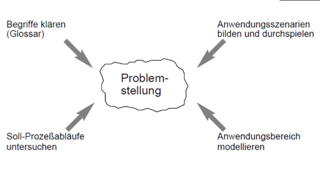

# Anforderungen

## Beteiligte

- Auftraggeber
- Auftragnehmer
- Endnutzer

> Nicht nur fachkundige Personen beteiligt
> {.is-info}

## Analyse und Spezifikation

### Überblick

1. Anforderungsanalyse
1. Spezifikation wird formuliert und geprüft
1. Entwurf umgesetzt
1. Implementierung
1. Test & Korrektur
1. Übergabe

> Klient bekommt nur was er wollte, wenn seine Anforderungen richtig / sorgfältig formuliert wurden und nicht verfälscht wurden
> {.is-info}

### Nutzen

Spezifikation ist notwendig für:

1. Abstimmung mit Kunden
1. Entwurf & Implementierung
1. Benutzerhandbuch
1. Test vorbereitung
1. Abnahme
1. Wiederverwendung
1. Klärung von Einwänden
1. Reimplementierung

### Arten

#### Anforderung (Requirement)

Bedingung / Fähigkeit die...

- Person benötigt um ein Problem zu lösen
- eine Software besitzen muss um einen Vertrag zu erfüllen

#### Anforderungsspezifikation (Requirement Specification)

Zusammenstellung aller Anforderungen

#### Anforderungsmanagement (Requirements Engineering)

- systematische, disziplinierte & quantitativ erfassbares Vorgehen beim Spezifizieren von Anforderungen

- verstehen von Kundenwünschen

#### Bestandteile

- Identifikator => eindeutige Identifikation
- Beschreibung => was soll gemacht werden (kurz und prägnant)
- Problembeschreibung => beschreibt das zugrunde liegende Problem
- Quelle => anfordernde Person / Dokument
- Abnahmekriterium => messbare Bedingung zur erfolgreichen Abnahme

#### Funktionale Anforderungen

Anforderungen, welche Statik, Dynamik, Logik des Systems beschreiben

Benutzersicht:

- Anwendungsfälle
- Benutzerschnittstelle

Entwicklersicht:

- Architektur
- Vorgaben (Gesetze, Standards)

z.B.:
An einem bestimmten Stichtag soll der Kunde eine Rechnung erhalten

> Stellt eine Funktion dar, welche das System erfüllen soll
> {.is-info}

#### Nicht-funktionale Anforderungen

- Zuverlässigkeit
- Sicherheit
- Performance
- Benutzerfreundlichkeit
- Wartbarkeit
- Portabilität

z.B.:
Soll innerhalb von 5 Sekunden starten

> Qualitative oder quantitative Eigenschaften, welche das System erfüllen soll
> {.is-info}

#### Rahmenbedingungen

Eine Rahmenbedingung (constraint) — auch Restriktion genannt — legt
organisatorische und/oder technische Restriktionen für das Softwaresystem
und/oder den Entwicklungsprozess fest

Organisatorische Rahmenbedingungen:

- Anwendungsbereiche (z.B. Textverarbeitung im Büro)
- Zielgruppen (z.B. Kinder)
- Betriebsbedingungen (z.B. 24/7)

Technische Rahmenbedingungen:

- technische Produktumgebung (z.B. Betriebssystem)
- Entwicklungsumgebung (z.B. IDE)

#### Qualitätsmerkmale nach ISO/IEC 9126-1

**Funktionalität**: Angemessenheit, Genauigkeit, Interoperabilität, Sicherheit, Konformität der Funktionalität

**Zuverlässigkeit**: Reife, Fehlertoleranz, Wiederherstellbarkeit, Konformität der Zuverlässigkeit

**Benutzbarkeit**: Verständlichkeit, Erlernbarkeit, Bedienbarkeit, Attraktivität, Konformität der Benutzbarkeit

**Effizienz**: Zeitverhalten, Verbrauchsverhalten, Konformität der Effizienz

**Wartbarkeit**: Analysierbarkeit, Änderbarkeit, Stabilität, Testbarkeit, Konformität der Wartbarkeit

**Portabilität**: Anpassbarkeit, Installierbarkeit, Koexistenz, Austauschbarkeit, Konformität der Portabilität

## Aktivitäten des Anforderungsmanagements

### Probleme

- Widersprüchliche Anforderungen von verschiedenen Stakeholdern
- Effekte des Systems schwer vorhersehbar
- Anforderungen ändern sich im Laufe des Projektes
- Großer Umfang der Anforderungen
- Komplexe Interaktion mit anderen Systemen

1. Ermittlung der Stakeholder
1. Ermittlung der Ziele des Systems

### Anforderungsermittlung

Identifizierung der Anforderungsquellen

- Kunden, Stakeholder, existierende Systeme, Vorgaben

Erheben der Anforderungen

- Interviews, Workshops, Beobachtung, Brainstorming

Kriterien

- vollständig, eindeutig, verständlich, nachprüfbar, atomar, identifizierbar, einheitlich, konsistent

## Begriffslexikon (Glossar)

- wird frühzeitig aufgebaut und weiterentwickelt
- enthält wichtige Begriffe und deren Definitionen
- enthält Begrifft die verschieden ausgelegt werden könnten

### Informationen im Glossar

- Begriff
- Bedeutung
- Abgrenzung
- Gültigkeitsbereich
- Fragen der Bezeichnung
- Unklarheiten
- Querverweise

> Angaben werden aus Gesprächen und Interviews abgeleitet
> {.is-info}

## Stellenwert

1. Anforderungen erstmals einfach  aufnehmen (ohne hinterfragen)
1. Wichtige Begriffe im Glossar definieren
1. Zusammenhänge erkennen

> Werden Erwartungen/Anforderungen nicht vollständig und präzise erfasst,ist damit zu rechnen, dass das entwickelte Produkt nicht den Erwartungen entspricht
{.is-info}

## Anforderungsanalyse

Ergebnis: [Grob-Konzept / Lastenheft](#grobkonzept--lastenheft)  (Was und wofür wird es gebraucht)
Ziel: Beschreibung einer angestrebten Lösung welche alle Anforderungen erfüllt

- Analyse ermittelter Anforderungen
  - konkretisieren
  - priorisieren
- Hilfsmittel
  - Objektorientierte Analyse
  - Datenanalyse
  - Analyse funktionaler Szenarien
- Kriterien
  - Abhängigkeiten
  - Zusammengehörigkeit
  - Rollenbezug

> Vollständige + Präzise Anforderungserfassung ist wichtigste technische Voraussetzung für den Erfolg eines Projektes
{.is-info}

### Ist-Analyse

Ziel: Soll-Zustand feststellen / Lösung mind. so gut wie Altsystem

- Kunde kann viele Anforderungen nicht nennen da für Kunde unbekannt
- Analytiker haben eigene Interessen
- Kunde hat selbstverständliche Anforderungen nicht erwähnt
- Kunde will keine Veränderung sondern nur Verbesserung

> Kunde beschreibt oft was nicht gefällt. Bei Lösen von Problemen nicht existierende Begeisterungsfaktoren verlieren.
{.is-info}

### Soll-Analyse

- Aufnahme der gewünschten Veränderungen
- Aufnahme ungefilterter Kundenwünsche (Wunschzettel)
- anschließend Bewertung und Filterung der Kundenwünsche

### Eigenschaften von Spezifikationen

- **zutreffend**: Sie gibt die Vorstellungen des Kunden richtig wieder
- **vollständig**: Jede vorhandene Anforderung ist spezifiziert
- **Widerspruchsfrei** (Oder konsistent): Keine unvereinbaren Anforderungen
- **neutral** (Oder abstrakt): Keine unnötige Einschränkung der Realisierung
- **nachvollziehbar**: Quellen der Anforderungen Sind dokumentiert
- **objektivierbar**: Das reale System kann gegen die Spezifikation geprüft werden

### Änderungsmanagement

- Änderungen an Spezifikation sollten mit einer Versionsverwaltung dokumentiert werden
- Änderungen sollten Projektlaufzeit / -kosten nicht beeinflussen

## Zehn Regeln

1. Begriffslexikon anlegen und entwickeln
1. Von Aufgabe ausgehen, nicht von Lösung
1. Nach Daten (Objekten) suchen, nicht (vermuteten)
Programmabläufe beschreiben
1. Abstraktionsebene nicht innerhalb derselben Darstellung wechseln
1. Spezifikation nach Aspekten organisieren und Checklisten verwenden, die weiterentwickelt werden
1. Mengengerüst bilden
1. Kunden (Anwender) einbeziehen
1. Sprachen und Werkzeuge verwenden, die Regeln unterstützen
1. Spezifikation der Konfigurationsverwaltung unterstellen und möglich prüfen, z. B. durch Reviews / Prototypen
1. Spezifikation intensiv verwenden

## Grobkonzept / Lastenheft

Zusammenstellung aller Anforderungen des **Auftraggebers** hinsichtlich der Liefer und Leistungsumfänge. Beschreibt aus Anwendersicht was wofür zu lösen ist.

## Feinkonzept / Pflichtenheft

Beschreibung der Realisierung aller Anforderungen des [Lastenhefts](#grobkonzept--lastenheft) durch den Auftragnehmer. Beschreibt aus Entwicklersicht wie und womit etwas zu lösen ist.

> Pflichtenheft bedarf der Genehmigung durch den Auftraggeber
{.is-info}

Ein- / Zweistufiges Vorgehen:

