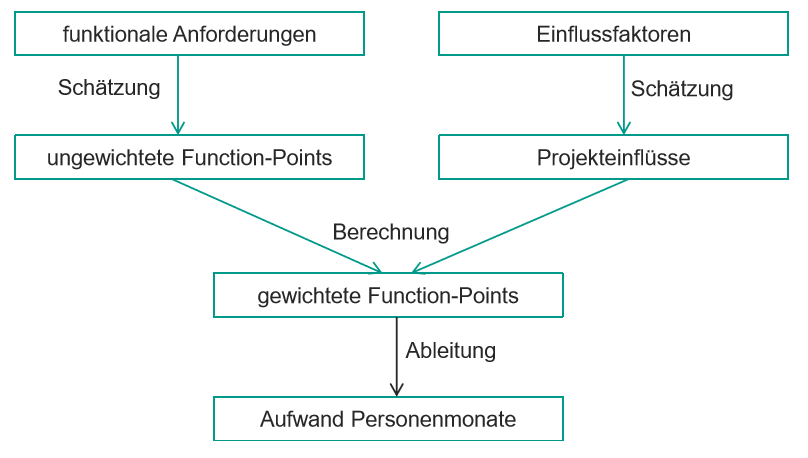

# Aufwandschätzung

## Problemstellung, Bottom-Up-Verfahren, Top-Down-Verfahren

Warum Schätzt man?

- Aufwandsbestimmung
- Schätzung verbleibender Aufwände
- Gegenseitige Aufwandsabschätzung
- Preisfindung

Aufwandsschätzung != Entwicklungszeit != Personalbedarf

Grundlage für:

- Kalkulation & Angebotserstellung
- Personalbedarf
- make or buy Entscheidung
- Nachkalkulation

Kostenschätzung ist nie präzise.
Unsicherheit nimmt im Laufe des Projekts ab.

> Aufwand kann in Geldeinheiten, Arbeitsstunden und Materialbedarfen ausgedrückt werden
{.is-info}

### Ansätze

Expertenschätzung => Fachleute fragen

- häufig nicht systematisch
- ohne Dokumentation bei Problemen Schuldzuweisung
- Delphi-Verfahren
  - Moderator erläutert Problemstellung
  - getrennte, anonyme Expertenschätzungen
  - Diskussion der Ergebnisse
  - Ergebnisse werden wiederholt abgefragt
  - Ergebnis ist Median der Schätzungen

Algorithmische Schätzung => wird aus Größen berechnet
Bottom-up => Schätzung kleiner elementarer Projektbausteine (am populärsten)
Top-down => Aufteilung Ressourcen auf Projektbausteine

## Analogieverfahren, Schätzung auf Grundlage der Aufwandsverteilung auf Phasen

### Vereinfachter Analogieschluss

Forderungen:

- Erfahrungen müssen einfliessen können
- Verständliches Verfahren für Schätzbeteiligte
- Verständliche & angepasste Schätzfaktoren
- Schätzergebnisse müssen anpassbar und dokumentierbar sein
- Einbettung in Geschäftsprozesse

#### Vorbereitung der Schätzung

1. Zerlegung des Projekts in Komponenten, SW-Einheiten & Use Cases
1. von vergleichbarem Projekt liegen Aufwandsdaten vor

#### Durchführung der Schätzung

1. Vergabe von Aufwandspunkten Komponenten, SW-Einheiten & Use Cases des neuen Projekts
1. Vergabe von Aufwandspunkten Komponenten, SW-Einheiten & Use Cases des vergleichbaren Projekts
1. Aufwandspunkte / Personentage Faktor bestimmen des vergleichbaren Projekts

#### Analogieschluss

=> Umrechnung der Aufwandspunkte des neuen Projekts in Personentage

### Prozentsatzmethode

Aufwandsverteilung für Projektphasen ähnelt sich innerhalb bestimmter Projektgrößen.

## COCOMO, Function-Point-Verfahren

- Kosten werden aus atomaren Größen berechnet
- Bei COCOMO liegt die Anzahl der Codezeilen zu Grunde, bei der Function-Point-Verfahren die Ein- und Ausgabe.
- gesuchte Größe werden aus Berechnung abgeleitet
- Rahmenbedingungen werden durch Korrekturfaktoren berücksichtigt

> Voraussetzung ist eine ausreichend genaue Schätzung

### COCOMO

<!-- ! Muss noch abgeklärt werden -->

### Function-Point-Verfahren

1. Funktionale Anforderungen werden in Elementarprozesse unterteilt.
1. Bewertung der Elementarprozesse mit Function Points => ungewichtete Function Points
1. Bestimmung & Bewertung der Einflussfaktoren
1. Berechnung der gewichteten Function Points
1. Berechnung der Personentage

#### Kategorien Elementarprozesse

Kategorie | Beispiel
---------|---------
Eingabe | Veranstaltung anlegen​
Abfrage | Veranstaltungen anzeigen​
Ausgabe | Veranstaltungsdetails anzeigen​
|
Datenbestände | Veranstaltungsdatenbank​
Referenzdaten | externes Teilnehmerverzeichnis​

## Planning Poker & Magic Estimation

### Planning Poker

Schätzung:

1. Teammitglieder erhalten Karten mit Zahlen
1. Teammitglieder schätzen einzeln & geheim Aufwand
1. Teammitglieder gleichzeitig zeigen Karten

Bewertung:

1. gleicher Wert => Annahme des Schätzwertes
1. unterschiedliche Werte => Diskussion

Bei keiner Einigung wird das Problem weiter zerlegt.

### Magic Estimation

1. Reihe mit Zahlen ausgelegt
1. User Story wird Zahl zugeordnet
1. Karten werden beliebig verschoben
1. Product Owner notiert Karten welche häufig verschoben werden (Fall-Outs)
1. Fall-Outs werden mit einer anderen Methode geschätzt
1. Schätzung ist beendet wenn keine Karten mehr bewegt werden
