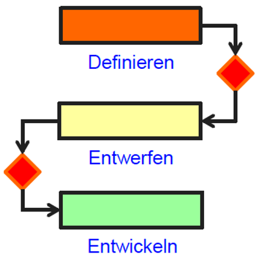

# Vorgehensmodelle

## Basismodelle
Vorgehensmodelle auf Projektebene
### Code & Fix
Loslegen ohne Entwurf

Vorteile:
- schnell
- einfache Tätigkeiten
- geringe Komplexität

Nachteile:
- Fehler werden nachträglich behoben
- häufige Überarbeitung notwendig
- Arbeiten können nicht verteilt werden
- schlechte Skalierbarkeit
- keine Dokumentation

### Sequentielles Modell
Definieren, Entwerfen, Entwickeln
Eine Phase nach der anderen

Vorteile:
- einfach Verständlich
- geringer Projektaufwand
- wenig Kommunikationsaufwand

Nachteile:
- keine parallele Arbeit möglich
- Ergebnisse liegen später vor
- keine Schleife oder Iteration (keine Rückfragen)

### Wasserfallmodell
Jeder Aktivität wird eine Phase zugeordnet, die in einer bestimmten Reihenfolge abgearbeitet werden muss.
Möglichkeit von Rücksprung in die jeweils vorherige Phase

Vorteile:
- einfach Verständlich
- geringer Projektaufwand
- wenig Kommunikationsaufwand
- Rücksprungmöglichkeit

Nachteile:
- kein Feedback
- keine parallele Arbeit möglich
- bei Änderungen startet das Modell neu

### V-Modell
- Integriert Maßnahmen zur Qualitätssicherung  
- Erweitert Wasserfallmodell  

Vorteile:
- Fehler werden früher als im Wasserfallmodell erkannt
- Abnahme durch den Auftraggeber vereinfacht
- arbeiten in verteilen Teams möglich

Nachteile:
- erneute Einarbeitung von Teams bei Änderungen / Rückfragen
- nicht iterativ
- nicht für komplexe Projekte geeignet

## Monumentale Modelle
Genaue Beschreibung wie Prozess und Qualitätsziele erreicht werden sollen 

## Agile Modelle
Gegenbewegung zu den monumentalen Modellen
