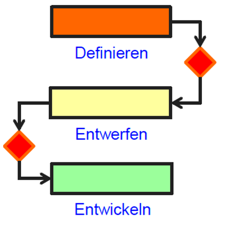
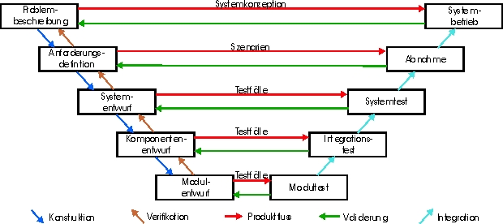
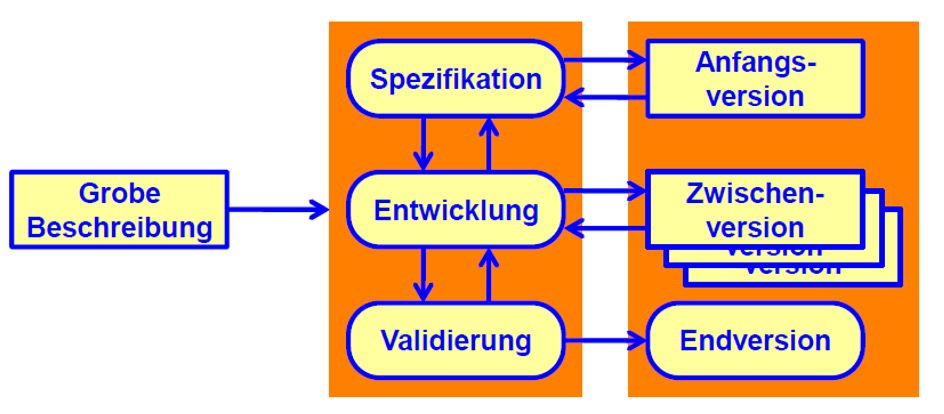
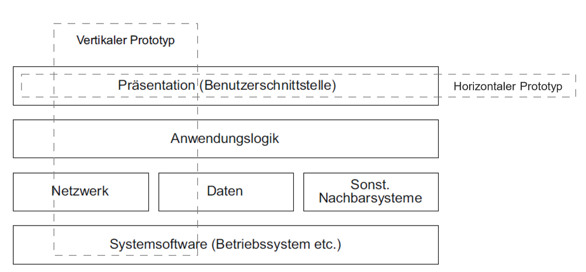
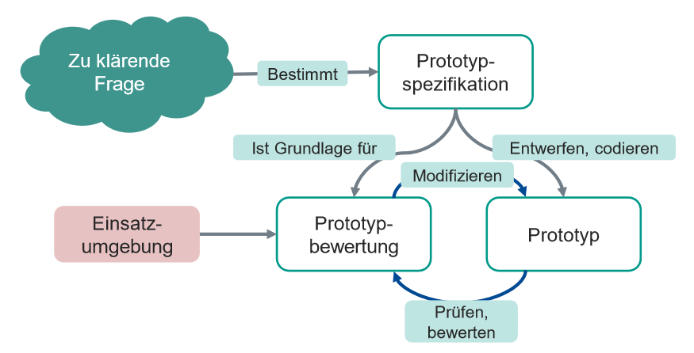
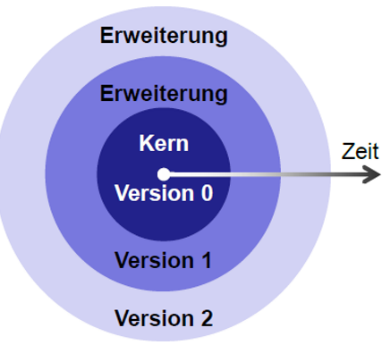
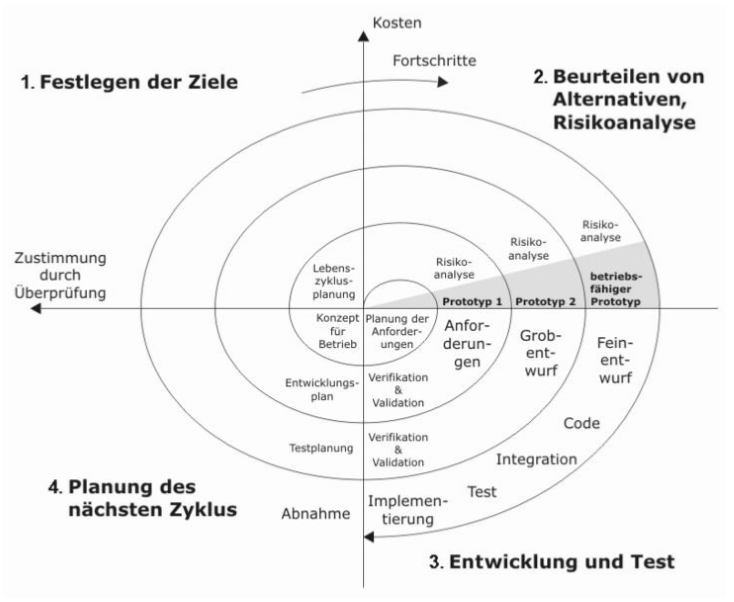
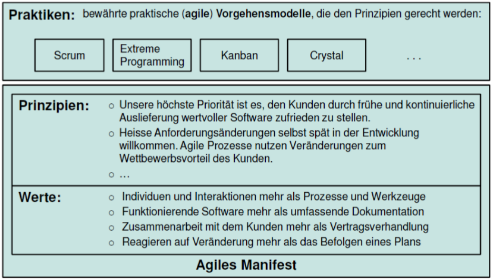

# Vorgehensmodelle

## Basismodelle

Vorgehensmodelle auf Projektebene

### Code & Fix

Loslegen ohne Entwurf

Vorteile:

- schnell
- einfache Tätigkeiten
- geringe Komplexität

Nachteile:

- Fehler werden nachträglich behoben
- häufige Überarbeitung notwendig
- Arbeiten können nicht verteilt werden
- schlechte Skalierbarkeit
- keine Dokumentation

### Sequentielles Modell

Definieren, Entwerfen, Entwickeln
Eine Phase nach der anderen

Vorteile:

- einfach Verständlich
- geringer Projektaufwand
- wenig Kommunikationsaufwand

Nachteile:

- keine parallele Arbeit möglich
- Ergebnisse liegen später vor
- keine Schleife oder Iteration (keine Rückfragen)

### Wasserfallmodell

Jeder Aktivität wird eine Phase zugeordnet, die in einer bestimmten Reihenfolge abgearbeitet werden muss.
Möglichkeit von Rücksprung in die jeweils vorherige Phase

Vorteile:

- einfach Verständlich
- geringer Projektaufwand
- wenig Kommunikationsaufwand
- Rücksprungmöglichkeit

Nachteile:

- kein Feedback
- keine parallele Arbeit möglich
- bei Änderungen startet das Modell neu

### V-Modell

- Integriert Maßnahmen zur Qualitätssicherung  
- Erweitert Wasserfallmodell  

Vorteile:

- Fehler werden früher als im Wasserfallmodell erkannt
- Abnahme durch den Auftraggeber vereinfacht
- arbeiten in verteilen Teams möglich

Nachteile:

- erneute Einarbeitung von Teams bei Änderungen / Rückfragen
- nicht iterativ
- nicht für komplexe Projekte geeignet

### Nebenläufiges Modell

Phasen werden so schnell wie möglich gestartet.
Erfordert viel Kommunikation und Koordination und ausreichend Ressourcen für Überarbeitungen innerhalb der Phasen.

Vorteile:

- optimale Zeitnutzung
- parallele Arbeit möglich
- schnelle Ergebnisse
- allgemein anwendbar

Nachteile:

- unnötige Schleifen durch Überarbeitungen
- hoher Kommunikationsaufwand
- hoher Planungsaufwand
- doppelte Arbeiten

### Evolutionäres Modell

Anfangsentwurf wird iterativ weiterentwickelt. Konzentration liegt auf lauffähigen Zwischenversionen.

Vorteile:

- schnelle lauffähige Zwischenversionen
- geringes Projekt-Risiko - Auftraggeber hat keine Überraschungen
- Fehler werden frühzeitig erkannt

Nachteile:

- grundlegend Änderungen sind schwierig
- neue Anforderungen können unwirtschaftlich sein

### Komponentenmodell

Projekt wird in Komponenten aufgeteilt, die unabhängig voneinander entwickelt werden können.

Vorteile:

- frühe Produktlieferung
- Konzentration auf eigene Stärken

Nachteile:

- auffinden geeigneter Komponenten ist schwierig
- Anpassungen von fremden Komponenten sind schwierig
- abhängig von andere Lieferanten

### Prototypenmodell

Es wird ein horizontaler oder vertikaler Prototyp entwickelt, der die Anforderungen teilweise erfüllt.  
Der Nutzer bekommt einen frühzeitigen Einblick in die Funktionalität des Produktes.

#### Vertikaler Prototyp

Bildet Funktionen über den ganzen Stack ab.  
zb. eine vollständige CRUD-Operation

#### Horizontaler Prototyp

Bildet eine Ebene des Stacks ab.  
zb. Wireframes für die UI

Vorteile:

- Reduzierung des Projektrisikos
- bessere Planbarkeit
- bessere Lösungsfindung

Nachteile:

- zusätzlicher Entwicklungsaufwand
- Dokumentation wird durch Prototypen ersetzt
- Grenzen und Einschränkungen schwer zu erkennen

#### Rapid Prototyping

Frühzeitige Entwicklung von Prototypen.
Gewonnenes Wissen kann in den Entwicklungsprozess einfließen.

Der Prototyp:

- kein Teil Software
- Teil der Anforderungsanalyse
- darf nicht von schlechter Qualität sein
- ersetzt nicht die Spezifikation

> schnelles Zusammensetzten von Prototypen wird **Rapid Prototyping** genannt
{.is-info}

#### Vorgehensweise

### Inkrementelles Modell

Von einem Kern wird Stückweise die Software erweitert.  
Schalenförmiger Aufbau.

Vorteile:

- vollstände Anforderungsdefinition von Anfang an
- schnelle Auslieferung von Teilprodukten
- geringes Risiko einer Fehlentwicklung
- kann in unterschiedlichen Teams entwickelt werden

Nachteile:

- Anforderungsdefinition kostet am Anfang viel Zeit
- schlechter Umgang mit Änderungen der Anforderungen

### Iteratives Modell

Entwicklung in mehreren geplanten Iterationen.
Jeder Iteration enthält die gleichen Teilschritte (z.B. Analyse, Design, Implementierung, Test).
Die Basis für die nächste Iteration ist das Ergebnis der vorherigen Iteration.

> größere Projekte können mehrere kleinere Projekte aufgeteilt.  
{.is-info}

### Spiralmodell

Ein iteratives Modell welches innerhalb einer Iteration ein Wasserfallmodell durchläuft. Wird gerne für große Projekte verwendet, um Risiken zu minimieren.

Vorteile:

- Flexibilität
- Risikobehandlung (minimiert Risiko der Planabweichung, nicht Risiko falscher Konzeption)
- hohes Kundenfeedback

Nachteile:

- hohe Kosten
- abhängig von der Risikoanalyse
- Komplexität
- schwierig zu planen

## Monumentale Modelle

Genaue Beschreibung wie Prozess und Qualitätsziele erreicht werden sollen
Basismodell Grundgedanken (Sequentiell, Parallel, Iterativ) auch im Monumentalen Modell aber ganzheitlich Betrachtet (Was, Wer, Wie).
Vorlagen für für typische Anwendungsszenarien.

Für individuelles Projekt wird vorab festgelegt (tailoring):
	- Aktivitäten und deren Reihenfolge
	- Rollen
	- Produkten

### V-Modell XT

XT steht für extreme tailoring  => Fokus auf Verhältnis zwischen Auftraggeber und Auftragnehmer
Einheitliche Vorgabe von Aktivitäten und Produkten
Produkte haben Verantwortlichkeiten nach RACI:

- R: Responsible (operativ Verantwortlich)
- A: Accountable (finanzielle Verantwortlich)
- C: Consulted (Beratend)
- I: Informed (Informiert)

> Produktgetrieben
{.is-info}

#### Von wem stammt das V-Modell XT?

Wurde vom Bundesministerium für Verteidigung vereinheitlicht

#### Aus welchen Elementen besteht das V-Modell XT?

Aktivitäten & Produkten (Ergebnisse)

#### Was bedeutet Produktorientierung?

- Produkte stehen im Mittelpunkt
- Produktqualität ist überprüfbar
- für jedes Produkt ist eine Rolle verantwortlich (vermeidet unterschiedliche Entscheidungen)

#### Was sind Projektfortschrittsstufen im V-Modell XT?

Wichtige Ergebnisse / Phasen im Projekt welche in der Projektdurchführungsstrategie definiert wurden

### RUP (Rational Unified Process)

für objektorientierte Softwareentwicklung
ist eng verbunden mit der Entstehung von UML

> Aktivitätsgetrieben
{.is-info}

#### Welche Phasen existieren im RUP?

- Inception (Konzeption)
  - Ermittlung zentraler Anforderungen, Projektumfang
- Elaboration (Ausarbeitung)
  - stabile, möglichst Vollständige Anforderungen
- Construction (Konstruktion)
  - Entwicklung der Software
- Transition (Übergang)
  - Übergabe an den Kunden

#### Was ist im RUP eine Disziplin?

Kerndisziplinen decken fachliche und technische Aufgaben ab.
Unterstützungsdisziplinen bündeln unabhängige Querschnittsaufgaben.
z.B.

- Entwicklung
- Test
- Auslieferung

## Agile Modelle

Gegenbewegung zu den monumentalen Modellen
Agil = flink

### Welche Kritik üben die agilen Ansätze?

Nicht Werkzeug/Methode macht Projekte erfolgreich, sondern Menschen

### Was ist das agile Manifest?

Verhaltensregeln, Grundgerüst für Einhaltung der Werte in der Praxis

### Was sind die agilen Prinzipien?

- frühe und kontinuierliche Lieferung von Software
- Zusammenarbeit mit Kunden
- Reaktion auf Veränderungen
- Nutzung von Veränderungen zum Wettbewerbsvorteil  

### SCRUM

Interaktives, inkrementelles Prozessmodell

#### Was ist der Product Owner?

- hat Produktvision
- trägt wirtschaftliche Verantwortung (accountable)
- legt Ziele fest
- definiert & priorisiert

#### Was ist der Scrum Master?

- verantwortlich für den Scrum-Prozess (Rituale)
- hilft zusammenarbeit zu optimieren
- beseitigt Hindernisse

#### Was ist das Entwicklungsteam?

- Entwickler des Produkts
- selbstorganisiert

#### Was ist der Product Backlog?

- Liste aller Anforderungen
- Priorisiert
- wird vom Product Owner gepflegt

#### Was ist der Sprint Backlog?

- Liste der Aufgaben für den Sprint
- wird vom Entwicklungsteam in Tasks aufgeteilt
- Beitrag muss im aktuellen Sprint fertig sein

#### Was ist das Sprint-Ergebnis?

- Produkt, das am Ende des Sprints fertig ist (Demonstrierbare Funktionalität, auslieferbarer Code)
- wird im Stakeholder Review validiert

#### Was ist das Definition of Done?

Was ein Artefakt haben muss, damit es als fertig gilt

#### Was ist ein Sprint?

- Zeitraum in dem ein Sprint Backlog implementiert wird

#### Was ist das Sprint Planning?

- Planung des Sprints

#### Was ist das Daily Scrum?

- tägliche Besprechung von ca. 15 Minuten

#### Was ist das Sprint Review?

- Veranstaltung um das Produkt zu überprüfen

#### Was ist die Sprint-Retrospektive?

- Überprüfung der eigenen Arbeit und Planung für Verbesserungen

#### Was ist das Backlog Refinement?

- Überarbeitung des Product Backlogs

### Kanban

- linearer Ablauf (Iteration nicht vorgesehen aber möglich)
- visualisiert Fluss der Arbeit
- begrenzt Menge angefangener Arbeit
- bessere Nutzung von Personalressourcen (vgl. Autofertigung Fließband-Stationen)
- Tasks durchlaufen Phasen
  - jede Phase unterteilt in "In Arbeit" u. "Done"
  - jede Phase hat eigenes "Definition of Done" (=> Zustandsbeschreibung für Tasks wenn in "Done")

## Rahmenmodelle

Prozessabläufen übergeordnetes Managementwerkzeug.
Betreffen hauptsächlich die Unternehmen und Gruppe/Projekt Ebene.

### CMMI (Capability Maturity Model Integration)

- Zusammenfassung praxisorientierter Best-Practices
- Ziel: Prozessverbesserung in Software-Unternehmen
- Stufenförmige Darstellung von Reifegraden

### SPICE (Software Process Improvement and Capability Determination)

(heute ISO / IEC 15504 Information Technology - Process assessment)

Hat auch Reifegrade wie CMMI, allerdings für anders gruppierte Themenbereiche.

## Vergleich monumentale / agile Modelle

### Monumentales Modell

Besser geeignet für vorhersagbare Prozesse, geführt mit formaler Kommunikation, mit umfangreicher Dokumentation, großen Teams und Festpreisaufträge.

### Agiles Modell

Besser geeignet für adaptive Prozesse die schnell liefern müssen, weniger Dokumentation kleinere Teams, Auftrag nach Aufwand.

### Vorgehensmodelle Vorteile/Nachteile

Vorteile:

- Gemeinsame Abbildung von Projektmanagement-, QS- u. produkterstelleneden-Prozessen
- Projekte können geordnet ablaufen
- verbesserte Übersichtlichkeit des Gesamtprojekts
- Projektbegleitende Dokumentation
- Verbesserte Koordination von Teams

Nachteile:

- sehr viele verschiedene Modelle - hat sich kein einzig-richtiger Standard durchgesetzt
- Aufwendige Vorgehensmodelle können Softwareentwicklung behindern und verteuern
- Alle müssen mitmachen und sich auf ein Modell einigen
- Arbeiten in fest vorgegebenen Schienen behindert Kreativität => Innovations-Verlust

### Trends

- Monumentale Modelle werden abgemagert
- Agile Modelle werden erweitert
- Monumentale und agile Modelle koexistieren (hybride Modelle/bimodale IT)

## Bimodale IT

Zweiteilung von IT Organisation in traditionelle IT und agile IT Teams.
Traditionelle IT gibt langfristige Sicherheit, während das agile IT Team flexibel auf sich verändernde Trends reagieren kann.
