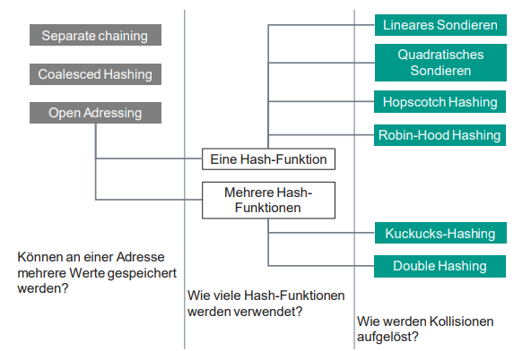
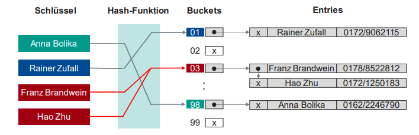
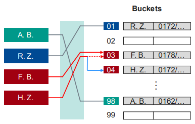
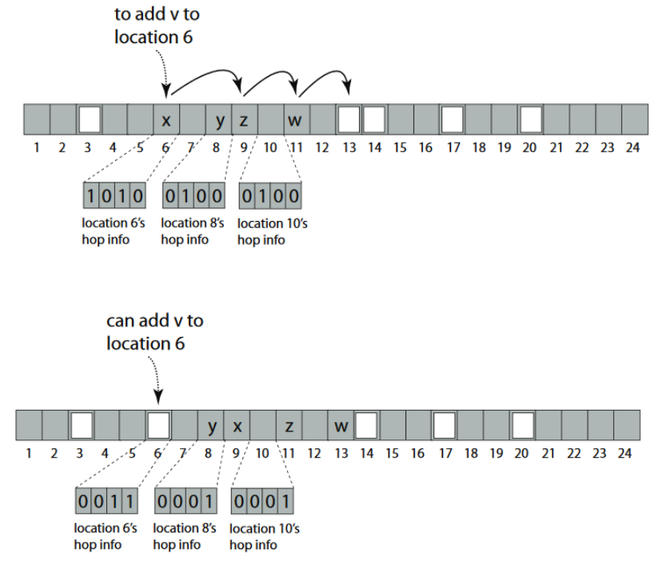

# Hashing

Index-Datenstruktur, in welcher der Ort an dem ein Element gespeichert wird, mathematisch mit Hash-Funktion berechnet wird.

Ziel: Erzeugen einer Datenstruktur mit $O(1)$ Zugriffszeit via Schlüssel

## Hash-Verfahren

Bestimmen von Speicherpositionen für Elemente und Auflösung von Kollisionen

- nicht perfekt -> unterschiedliche Schlüssel können auf gleichen Hash-Wert abgebildet werden
- perfekt -> jeder Schlüssel wird auf einen anderen Hash-Wert abgebildet
- minimal perfekt -> jeder Schlüssel wird auf genau einen anderen Hash-Wert abgebildet (Hash-Tabelle ist minimal groß)

## Kollisionen / Sondierverfahren

- Kollisionen: mehrere Schlüssel werden auf gleichen Hash-Wert abgebildet
- Sondierverfahren: Algorithmus welcher prüft welche Speicherposition als nächstes verwendet wird

## Separate Chaining

- Buckets sind Datenstrukturen welche mehrere Elemente speichern können

## Open Addressing

- Buckets sind einzelne Speicherpositionen
- bei Kollision -> Sondierverfahren bestimmt nächste Speicherposition

### Lineares Sondieren

- lineare Suche nach nächster freier Speicherposition

Vorteile:

- einfach zu implementieren
- alle Speicherpositionen werden verwendet

Nachteile:

- Clustering: Kollisionen führen zu weiteren Kollisionen

### Quadratisches Sondieren

- Suchschritte nach nächster freier Speicherposition wachsen quadratisch
- häufig mit alternierende Suchrichtung

Vorteile:

- Cluster werden schneller durchlaufen
- alle Behälter werden verwendet

### Doppel Hashing

- ist Speicherposition besetzt wird mit zweiter Hash-Funktion nächste freie Speicherposition bestimmt

Vorteile:

- Effektiver Sondiervorgang

Nachteile:

- Komplexität

### Kuckucks-Hashing

- jedes Element hat 2 Positionen
- bei Kollision auf beiden Positionen wird erstes Element ausgeworfen und auf andere Position verschoben
- alternativer Speicherort ist eine zweite Tabelle

Vorteile:

- kurze Sondierketten
- schneller Zugriff

Nachteile:

- Gefahr von Endlosschleifen
- bei > 50% Füllgrad werden Sondierketten lang

### Hopscotch-Hashing

- jedes Element hat 1 Position + Nachbarschaft
- wenn Speicherposition besetzt wird linear nach nächster freier Speicherposition gesucht
- wenn freie Speicherposition in Nachbarschaft von ursprünglicher Speicherposition wird Element dort gespeichert
- wenn freie Speicherposition nicht in Nachbarschaft von ursprünglicher Speicherposition wird Element in Nachbarschaft von freier Speicherposition in freie Speicherposition verschoben
- freier Speicherplatz wandert in Nachbarschaft von ursprünglicher Speicherposition
- verschiebbare Elemente werden durch Bitvektor markiert

### Robin-Hood-Hashing

- jedes Element hat 1 Position + Abstand (DIB -> Distance to initial Bucket) zum ursprünglichen Speicherort
- bei Kollision wird Element mit kleinerem Abstand zum ursprünglichen Speicherort verschoben

Vorteile:

- Verhinderung langer Suchzeiten (early termination)
- gleichmäßige Verteilung der Elemente

Nachteile:

- Aufwand für Berechnung des Abstandes
