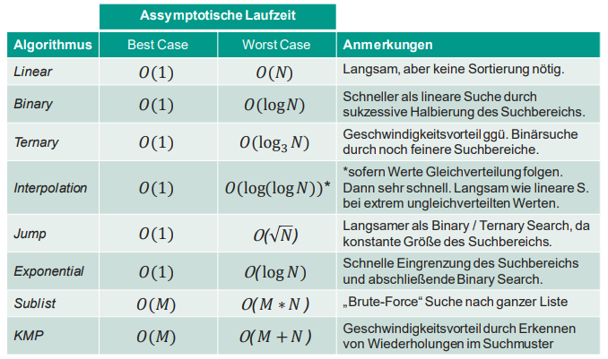

# Suchalgorithmen

Suchalgorithmen durchsuchen eine Menge von Elementen nach einem bestimmten Element.

## Linear Search

- Laufzeit ist $O(n)$

Iteration über Liste bis Element gefunden oder Ende erreicht.

Vorteile:

- Einfach
- Funktioniert auch bei unsortierten Listen

Nachteile:

- Langsam

## Binary Search

- Teile Liste in zwei Hälften
- Vergleiche gesuchtes Element mit mittlerem Element
- Wenn gesuchtes Element kleiner ist, suche in der linken Hälfte
- Wenn gesuchtes Element größer ist, suche in der rechten Hälfte
- Teile die Hälfte wieder in zwei Hälften
- Laufzeit ist $O(log(n))$

Vorteile:

- Schnell bei großen Listen

## Ternary Search

- Teile Liste in drei Hälften
- Vergleiche gesuchtes Element mit den pivot Elementen
- Wenn gesuchtes Element kleiner ist, suche in der linken Hälfte
- Wenn gesuchtes Element größer ist, suche in der rechten Hälfte oder beim nachfolgenden pivot Element
- Laufzeit ist $O(log_3(n))$

## Interpolation Search

- Berechne den Index des gesuchten Elements mit dem durchschnittlichen Abstand zwischen den Elementen
- Laufzeit ist $O(n)$

$middleIndex = lowIndex + \lfloor (val - array[lowIndex]) * \frac{(highIndex - lowIndex)}{(array[highIndex] - array[lowIndex])} \rfloor$

Vorteile:

- bei gleichmäßig verteilten Elementen schnell
- potentiell $O(1)$

Nachteile:

- anfällig gegen Ausreißer

## Jump Search

- Teile Liste in $\lfloor \sqrt{n} \rfloor$ Blöcke
- Springe bis Element gefunden oder übersprungen
- Suche linear Element in Block
- Laufzeit ist $O(\sqrt{n})$

- Vorteile:
  - Schnell bei großen Listen

## Exponential Search

- wie Jump Search, aber mit exponentiell wachsenden Schritten
- Suche mit Binary Search im gefundenen Block
- Laufzeit ist $O(log(n))$

## Pattern Matching

- Suche nach einer folge von Elementen (Pattern m) in einer anderen Folge von Elementen

### Substring Search

- lineare Suche nach ersten Element des Patterns in der Folge
- wenn gefunden, vergleiche die folgenden Elemente des Patterns mit den folgenden Elementen der Folge
- Laufzeit ist $O(n*m)$

### KMP Search

- erstelle eine Randtabelle: beschreibt pro Zeichen des Patterns die Länge des gleichen Präfixes und Suffixes
- führt Substring Search durch, aber springt bei einem Mismatch in der Folge anhand der Randtabelle zurück
- Laufzeit ist $O(n*m)$

Vorteile:

- schneller als Substring Search

