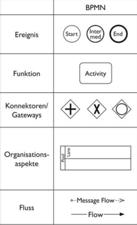
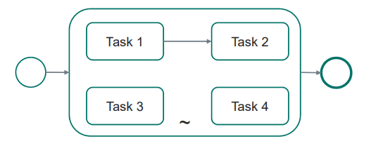
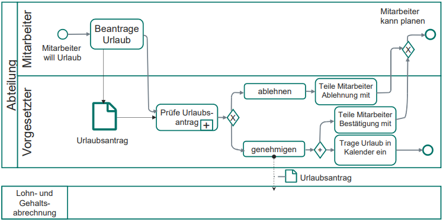

# BPMN

Business Process Model and Notation (BPMN)

## Elemente der BPMN

> Reihenfolge beim Ad-Hoc-Subprozess ist meist nicht festgelegt -> kann in beliebiger Reihenfolge abgearbeitet werden. Ad-Hoc-Subprozess endet, wenn alle Aktivitäten abgearbeitet sind.
{.is-info}

## Beispiele

