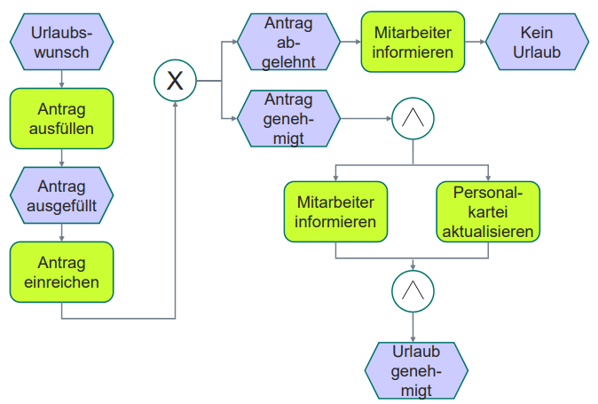
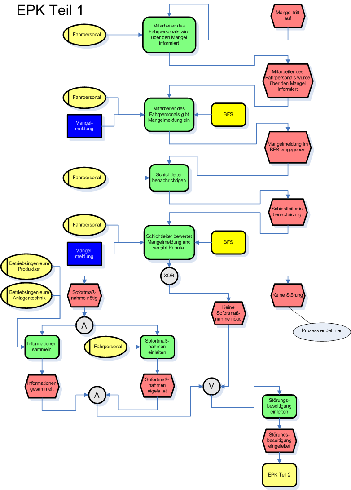

# Ereignisprozessketten

## EPK

Grundregeln:

- Prozess beginnen und enden mit Ereignissen
- Ereignisse lösen Funktionen aus
- Funktionen erzeugen Ereignisse

> Auf ein Ereignis kann kein weiteres Ereignis folgen
{.is-warning}  
> Auf eine Funktion kann keine weitere Funktion folgen
{.is-warning}

Verknüpfungsoperatoren:

- können aufteilen und zusammenführen
- UND  
- ODER  
- XOR (entweder oder)  

> Splits können nur mit gleichem JOIN zusammengeführt werden
{.is-warning}

## Erweiterte EPK (eEPK)

Zusätzliche Elemente:

Stelle: Beschreibt ein bestimmtes Aufgabenfeld einer
Person  
  
Rolle: Beschreibt eine bestimmte Aufgabe einer Person  
  
Organisationseinheit: Beschreibt eine Gruppe von Personen  
  
Datencluster/Anwendungssystem: Funktionsspezifische Software  
  
Externe Personen: Personen, die nicht zur Organisation gehören, aber im Prozess eine Rolle spielen  
  
Dokument: Informations- oder Planungsgrundlage  
  
Datenbank: Gespeicherte Informationen  
  

## Beispiele

## Sonstiges

- beschreibt Arbeitsprozesse als Aufeinanderfolge von Ereignissen und Funktionen / Tätigkeiten
- Funktion ist fachliche Aufgabe / Tätigkeit an einem Objekt
  - Beschreibung mit Objekt und Verrichtung
- Ereignis beschreibt einen eintretenden Zustand

### eEPK

Zusätzliche Sichten möglich:

- Datensicht
  - Fluss von Daten
- Organisationssicht
  - Beziehungen zwischen Ressourcen
- Funktionssicht
  - Beziehungen zwischen Vorgängen
- Leistungssicht
  - Zuordnung von Dienst-, Sach-, und finanziellen Leistungen
