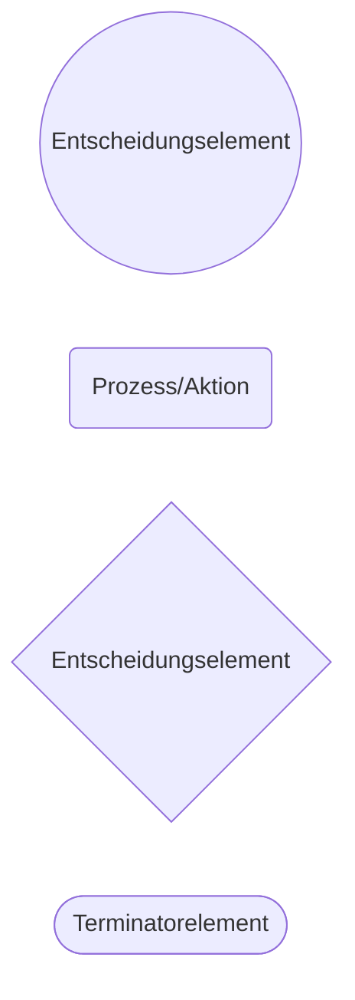

# Grafische Basisnotationen

## Elemente des einfachen Flussdiagramms

## Elemente der SADT (Structured Analysis and Design Technique)

Max 6 Aktionselement pro Diagramm

Hierarchische Bezeichnung

> Alle ein- und ausgehenden Pfeile einer Parent-Box müssen in dem Child-Diagramm erscheinen.
{.is-warning}
