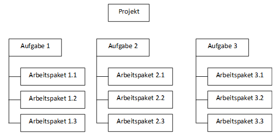
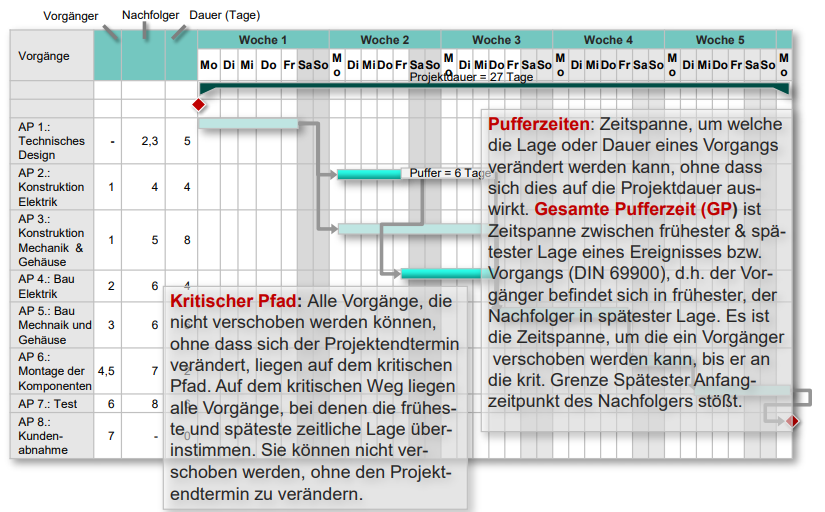
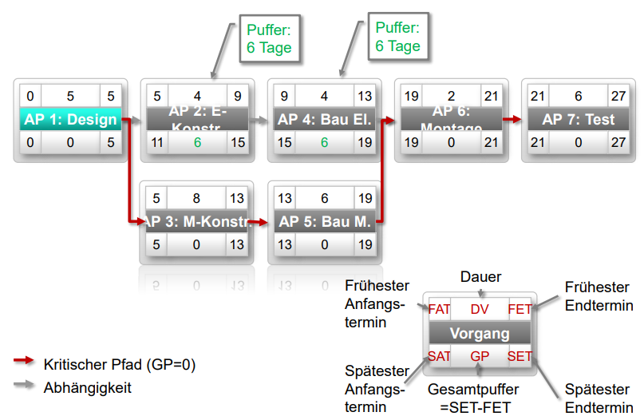

# Klausurvorbereitung

## [Unternehmen im Projektmanagement](/fom/semester-4/projektmanagement/unternehmen-im-projektmanagement.md)

## [Grundlagen von Projektmanagement](/fom/semester-4/projektmanagement/grundlagen-projektmanagement.md)

## [Einführung in das Projektmanagement](/fom/semester-4/projektmanagement/einfuehrung-in-das-projektmanagement.md)

## Streckbriefe

### Projektantrag

Ein Projekt ist ein einmaliges, einzigartiges Vorhaben mit definierten Start und Endzeitpunkt, welches ein bestimmtes Ziel verfolgt.

- Projektname, Akronym
- Projektleiter, Mitglieder
- Kurzbeschreibung
- Ziele, Nicht-Ziele
- Art der Vergabe (intern, extern)
- Hauptaufgaben
- Grobe Termine
- Grobe Aufwandsabschätzung

### Zielkatalog

Ein Ziel ist ein Zustand in der Zukunft den es zu erreichen gilt.

Nach der SMART-Formel (spezifisch, messbar, erreichbar, relevant, terminiert)

Beispiel:

- Im 1. Quartal mindestens drei unterschiedliche Arten von umfassenden Marketingmaterialien (z. B. E-Book, Webinar, Videos, Verkaufsbroschüren) pro Monat produzieren
- Das Produktteam soll in der ersten Hälfte des Geschäftsjahrs 2022 an fünf funktionsübergreifenden Projekten im Bereich Usability-Tests, Kundenumfragen, Kundenmarketing oder Forschung und Entwicklung arbeiten.
- Ich werde trainieren, um den Berliner Halbmarathon im März in unter zwei Stunden zu laufen.

### Stakeholderanalyse

- Stakeholder sollen identifiziert werden (Heinz, 54 Geschäftsführer)
- Relevanz der Stakeholder (Heinz ist der Geschäftsführer)
- Interesse der Stakeholder (In Time, In Budget, In Function)
- Einfluss der Stakeholder (Heinz hat einen hohen Einfluss auf das Projekt, da er der Auftraggeber ist)
- Betroffenheit der Stakeholder (direkt, indirekt)
- Relevanz der Stakeholder (gering, mittel, hoch)
- Maßnahmen (z. B. Kommunikation, Einbindung, Information)

Beispiel:

- Heinz, 54 Geschäftsführer
- Hat etwas beauftragt, ist also direkt betroffen
- Zielgruppe vergrößern
- Beobachten, Befragen

### Risikoanalyse

Risiko ist ein mögliches Ereignis in der Zukunft, welches einen negativen Einfluss auf das Projekt haben kann.

- Name des Risikos
- Eintrittswahrscheinlichkeit (gering, mittel, hoch)
- Tragweite - Auswirkung auf Qualität, Kosten, Termine (gering, mittel, hoch)
- Bewertung - Wie ist das Projekt gefährdet? (gering, mittel, hoch)
- Gegenmaßnahmen - Wie kann gegengesteuert werden? (z. B. Risiko vermeiden, Risiko reduzieren, Risiko übertragen, Risiko akzeptieren)

Bild einer Risikomatrix

- Legende einer Matrix -> Ausschnitt aus allen Risiken

### Informationsfluss

- Besprechung (Teilnehmer, Häufigkeit, Zeitpunkt)
- Protokoll (Verteiler, Speicherort, Zugriff)
- Projektordner (Inhalte, Aufbewahrungsort)
- E-Mail (Verteiler)
- Beantwortungszeiten
- Informationsverantwortliche (für Teilbereiche)
- Datenhaltung (z. B. Cloud, Server, USB-Stick)

### Arbeitspakete

Ein Arbeitspaket ist eindeutig identifizierbare Aufgabe, die von einer Person oder einer Arbeitsgruppe innerhalb eines Projekts zu erledigen ist.

- Arbeitspaketname
- Arbeitspaket Nr.
- Datum
- Verantwortlicher
- Input
- Aufgaben
- Output
- Dauer (in Tagen)
- Kosten

### Projektstrukturplan

Ablauforientiert, Objektorientiert

### Balkenplan

Meilensteine

### Statusbericht / Projektcontrolling

- Datum
- Ersteller
- Projektname
- Projektabschnitt (Meilenstein)
- Projektleiter
- Verteiler
- Aktivitäten / Teilnehmer
- Status Qualität/ Termine (je im Soll, im Plan, im Verzug -> Begründung)
- Probleme / Risiken
- Maßnahmen (Beschreibung, Verantwortlicher, zu erledigen bis)
- Nächste Schritte

### Abschlussbericht

- Datum
- Ersteller
- Projektname
- Projektleiter
- Projektmitarbeiter
- Projektziele
- Projektergebnisse
- Projektablauf
- Entlastung des Projektteams (Unterzeichnung von Projektleitung)
- Anlagen
  - Projektauftrag
  - Letzter Stand Terminplan, Auftragskalkulation
  - Projektberichte
  - Projektabnahmeprotokoll

### Projektorganisation

Bild von Projektorganisation
