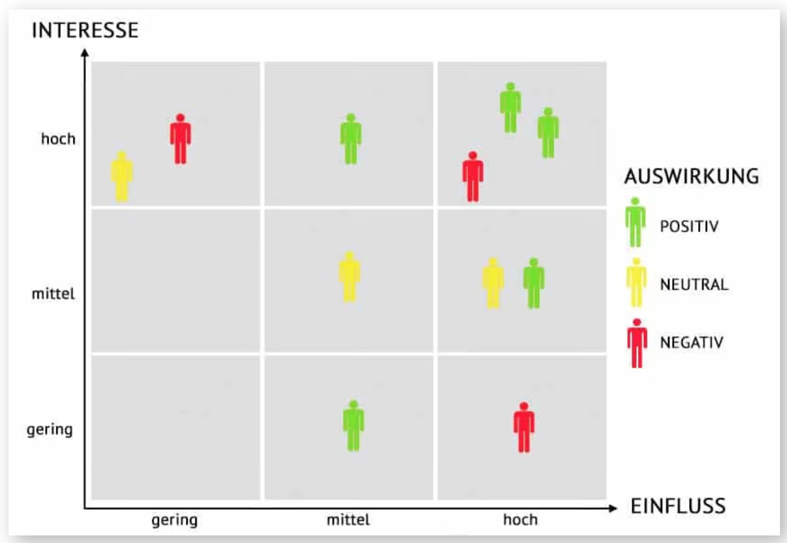
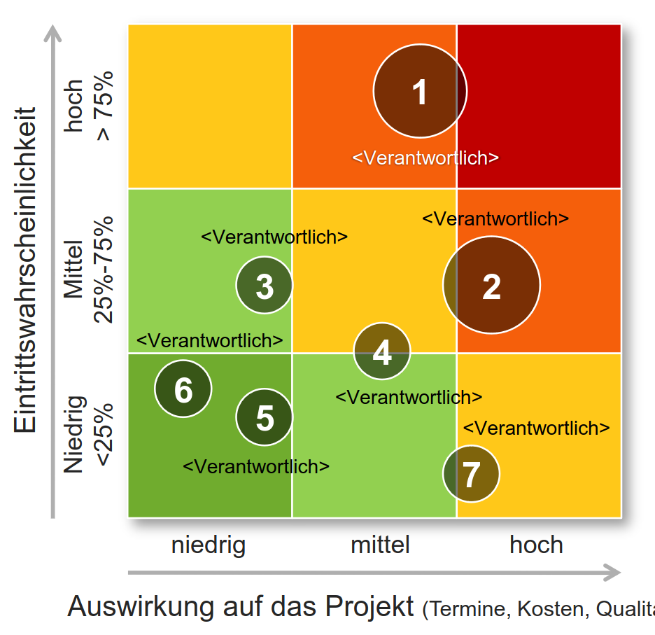
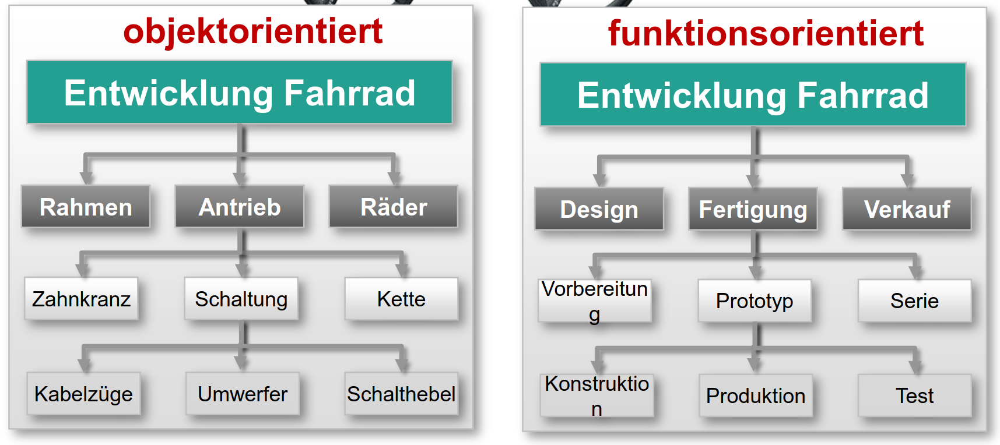
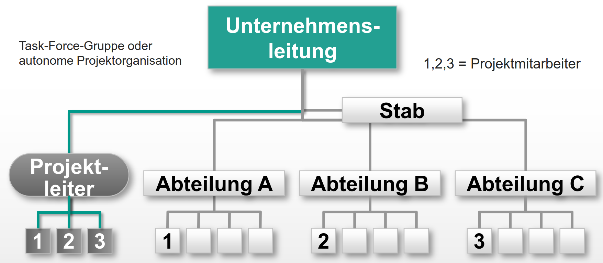
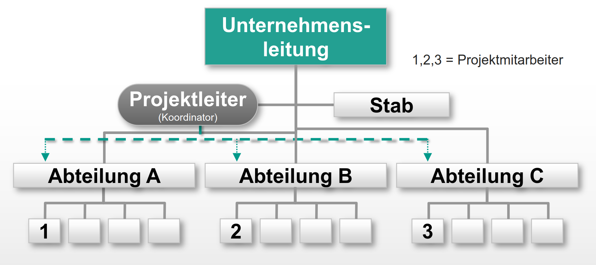
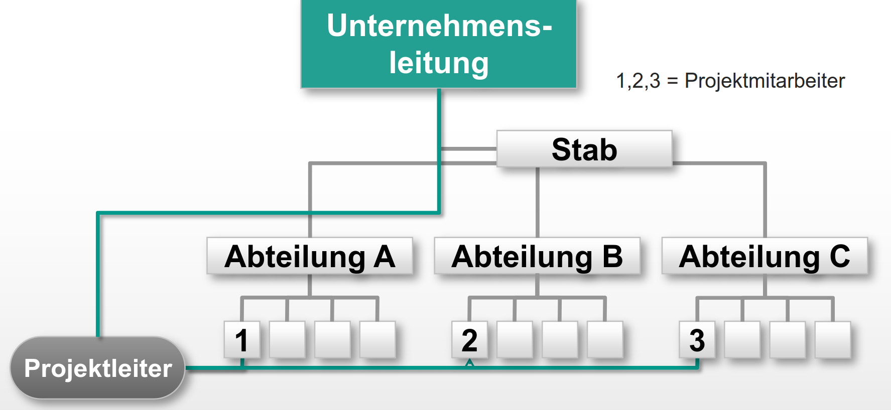

# Klausurvorbereitung

## [Unternehmen im Projektmanagement](/fom/semester-4/projektmanagement/unternehmen-im-projektmanagement.md)

## [Grundlagen von Projektmanagement](/fom/semester-4/projektmanagement/grundlagen-projektmanagement.md)

## [Einführung in das Projektmanagement](/fom/semester-4/projektmanagement/einfuehrung-in-das-projektmanagement.md)

## Fachbegriffe

- Opportunitätskosten: Kosten, die mit einer entgangenen oder nicht genutzten Möglichkeit (Opportunität) einhergehen
- Stakeholder: Person oder Gruppe, die ein Interesse am Projekt hat oder von diesem betroffen ist. (interne und externe Stakeholder)
- Sponsor: Person oder Organisation, die das Projekt finanziert, unterstützt und vertritt.

## Streckbriefe

### Projektantrag

Ein Projekt ist ein einmaliges, einzigartiges Vorhaben mit definierten Start und Endzeitpunkt, welches ein bestimmtes Ziel verfolgt.

- Projektname, Akronym
- Projektleiter, Mitglieder
- Kurzbeschreibung
- Ziele, Nicht-Ziele
- Art der Vergabe (intern, extern)
- Hauptaufgaben
- Grobe Termine
- Grobe Aufwandsabschätzung

### Zielkatalog

Ein Ziel ist ein Zustand in der Zukunft den es zu erreichen gilt.

Nach der SMART-Formel (spezifisch, messbar, erreichbar, relevant, terminiert)

Beispiel:

- Im 1. Quartal mindestens drei unterschiedliche Arten von umfassenden Marketingmaterialien (z. B. E-Book, Webinar, Videos, Verkaufsbroschüren) pro Monat produzieren
- Das Produktteam soll in der ersten Hälfte des Geschäftsjahrs 2022 an fünf funktionsübergreifenden Projekten im Bereich Usability-Tests, Kundenumfragen, Kundenmarketing oder Forschung und Entwicklung arbeiten.
- Ich werde trainieren, um den Berliner Halbmarathon im März in unter zwei Stunden zu laufen.

### Stakeholderanalyse

- Stakeholder sollen identifiziert werden (Heinz, 54 Geschäftsführer)
- Relevanz der Stakeholder (Heinz ist der Geschäftsführer)
- Interesse der Stakeholder (In Time, In Budget, In Function)
- Einfluss der Stakeholder (Heinz hat einen hohen Einfluss auf das Projekt, da er der Auftraggeber ist)
- Betroffenheit der Stakeholder (direkt, indirekt)
- Relevanz der Stakeholder (gering, mittel, hoch)
- Maßnahmen (z. B. Kommunikation, Einbindung, Information)

Beispiel:

- Heinz, 54 Geschäftsführer
- Hat etwas beauftragt, ist also direkt betroffen
- Zielgruppe vergrößern
- Beobachten, Befragen

#### Stakeholderanalyse-Matrix

### Risikoanalyse

Risiko ist ein mögliches Ereignis in der Zukunft, welches einen negativen Einfluss auf das Projekt haben kann.

- Name des Risikos
- Eintrittswahrscheinlichkeit (gering, mittel, hoch)
- Tragweite - Auswirkung auf Qualität, Kosten, Termine (gering, mittel, hoch)
- Bewertung - Wie ist das Projekt gefährdet? (gering, mittel, hoch)
- Gegenmaßnahmen - Wie kann gegengesteuert werden? (z. B. Risiko vermeiden, Risiko reduzieren, Risiko übertragen, Risiko akzeptieren)

#### Risikomatrix

- Legende einer Matrix -> Ausschnitt aus allen Risiken

### Informationsfluss

- Besprechung (Teilnehmer, Häufigkeit, Zeitpunkt)
- Protokoll (Verteiler, Speicherort, Zugriff)
- Projektordner (Inhalte, Aufbewahrungsort)
- E-Mail (Verteiler)
- Beantwortungszeiten
- Informationsverantwortliche (für Teilbereiche)
- Datenhaltung (z. B. Cloud, Server, USB-Stick)

### Arbeitspakete

Ein Arbeitspaket ist eindeutig identifizierbare Aufgabe, die von einer Person oder einer Arbeitsgruppe innerhalb eines Projekts zu erledigen ist.

- Arbeitspaketname
- Arbeitspaket Nr.
- Datum
- Verantwortlicher
- Input
- Aufgaben
- Output
- Dauer (in Tagen)
- Kosten

### Projektstrukturplan

### Balkenplan

> Ein Meilenstein ist ein klar definiertes Teilergebnis, das zu einem bestimmten Termin erreicht sein muss (Meilensteine im Gantt-Diagramm sind mit einem roten Diamanten gekennzeichnet).
{.is-info}

### Statusbericht / Projektcontrolling

- Datum
- Ersteller
- Projektname
- Projektabschnitt (Meilenstein)
- Projektleiter
- Verteiler
- Aktivitäten / Teilnehmer
- Status Qualität/ Termine (je im Soll, im Plan, im Verzug -> Begründung)
- Probleme / Risiken
- Maßnahmen (Beschreibung, Verantwortlicher, zu erledigen bis)
- Nächste Schritte

### Abschlussbericht

- Datum
- Ersteller
- Projektname
- Projektleiter
- Projektmitarbeiter
- Projektziele
- Projektergebnisse
- Projektablauf
- Entlastung des Projektteams (Unterzeichnung von Projektleitung)
- Anlagen
  - Projektauftrag
  - Letzter Stand Terminplan, Auftragskalkulation
  - Projektberichte
  - Projektabnahmeprotokoll

> Langzeitgier Mehrwert für Projekt-Durchführende Unternehmen ergibt sich aus Dokumentation der Projekte.
{.is-info}

### Projektorganisation

#### Reine Projektorganisation

- eignet sich für Großprojekte mit hoher Bedeutung
- Lösung von speziellen Aufgaben

Vorteile:

- klare Führungsrolle des Projektleiters
- Projektleiter hat Verantwortung
- Projekt hat eigene Ressourcen
- Mitarbeiter sind vollständig dem Projekt zugeordnet
- kurze Reaktionszeiten

Nachteile:

- Schwierig Mitarbeiter über Projektdauer auszulasten
- Projekt ist isoliert (keine einbindung vom Fachbereich)
- Aus- und Eingliederung der Mitarbeiter ist schwierig

#### Stablinien-Projektorganisation

- Projektleitung ist ohne Entscheidung- oder Weisungsbefugnis
- eignet sich für Projekte mit geringer Bedeutung (begrenzte Finanzmittel, geringes Risiko)

Vorteile:

- leicht und schnell zu realisieren
- einfache Reintegration der Mitarbeiter
- abteilungsübergreifend

Nachteile:

- schwache Position des Projektleiters
- Projektleiter hat keine Entscheidungsbefugnis
- Lange Reaktionszeiten

#### Matrix-Projektorganisation

-Mischform mit Kompetenzaufteilung zwischen Projektleitung und Linien-organisation

- geeignet für lange, komplexe Projekte mit hoher Bedeutung
- Projekte welche die Zusammenarbeit mehrerer Abteilungen erfordern
- Projektleiter ist aus der Linienorganisation ausgelagert
- Projektmitarbeiter ist disziplinarisch der Linienorganisation unterstellt
- Projektmitarbeiter arbeiten nicht ausschließlich im Projekt

Vorteile:

- Flexibler Einsatz der Mitarbeiter
- geringe Auslastung ist kein Problem
- übergreifendes Spezialwissen
- überwindet Grenzen der Linienorganisation

Nachteile:

- Konflikte zwischen Projektleiter und Linienmanager
- gute Abstimmung zwischen Projektleiter und Linienmanager notwendig
- Projektleiter hat keine Entscheidungsbefugnis aber Verantwortung
