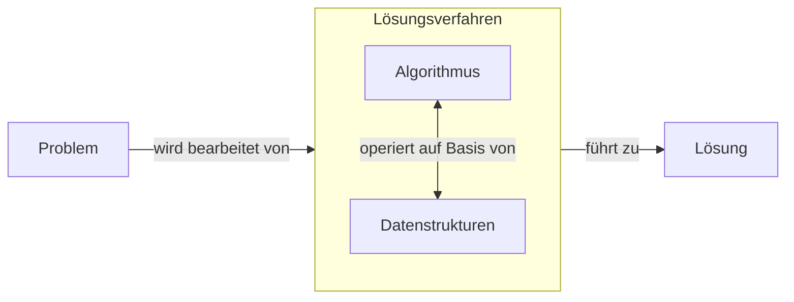

# Heranführung

## Grundlagen

### Algorithmen

- eindeutige Handlungsvorschrift zur Lösung eines Problems
- endlichtviele und wohldefinierte Schritte

Eigenschaften:

- Abstrahierung
  - löst eine Klasse von Problemen
- Finitheit
  - statisch: Beschreibung in endlicher Länge
  - dynamisch: Benötigte Ressourcen sind endlich
- Terminiertheit
  - liefert nach endlich vielen Schritten ein Ergebnis
- Determiniertheit
  - bei gleichen Eingabewerten und Startbedingungen immer das gleiche Ergebnis

### C++

- multi-purpose Programmiersprache

Eigenschaften:

- Imperativ
- Objektorientiert
- Abstrakt
- Maschinennah

### Laufzeitkomplexität

- beschreibt die Laufzeit eines Algorithmus in Abhängigkeit von der Größe der Eingabe
- Anzahl der Rechenoperationen kann je nach Hardware variieren

Fassungen der Laufzeitkomplexität:

- Big-$\Omicron$ Notation (Omikron)
  - Majorante
  - Worst-Case
- Big-$\Theta$ Notation (Theta)
  - Mittelwert
  - Average-Case
- Big-$\Omega$ Notation (Omega)
  - Minorante
  - Best-Case

> Es gilt $f_{1}(n) \leq f_{2}(n) \leq f_{3}(n)$

| Komplexität | $\Omicron$-Notation  | Anmerkung
| ----------- | --- | ---
|Konstant|$\Omicron(1)$|keine Abhängigkeit von der Eingabe
|Logarithmisch|$\Omicron(log(n))$| Binäre Suche|
|Linear| $\Omicron(n)$ | max- und min- Funktion
|$n*log(n)$| $\Omicron(n * log(n))$ |die schnellsten Sortieralgorithmen

