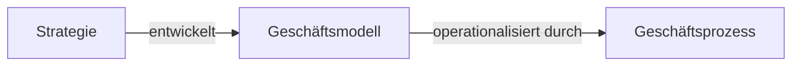
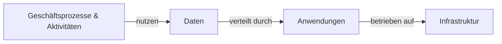

# Prozesse und Prozessmanagement

## Prozess

- wird durch Ereignisse ausgelöst
- bekommt Input
- erzeugt Output
- hat eine Zielsetzung
- hat bestimme Adressaten
- inhaltlich/logisch sinnvolle Verknüpfung von elementaren Aktivitäten  

Arten von Prozessen:

- Informatorische Prozesse
- Materielle Prozesse (häufig auch Informatorische Prozesse)

> Ein Prozess ist eine Folge logisch zusammenhängender Aktivitäten zur Erstellung einer kundenorientierten Leistung
{.is-info}

Einflussfaktoren auf Transformantionsprozesse:

- Führungsbeziehungen (z.B. Vorgesetzter trifft Einzelentscheidung)
- Organisationsbeziehungen (z.B. B2B)
- Zeitbeziehungen (z.B. Vorgelagerte Aktivitäten müssen abgeschlossen sein)
- Raumbeziehungen (z.B. Motor wird von einem Werk zu einem anderen Werk transportiert)

> Aus Kernkompetenzen können Geschäftsvorteile entstehen
{.is-info}

Prozessarten:

- nach Prozessgegenstand:
  - Materielle Prozesse -> Güterverkehr
  - Informatorische Prozesse -> Weiterleitung von Informationen
- nach Tätigkeit:
  - Leitungsprozesse:
    - direkt -> Bearbeitung von Gegenständen
    - indirekt -> Maschine wird gewartet
  - Führungsprozesse
- nach Marktbezug:
  - primärer Prozess
  - sekundärer Prozess
  - innovativer Prozess
  
Wie unterscheiden sich Prozesse von Projekten?

|Prozesse|Projekte|
|---|---|
|regelmäßig|einmalig|
|transformation von Input zu Output|erreichen Projektziel|
|start Prozessinstanz durch Ereignis|start durch Projektplanung|
|Organisation ist dauerhaft|Organisation ist für die Laufzeit|
|Ressourcen sind für mehrere Prozessinstanzen verfügbar|Ressourcen sind für Projekt verfügbar|

> Prozesse können Projekte beinhalten und Projekte können Prozessinstanzen starten
{.is-info}

## Geschäftsprozess

Elemente eines Geschäftsprozesses:

- Input -> Kunde gibt Auftrag
- Output -> Kunde erhält Ware, Dienstleistung
- Transformation -> Wertschöpfung
- Aktivitäten -> Tätigkeiten der Werteschöpfung
- Input-Output-Transformation -> Anforderungs-Ergebnis-Beziehung / End-to-End-Prozess

Außerdem:

- funktionsübergreifend
- organisationsübergreifend
- aus Kundensicht

> Geschäftsprozesse sind besondere Prozesse
{.is-info}

Ereignis|Prozesskette|Ereignis
---|---|---
Kundenbedürfnis|Produktentstehungsprozess|Produkt
Kundenwunsch|Auftragsgewinnungsprozess|Kundenauftrag
Kundenauftrag|Auftragsabwicklungsprozess|Produkt beim Kunden
Produktproblem|Serviceprozess|Problemlösung

Business Process Transformation Prozessarten:

- Managementprozesse:
  - Planung, Steuerung, Kontrolle
- Kernprozesse:
  - Werteschöpfungsprozesse (Umsatz generieren)
- Supportprozesse:
  - Unterstützung der Werteschöpfungsprozesse

### Geschäftsprozess und IT

> Bindeglied zwischen Unternehmensstrategie und Systementwicklung
{.is-info}
> Geschäftsprozess is Abfolge von Aufgaben, die von IT-Anwendungen unterstützt werden
{.is-info}

Alignment:

- IT an den Bedürfnissen einer Organisation ausrichten

Enabling:

- Organisation an Funktionsweise von IT ausrichten

Strategie zu Geschäftsprozess:

Schichtenmodell:

## Geschäftsprozessmanagement (GPM)

- PDCA (Plan-Do-Check-Act) Zyklus

> geplant, koordiniert, kontrolliert und gesteuert
{.is-info}

Geschäftsprozessmanagement:

- Prozessführung -> Wie wird es gemacht?
- Prozessorganisation -> Wer macht was?
- Prozesscontrolling -> Wie gut wird es gemacht?
  
### Dimensionen des Geschäftsprozessmanagements

Prozessqualität:

- First Pass Yield (FPY)
  - $FPY = \frac{\sum{Prozessergebnisse \ ohne \ Nacharbeit}}{\sum{alle \ Prozessergebnisse}}\%$
- Rolled Throughput Yield (RTY)
  - $RTY = FPY_1 *FPY_2* ... *FPY_n $

Prozesszeiten:

- Rüstzeit -> Zeit für Vorbereitung
- Ausführungszeit -> Zeit für eigentliche Bearbeitung
- Transportzeit -> Zeit für Transport zum nächsten Prozessschritt
- Liegezeit -> Verweildauer ohne Bearbeitung/Bewegung
- Durchlaufzeit -> Rüst- + Ausführungs- + Transport- + Liegezeit
- $Zeiteffizienz = \frac{Ausführungszeit}{Durchlaufzeit}\%$
- $Termintreue = \frac{\sum{termingerechte \ Prozessergebnisse}}{\sum{aller \ Prozessergebnisse}}\%$

> Aus Produktqualität und Termintreue erfolgt Kundenzufriedenheit
{.is-info}
> Zeiten und Produktqualität sind einfacher intern überwachbar und optimierbar
{.is-info}

Prozessprobleme:

- Beanstandungen (Prozessoutput)
- viele Fehler  (Prozessablauf)
- viele Änderungen
- hohe Produktionskosten
- hohe Prozesskosten
- lange Durchlaufzeiten
- schlechte Liefertreue
- hohe Bestände

> Prozesskosten ist die Menge der Ressourcen, die für Erstellung des Prozessergebnisses notwendig ist.
{.is-info}

<!-- S. 53 -->
### Prozessmodellierung und Geschäftsprozessmanagement
