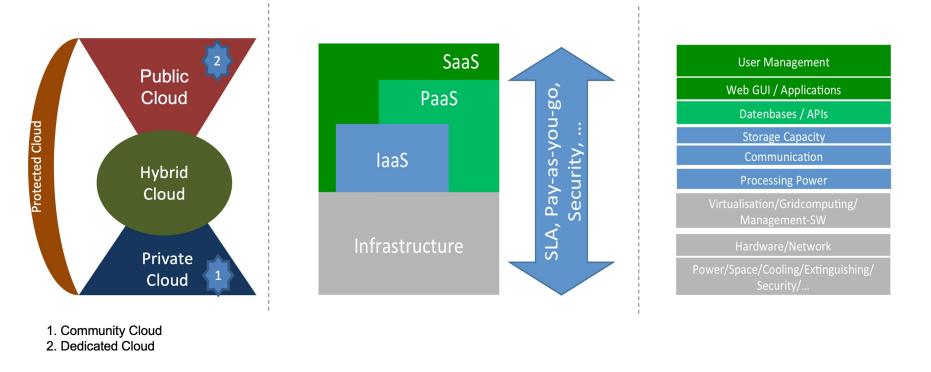

# Einführung verteilte Systeme

## Transparenz

Verteilte Systeme verbergen:

- Zugriffsart auf eine Ressource
- Speicherort einer Ressource
- Migration einer Ressource
- Relocation einer Ressource
- Replikation einer Ressource
- konkurrierende Zugriffe von mehreren Benutzern
- Ausfall und Wiederherstellung einer Ressourcen

## CAP Theorem

- Consistency
- Availability
- Persistence

Man kann nur zwei der drei Eigenschaften garantieren.

## TP-Monitor (Transaction Processing Monitor)

Ein Transaktionsmonitor:

- integriert verschiedene Systemkomponenten
- bietet für Anwendungen/Operationen standardisierte, gleichförmige Schnittstellen an die im Fehlerfall stets dasselbe Verhalten bieten
- Betriebssystem für transaktionsgeschützte Anwendungen
- Aufgabenspektrum
  - Klassen Client-Server-Kommunikationsverwaltung
  - Transaktionsverwaltung
  - Prozessverwaltung

## Middleware

- Softwarekomponenten, die zwischen Client und Server liegen

z.B.: IBM Netsphere, SAP NetWeaver

## Aufbau

Protokolle auf hoher Ebene:

1. Anwendung
1. Middleware
1. Dienste des Betriebssystems

Protokolle auf niedriger Ebene:

Dienste des Betriebssystems + Hardware:

1. Transport
1. Vermittlung
1. Sicherung
1. Bitübertragung (via Netzwerk)

> Trend: Verlagerung vom Server zum Client

## Streaming

- Qos über HLS bestimmt Qualität
- Latency -> Verzögerung durch Netzwerk
- Jitter -> Veränderung der Latency
- Puffer -> Verzögerung um Verzerrung zu vermeiden
- Synchronisation -> Synchronisation von Audio und Video usw.

## Mobile IP

- Mobile IP ist ein Verfahren zur dynamischen Adresszuweisung in mobilen Netzwerken
- DDNS -> dynamische DNS

## DNS Namensraum

|RR-Typ|Einheit|Beschreibung
|-|-|-|
|SOA|Zone|information zur dargestellten Zone
|A|Hots|Ip-Adresse des Hosts
|MX|Domäne|Verweist auf einen Mail-Server
|SRV|Domäne|Verweist auf einen Dienst
|NS|Zone|Verweist auf einen Nameserver
|CNAME|Zone|Symbolischer Link
|PTR|Host|kanonischer Name des Hosts
|HINFO|Host|Informationen über den Host
|TXT|Beliebig|zusätzliche Informationen

## Schutz vor Sicherheitsbedrohungen

Role Based Access Control (RBAC)

- Zugriff auf Ressourcen wird anhand der Rolle des Nutzers gesteuert

Mandatory Access Control (MAC)

- Marker, wenn Subjekt (Nutzer) Zugriff auf Objekt (Ressourcen) hat
