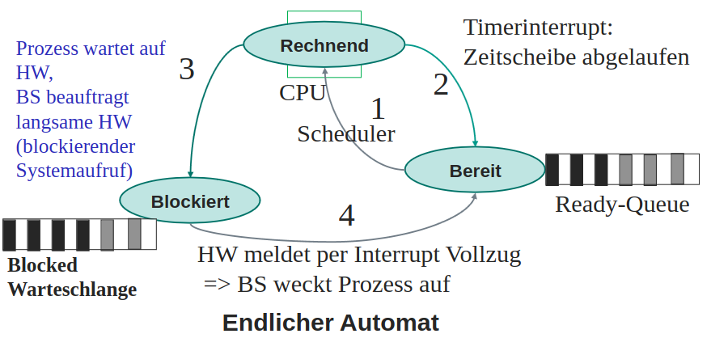

# Ablaufplanung / Scheduling

Prozesskontrollblock (PCB) enthält alle Informationen, die für die Ablaufplanung benötigt werden => Zeile in Prozesstabelle

## Kontextwechsel

- (1) Scheduler wählt Prozess aus Ready-Queue aus & Dispatcher startet Prozess in CPU
  - Scheduler ermittelt Prozess mit höchster Priorität (scheduling)
  - Registerwerte werden vom Dispatcher aus dem PCB geladen (Kontextwechsel)
  - Prozess wird in CPU gestartet und wechselt in Ring 3 (User-Mode)

- (2) Nach Ablauf der Zeit legt Dispatcher Prozess zurück in Ready-Queue
  - Wechsel in Ring 0 (Kernel-Mode)
  - Inhalte der Register werden vom Dispatcher in PCB gespeichert (Kontextwechsel)

- (3) Prozess startet I/O-Operation und wird in Blocked-Queue verschoben

- (4) Nach Abschluss der I/O-Operation wird Prozess in Ready-Queue verschoben

> (1) und (2) -> schneller & häufiger Kreislauf; (3) und (4) -> langsamer & seltener Kreislauf
{.is-info}

## Prozesskontext

- Benutzerkontext (Daten im zugewiesenen Adressraum)
  - Registerinhalte
  - Programmzähler
  - Stack
  - Heap

- Systemkontext (Informationen die Betriebssystem über den Prozess speichert)
- Kernel-Stack
- Dateiinformationen
- Netzwerkverbindungen

- Hardwarekontext (Inhalte der CPU-Register zur Ausführung des Prozesses)
  - CPU-Register
  - MMU-Register

## Scheduling-Kriterien aus Sicht des Benutzers

Scheduling-Verfahren (abhängig von Betriebsart)

- Stapelbetrieb
  - Minimieren der Durchlaufzeit
  - Maximieren von Durchsatz und CPU-Auslastung
  - Verfahren:
    - First-Come-First-Served (FCFS)
    - Shortest-Job-First (SJF)
    - Shortest-Remaining-Time (SRT)
- Interaktiver (Dialog-)Betrieb
  - Maximieren der Wartezeit
  - Minimieren der Antwortzeit
  - Verfahren:
    - Round-Robin (RR)
    - Multilevel-Feeback-Queue (MFQ)
- Real (Echtzeit-)Betrieb
  - Einhalten von Deadlines
  - Vorsehrbarkeit
  - Antwort & Durchlaufzeit wichtiger Threads unabhängig von Auslastung
  - Verfahren:
    - Priority Scheduling (PS)

## Scheduling-Kriterien aus Sicht des Betriebssystems

- Hohe CPU-Auslastung
- Fairness
- Prioritäten bestimmter Aufgaben

> Hohe CPU-Auslastung -> längere Antwortzeit
{.is-warning}

## First-Come-First-Served (FCFS)

Neue Prozesse werden in der Reihenfolge ihrer Ankunft in die Ready-Queue eingereiht.

- nicht preemptiv

Vorteile:

- einfach
- nicht unterbrechend

Nachteile:

- lange Wartezeiten
- lange Durchlaufzeiten

## Shortest-Job-First (SJF)

Reihenfolge der Prozesse wird nach der geschätzten Prozessdauer sortiert.

- nicht preemptiv

Vorteile:

- optimale Durchlaufzeit
- optimale Wartezeit

Nachteile:

- rechenzeit muss vorab bekannt sein oder geschätzt werden
- lange Wartezeiten für Prozesse mit langer Prozessdauer

## Round-Robin (RR)

Jeder Prozess bekommt eine bestimmte Zeit (Zeitscheibe) in der CPU zugewiesen. Ist die Zeit abgelaufen, wird der Prozess in die Ready-Queue verschoben und der nächste Prozess wird ausgeführt.

- preemptiv

Vorteile:

- jeder Prozess bekommt CPU-Zeit
- relativ kurze Antwortzeit

Nachteile:

- lange Prozessdauer
- aufwendig zu implementieren
- Zeitscheibe zu kurz -> hohe Anzahl an Kontextwechseln
- Zeitscheibe zu lang -> lange Warte/- Antwortzeit

## Scheduler für Harte Echtzeitsysteme

- müssen Deadlines einhalten
- Earliest Deadline First (EDF)
  - Prozess mit frühster Deadline wird zuerst ausgeführt
