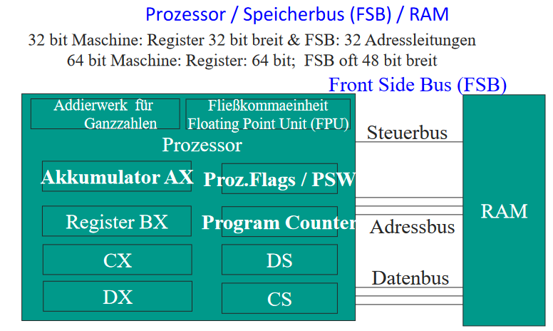
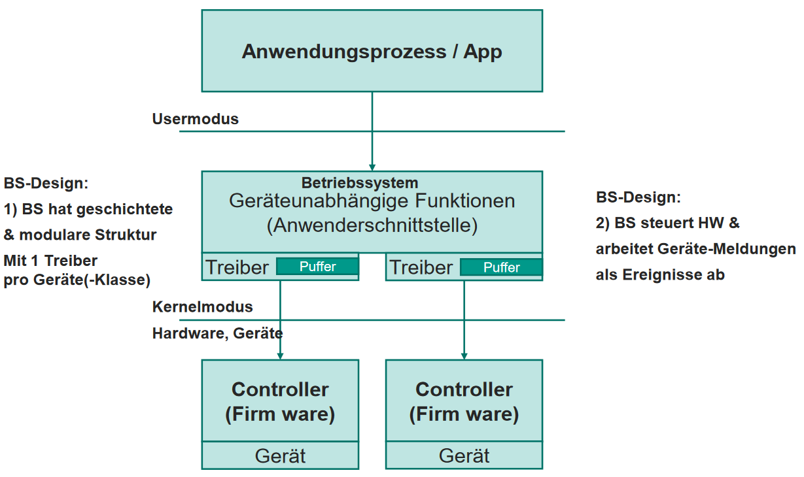
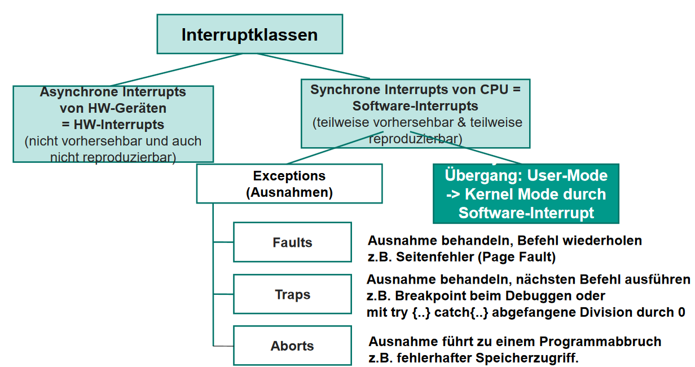
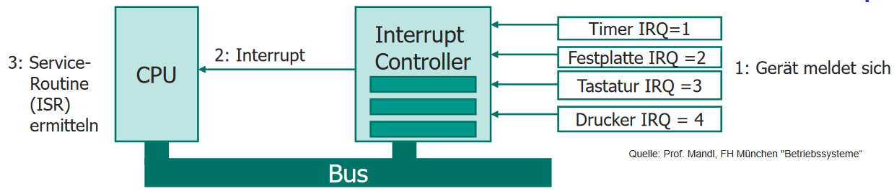

# Hardware und Ein-/Ausgabe

## von Neumann Architektur

[siehe Semester 1](/fom/semester-1/hardware-grundlagen/klausurvorbereitung.md#von-neumann-architektur)

- eingeschränkte Echtzeitfähigkeit aufgrund des Konkurrenzproblems
- Sicherheit reduziert

## Prozessor-Aufbau

<!--TODO S.83 -->

## Bus

- gemeinsamer Datenweg für mehrere Funktionseinheiten
- besteht aus Steuer-, Adress- & Datenleitungen
- immer nur 1 Teilnehmer kann senden (wird zu Busmaster)
- passive Komponenten (Slaves): z.B. Speicher, Peripherie

### CPU - Frontside Bus - RAM



## Schichtung des I/O-Systems



## Polling

> Synchrone von CPU gesteuerte Geräteabfrage
{.is-info}

- Aktives Abfragen des Gerätes
- oft im User-Mode möglich

### Busy Waiting

```pseudocode
while (device_busy()) {
    /* do nothing */
}
do_device_action();
```

- kein Multitasking möglich
- nur für kritische Geräte (z.B. Authentifizierung)

### Zyklisches Abfragen (Polling)

```pseudocode
while (device_ready() != READY) {
  sleep(100);
}
do_device_action();
```

- Multitasking möglich
- CPU-Last durch Polling

## Interrupts

> Asynchrone Geräteabfrage
{.is-info}

1. CPU sendet Anfrage an Controller
1. Controller bearbeitet Anfrage
1. Controller sendet Interrupt Request (IRQ) an CPU
1. CPU unterbricht aktuelle Ausführung
1. CPU bearbeitet Interrupt

> Betriebssysteme können Interrupts kurz unterbinden
{.is-info}

### DMA (Direct Memory Access)

- CPU beauftragt DMA-Controller
- DMA-Controller steuert Datenfluss zwischen Gerät und Speicher
- CPU wird nur bei Zeitaufwendige Ein- und Ausgaben, Fehlern oder Abschluss informiert

## Klassifizierung



- Externe Interrupts (Hardware): z.B. Tastatur, Maus, Netzwerk
  - Asynchron (nicht vorhersehbar)
  - unterscheidung zwischen [Block-Device](/fom/semester-1/hardware-grundlagen/Klausurvorbereitung2.md#block-device) und [Character-Device](/fom/semester-1/hardware-grundlagen/Klausurvorbereitung2.md#char-device)
- CPU-Interne Interrupts (Software): z.B. Division durch 0, Speicherzugriffsfehler
  - Synchron & von CPU ausgelöst
  - Sonderform Exception => Auftritt bei Fehlverhalten von Prozessen

## Ablauf Interruptbehandlung

- Bearbeitung von Interrupts durch Interrupt-Service-Routine (ISR)
- ISR ist Code der von CPU ausgeführt wird
- ISR wird durch Interrupt-Vektor angesprungen

1. Interrupt-Controller erhält Interrupt-Anforderung (IRQ) von Gerät
1. Interrupt-Controller priorisiert IRQs und leitet sie an CPU weiter
1. Betriebssystem ermittelt Speicheradresse der Interrupt-Service-Routine (ISR) aus Interrupt-Vektor
1. CPU führt ISR aus
1. ISR kopiert Daten vom Gerät in Speicher
1. CPU verarbeitet Daten


Ablauf ISR:

1. Weitere Interrupts sperrren
1. CPU-Register & Zustand des unterbrochenen Prozesses sichern
1. Anforderungen des Interrupts bearbeiten
1. Andere Interrupts freigeben
1. CPU-Register & Zustand des unterbrochenen Prozesses wiederherstellen

> Interrupt-Vektor: Tabelle mit Adressen der ISRs und attraktives Ziel für Angriffe
{.is-warning}
&nbsp;
> ISR sollte kurz gehalten werden da zeitgleich keine anderen wichtigen Interrupts bearbeitet werden können
{.is-info}
