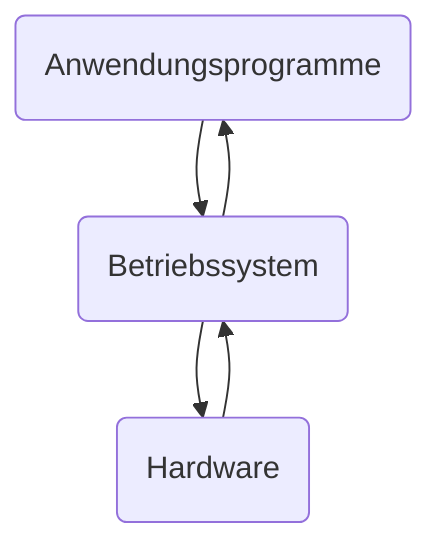

# Komponenten und Konzepte

## Begriffe

### TCO - Total Cost of Ownership

- Kosten Hardware
- Lizenzkosten
- Installations- und Anpassungskosten
- Migrationskosten
- Entwicklungskosten
- Schulungskosten
- Wartungskosten
- Entsorgungskosten

> Umstellung ist nicht schnell revidierbar
{.is-info}

### Betriebssystem

- ist die Software, die zusammen mit Hardware die Basis zum Betrieb eines Computersystems bildet
- abarbeitet und steuert Programme
- kann aus mehreren Schichten bestehen
- mit Hardware bildet eine virtuelle Maschine/ Ablaufumgebung mit stets gleichen Eigenschaften
- verwaltet vorhandene Geräte
- stellt Schnittstellen zur Hardware für Benutzer Programme bereit
- Abstraktion der Hardware
- Zugriff auf Ressourcen regeln

### Schichtenmodell

- jede Schicht hat eine Aufgabe
- bietet Dienste nach oben
- nutzt Dienste von unten
- jede Schicht ist im idealen Schichtenmodell einzeln austauschbar
- im nicht idealen Schichtenmodell müssen mehrere Schichten ausgetauscht werden
- nur benachbarte Schichten kommunizieren miteinander
- jede hat eine eigene Aufgabe und die Implementierung ist verborgen (Blackbox)

Vorteile:

- Portierbarkeit
- Wartbarkeit
- Skalierbarkeit
- einfachere Fehlersuche

Nachteile:

- mehr Kommunikation
- mehr Overhead

> HAL - Hardware Abstraction Layer
{.is-info}

### Teile eines Betriebssystems

Ein Betriebssystem enthaltet folgende Teile:

- Verwaltungsroutinen
  - CPU-Zuteilung
  - Speicher-Zuteilung
  - Interprozesskommunikation

Monolithische Betriebssysteme (Beispiel: Linux-Kernel) können außerdem enthalten:

- Partitionen & Dateisystem für Speichermedien-Belegung
- Verwalten & Teilen von Geräten - z. B. Druckern
- Treiber (Steuerprogramme) für Peripheriegeräte
  - binden Hardware an Betriebssystem an
  - veranlassen
- Dienstprogramme:
  - Config-Tools
  - Dateien anzeigen und bearbeiten
  - Kopieren/Sichern/Wiederherstellen von Daten
- Bibliotheken:
  - Hilfs-Routinen für Anwendungsprogramme
- Betriebssystem-Kern -> Kernel mit Basis-Funktionen (z. B.  CPU & RAM Zuteilung)

### Betriebssysteme Kategorien

1. Großrechner-Betriebssysteme -> Supercomputer
1. Server-Betriebssysteme
1. Client-Betriebssysteme
1. Multiprocessor-Betriebssysteme
1. Embedded-Betriebssysteme
1. SmartCard-Betriebssysteme
1. Echtzeit-Betriebssysteme
1. Universale-Betriebssysteme

S. 28
