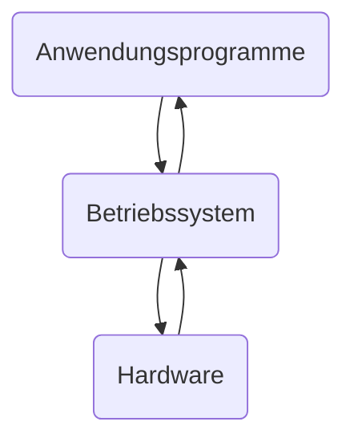
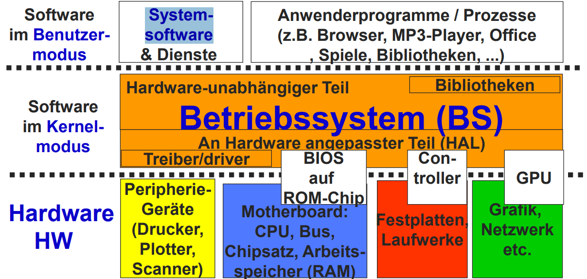

# Komponenten und Konzepte

## Begriffe

### TCO - Total Cost of Ownership

- Kosten Hardware
- Lizenzkosten
- Installations- und Anpassungskosten
- Migrationskosten
- Entwicklungskosten
- Schulungskosten
- Wartungskosten
- Entsorgungskosten

> Umstellung ist nicht schnell revidierbar
{.is-info}

### Betriebssystem

- ist die Software, die zusammen mit Hardware die Basis zum Betrieb eines Computersystems bildet
- abarbeitet und steuert Programme
- kann aus mehreren Schichten bestehen
- mit Hardware bildet eine virtuelle Maschine/ Ablaufumgebung mit stets gleichen Eigenschaften
- verwaltet vorhandene Geräte
- stellt Schnittstellen zur Hardware für Benutzer Programme bereit
- Abstraktion der Hardware
- Zugriff auf Ressourcen regeln

### Betriebssystemschichten

- jede Schicht hat eine Aufgabe
- bietet Dienste nach oben
- nutzt Dienste von unten
- jede Schicht ist im idealen Schichtenmodell einzeln austauschbar
- im nicht idealen Schichtenmodell müssen mehrere Schichten ausgetauscht werden
- nur benachbarte Schichten kommunizieren miteinander
- jede hat eine eigene Aufgabe und die Implementierung ist verborgen (Blackbox)

Vorteile:

- Portierbarkeit
- Wartbarkeit
- Skalierbarkeit
- einfachere Fehlersuche

Nachteile:

- mehr Kommunikation
- mehr Overhead

> HAL - Hardware Abstraction Layer
{.is-info}

### Teile eines Betriebssystems

Ein Betriebssystem enthaltet folgende Teile:

- Verwaltungsroutinen
  - CPU-Zuteilung
  - Speicher-Zuteilung
  - Interprozesskommunikation

Monolithische Betriebssysteme (Beispiel: Linux-Kernel) können außerdem enthalten:

- Partitionen & Dateisystem für Speichermedien-Belegung
- Verwalten & Teilen von Geräten - z. B. Druckern
- Treiber (Steuerprogramme) für Peripheriegeräte
  - binden Hardware an Betriebssystem an
  - veranlassen
- Dienstprogramme:
  - Config-Tools
  - Dateien anzeigen und bearbeiten
  - Kopieren/Sichern/Wiederherstellen von Daten
- Bibliotheken:
  - Hilfs-Routinen für Anwendungsprogramme
- Betriebssystem-Kern -> Kernel mit Basis-Funktionen (z. B.  CPU & RAM Zuteilung)

### Betriebssysteme Kategorien

1. Großrechner-Betriebssysteme -> Supercomputer
1. Server-Betriebssysteme
1. Client-Betriebssysteme
1. Multiprocessor-Betriebssysteme
1. Embedded-Betriebssysteme
1. SmartCard-Betriebssysteme
1. Echtzeit-Betriebssysteme
1. Universale-Betriebssysteme

#### Großrechner-Betriebssysteme

- Mainframe-Betriebssysteme
- Stapelverarbeitung "Batch Processing"
- Dialogbetrieb mit Time-Sharing-Verfahren
- Transaktionsverarbeitung

> Beispiel für Großrechner-Betriebssysteme: IBM z/OS, Linux
{.is-info}

#### Server-Betriebssysteme

- stellen Dienste für andere Systeme bereit
  - Druckdienste
  - Dateidienste
  - Webdienste

> Beispiel für Server-Betriebssysteme: Windows Server, Linux
{.is-info}

#### Client-Betriebssysteme

- Einbenutzer-Betrieb
- Interaktive Bedienung

> Beispiel für Client-Betriebssysteme: Windows, Linux, MacOS
{.is-info}

#### Multi-Prozessor-Betriebssysteme ()

- Mehrere Prozessoren

> Beispiel für Multi-Prozessor-Betriebssysteme: Linux, Windows Server
{.is-info}

#### Embedded-Betriebssysteme

- steuert Einzelgräte (z. B. Waschmaschine, Telefon)
- mobiles Gerät (z. B. Smartphone, Tablet)
- weiche Echtzeitanforderungen (z. B. VoIP) & eingeschränkte Ressourcen

> Beispiel für Embedded-Betriebssysteme: Android, Tizen, iOS
{.is-info}

#### SmartCard-Betriebssysteme

- Rechner auf Chipkarte
- stark eingeschränkte Ressourcen
- wenig spezielle Anforderungen
- meist primitiv und proprietär

#### Echtzeit Betriebssysteme

- "Zeit" ist wesentliches Kriterium (Rechtzeitig - Aufgabe wird nie später als gefordert gestartet)
- steuern technische Prozesse oder Vorgänge in der Außenwelt
- harte Echtzeit: Aufgabe muss immer rechtzeitig gestartet werden
- weiche Echtzeit: Nichteinhalten von Zeitgarantien führt zu Qualitätsverlust

> Beispiel für **harte** Echtzeit Betriebssysteme (Kraftwerke, Fahrzeuge): VxWorks
{.is-info}
&nbsp;  
> Beispiel für **weiche** Echtzeit Betriebssysteme (Audio-(VOIP), Video-Applikationen): QNX (Navi-Betriebssystem im Auto)
{.is-info}

### Anforderungen an Betriebssysteme

- unempfindlich gegenüber Abstürzen von Anwendungsprogrammen
- offen für Anwendungsprogramme, Erweiterungen und Treiber
- läuft auf unterschiedlicher Hardware

> Im Kernel ist mindestens die Prozess- & Speicherorganisation und Interprozesskommunikation enthalten
{.is-info}

### Kernel-Einordnung im Betriebssystem

- User-Mode
  - Standardsoftware
  - Individualsoftware
- Treiber, Hardwarenahe Module + Systembibliotheken, Standardmodule
- Betriebssystem-Kern

> Prozesse kommunizieren mit dem Betriebssystem-Kern über Systemaufrufe (System Calls)
{.is-info}
&nbsp;  
> Nur das Betriebssystem im Kernel-Mode kann auf die Hardware & Betriebssystem-Speicherbereich zugreifen
{.is-info}

### Sicherheits-Architektur moderner CPUs (Ringe)

Nur Betriebssystem hat Zugriff auf die Hardware um:

- Zugriffe der Prozesse auf Hardware fair koordinieren
- Beschädigung der Hardware durch Prozesse verhindern
- Prozesse voneinander isolieren
- User-Mode beschränkt nutzbaren Befehlssatz
  - kann nicht direkt auf Hardware zugreifen
  - kann nicht die Privilegierungsebene ändern

> Prozessor-Operations-Wechsel zwischen User-Mode und Kernel-Mode erfordert einen doppelten Kontextwechsel, der Rechenzeit in Anspruch nimmt (Prozess -> Kernel -> Prozess)
{.is-info}
