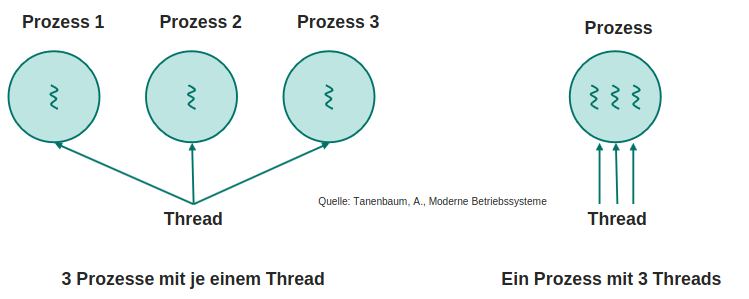

# Prozesse und Threads

Programme und Prozess:

- Programm: in Datei notierter [Algorithmus](/fom/semester-3/it-infrastruktur/it-infrastruktur.md#algorithmus)
- Prozess:
  - Programm in Ausführung (Ressourcenbesitz & Ausführung)
  - besitzt Prozessumgebung
  - kann über Systemcalls mit anderen Prozessen kommunizieren / weitere Prozesse erzeugen
  - kann von anderen Prozessen abhängig sein
  - können Prioritäten haben
  - Prozesstabelle heißt PCB (Process Control Block)
  - Enthält einen oder mehrere Threads
  - Windows: Prozess-Priorität wird via Wert 1-15 festgelegt (> 15 = Echtzeitprozess)
- Thread:
  - sequentieller Abarbeitungslauf innerhalb eines Prozesses
  - Betriebssystem und Programm muss Multithreading unterstützen
  - Teilt sich Ressourcen mit anderen Threads des Prozesses
  - Kernel-Thread: vom Betriebssystem verwaltet (präemptiv)
  - User-Thread: vom Programm verwaltet (kooperativ)
- Task: Sammelbegriff für Prozesse und Threads

Unterschiede zwischen Prozess und Thread:

- Prozess kann mehrere Threads haben (z.B. UI & Hintergrundprozesse)
- Prozess hat eigenen Adressraum, Threads teilen sich Adressraum

> Wird ein Programm von einem Betriebssystem ausgeführt, wird der Ablauf Prozess/Thread genannt.
{.is-info}
&nbsp;
> Mehrere Programme laufen in mehreren Prozessen gleichzeitig und parallel auf einem sequentiell arbeitenden Rechner.
{.is-info}
> Echt parallele Abarbeitung eines Prozesses mit mehreren Threads gleichzeitig unterscheidet sich von Quasi-paralleler Abarbeitung bei der mehrere Prozesse nacheinander abgearbeitet werden.
{.is-info}

## Speicherbereiche eines Prozesses

- Code-Segment:
  - Programmcode
- Daten-Segment:
  - alles was mit `new` angelegt wird
  - globale Variablen
  - kann dynamisch (zur Laufzeit) angefordert werden
- Stack-Segment:
  - lokale Laufzeitinformationen der aktuellen Methode
  - Rücksprungadresse
  - übergebene Parameter
- Status-Informationen:
  - Prozess-ID
  - Priorität
  - Zustand

## Organisation von Prozessen

- Scheduler: verwaltet Prozesse / entscheidet, welcher Prozess wann ausgeführt wird
- Dispatcher:
  1. Kopiert Register-Inhalte des Prozesses aus Arbeitsspeicher in CPU-Register
  1. Wechselt in User-Mode und führt Prozess aus
  1. Nach Zeitablauf / Interrupt / Prozessende speichert Register-Inhalte von CPU in Arbeitsspeicher

  

## Prozesszustände

- rechnend / aktiv -> wird gerade ausgeführt
- blockiert -> wartet auf Ereignis (z.B. I/O)
- bereit -> wartet auf CPU-Zuteilung
- beendet -> Ausführung beendet

## Prozessverwaltung

- Dispatcher
  - bei Unterbrechung: sichert aktuelle Register-Inhalte in den Arbeitsspeicher
  - bei Wiederherstellung: stellt Register-Inhalte des nächsten Prozesses wieder her
- Scheduler
  - entscheidet, welcher Prozess wann ausgeführt wird
  - kann nach Priorität, Zeit, etc. entscheiden

> Reicht der Arbeitsspeicher nicht aus, um alle Prozesse zu verwalten, werden Prozesse ausgelagert (swappen) und später wieder eingelagert.
{.is-info}

## Interprozesskommunikation

- Prozesse kommunizieren über:
  - Signale (Interrupts)
  - Nachrichten (d-bus)
  - Sockets (TCP/IP)
  - Fernaufrufe (RPC)
  - gemeinsame Speicherbereiche (RAM)
  - Daten auf der Festplatte (HDD)
  - über Pipes kommunizieren
- kritischer Abschnitt: Programmteil, der nur von einem Prozess gleichzeitig ausgeführt werden darf
- Semaphore:
  - Variable, die den Zugriff auf einen kritischen Abschnitt regelt
  - benachrichtigt wartende Prozesse bei Verfügbarkeit
  - kann von jedem Prozess benachrichtigt werden
  - eignet sich für die Synchronisation von Prozessen (z.B. Producer-Consumer)
- Mutex:
  - Semaphore mit Wert 0 oder 1
  - schützt Datenstrukturen
  - blockiert Zugriff
  - kann nur von dem Prozess, der den Mutex gesetzt hat, wieder freigegeben werden

## Prozesssynchronisation

Synchronisations-Probleme:

- Producer-Consumer-Problem
  - Prozesse sind von einander abhängig
  - Consumer möchte Daten vom Producer holen -> Semaphore : Consumer kann Daten erst holen, wenn Producer sie bereitgestellt hat
- exklusiv nutzbares Betriebsmittel
  - Schreib-Schreib-Konflikt
    - mehrere Prozesse wollen gleichzeitig in gleiche Datei schreiben -> Semaphore : regelt dass nacheinander geschrieben wird
  - Schreib-Lese-Konflikt
    - Lesender Prozess unterbricht schreibenden Prozess -> Semaphore : erlaubt erst Lesen, wenn Schreiben abgeschlossen ist

Lösungen:

- nur 1 Prozess im kritischen Abschnitt
- keine Annahmen über Geschwindigkeit der Prozesse / Anzahl der CPU
- kein Prozess darf unendlich lange im kritischen Abschnitt bleiben (verhindert Deadlock)
- kein Prozess soll unendlich lange auf Eintritt in kritischen Abschnitt warten müssen (verhindert Deadlock)

> Ampel = Semaphore oder Monitor der sicherstellt das nur ein Prozess im kritischen Bereich schreibt.
{.is-info}

### Semaphoren

- für jede schützenswerte Datenmenge wird eine Variable angelegt
- signalisiert Zustand und gibt in Abhängigkeit davon kritischen Bereich frei oder sperrt ihn
- sind Betriebsmittel zugeordnet
- Verwalten Warteliste für Betriebsmittel
- binäre Semaphore (Mutex):
  - Wert 0 oder 1
  - 0 = gesperrt
  - 1 = frei
  - für unteilbare Ressourcen (z.B. CPU)
- nicht negativer Zähler (zählende Semaphore)
  - wird mit Anzahl der freien Ressourcen initialisiert
  - wird bei jeder Anforderung einer Ressource dekrementiert
  - wird bei Freigabe einer Ressource inkrementiert

### Monitore

- Mechanismus zur Steuerung eines ausschließlichen Zugriffs auf Daten
- Monitor fordert Betriebssystem auf, Kritischen Bereich mit Semaphore zu schützen

> Monitor muss nicht vom Programmierer implementiert werden
{.is-info}

### Locks

- Sperre des Zugriffs während laufender Operationen -> File-Lock beim Schreiben in Datei
- kann mit Scheduler realisiert werden -> weißt keine Rechenzeit zu bis der Lock aufgehoben ist

> Mit Locks können Anwendungen Thread Safe gemacht werden.
{.is-info}

### Deadlocks

- Prozesse warten aufeinander und blockieren sich gegenseitig
- Ereignisse werden niemals ausgelöst
- Prozesse werden nicht mehr aktiv

Deadlock-Auslöser:

- wechselseitiger Ausschluss (Resource kann nur von einem Prozess genutzt werden)
- Halten und Warten (Prozess hält Ressource und wartet auf weitere Ressourcen)
- Ununterbrechbarkeit (Ressource kann nicht entzogen werden)
- Zyklisches Warten (Prozesse warten in einer Kette aufeinander)

Behandlungen:

- Vogel-Strauß-Algorithmus
  - nichts tun
- Deadlock-Avoidance (Vermeidung)
  - lässt Ressourcenanforderung nicht zu wenn sie zu Deadlock führen würde

- Deadlock-Detection (Erkennung & Behebung zur Laufzeit)
  - lässt zunächst alle Anforderungen zu
  - bei Deadlock -> Deadlock-Behebung (Rollback)
- Deadlock-Prevention (Verhinderung)
  - macht Deadlock Auslöser im Vorfeld unerfüllbar durch Belegungsordnung

> Einzige Lösung: Prozesse beenden und neu starten
{.is-info}
