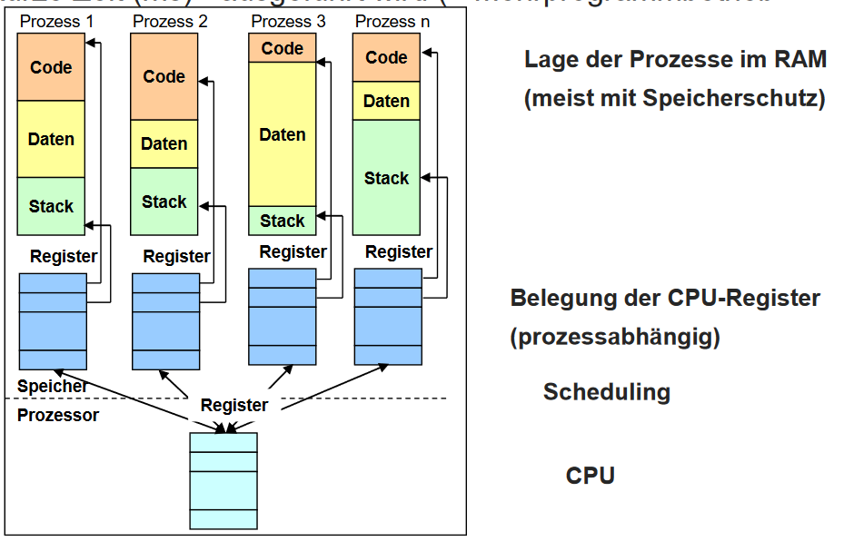
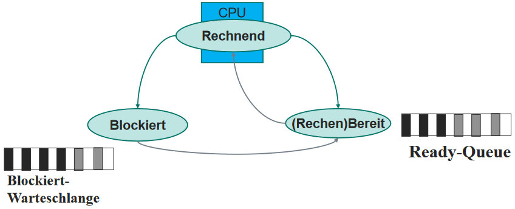

# Prozesse und Threads

Programme und Prozess:

- Programm: in Datei notierter [Algorithmus](/fom/semester-3/it-infrastruktur/it-infrastruktur.md#algorithmus)
- Prozess:
  - Programm in Ausführung (Ressourcenbesitz & Ausführung)
  - besitzt Prozessumgebung
  - kann über Systemcalls mit anderen Prozessen kommunizieren / weitere Prozesse erzeugen
  - kann von anderen Prozessen abhängig sein
  - können Prioritäten haben
  - Prozesstabelle heißt PCB (Process Control Block)
- Thread: sequentieller Abarbeitungslauf innerhalb eines Prozesses
- Task: Sammelbegriff für Prozesse und Threads

Unterschiede zwischen Prozess und Thread:

- Prozess kann mehrere Threads haben (z.B. UI & Hintergrundprozesse)

> Wird ein Programm von einem Betriebssystem ausgeführt, wird der Ablauf Prozess/Thread genannt.
{.is-info}
&nbsp;
> Mehrere Programme laufen in mehreren Prozessen gleichzeitig und parallel auf einem sequentiell arbeitenden Rechner.
{.is-info}

## Speicherbereiche eines Prozesses

- Code-Segment:
  - Programmcode
- Daten-Segment:
  - alles was mit `new` angelegt wird
  - globale Variablen
  - kann dynamisch (zur Laufzeit) angefordert werden
- Stack-Segment:
  - lokale Laufzeitinformationen der aktuellen Methode
  - Rücksprungadresse
  - übergebene Parameter
- Status-Informationen:
  - Prozess-ID
  - Priorität
  - Zustand

## Organisation von Prozessen

- Scheduler: verwaltet Prozesse / entscheidet, welcher Prozess wann ausgeführt wird
- Dispatcher:
  1. Kopiert Register-Inhalte des Prozesses aus Arbeitsspeicher in CPU-Register
  1. Wechselt in User-Mode und führt Prozess aus
  1. Nach Zeitablauf / Interrupt / Prozessende speichert Register-Inhalte von CPU in Arbeitsspeicher

  

## Prozesszustände

- rechnend / aktiv -> wird gerade ausgeführt
- blockiert -> wartet auf Ereignis (z.B. I/O)
- bereit -> wartet auf CPU-Zuteilung

