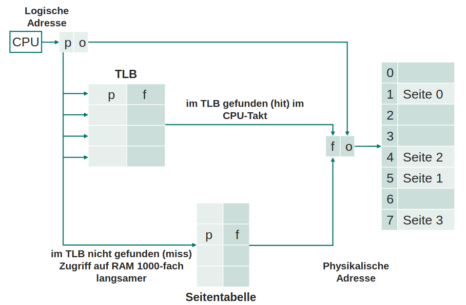
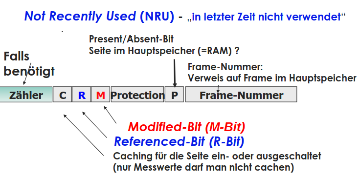

# Speicher(-verwaltung)

- damals Absolute Adressierung
- heute Relativer Adressierung mit Basisadresse
  - Code im Hauptspeicher ist verschiebbar
  - Trennung von logischen und physikalischen Adressen
  - Programme, Bibliotheken, Treiber, etc. werden an beliebige Basisadresse geladen
  - Hauptspeicher-Aufteilung zwischen Betriebssystem und Prozessen
    - Speicher vergeben und zurücknehmen
    - Speicherbereiche schützen (Zugriffsrechte)
    - Buchhaltung über Speicherbelegung (Frei/Belegt)

## Speicherhierarchie

- flüchtig (nicht persistent)
  - Register (KiB)
  - Cache (MiB)
  - RAM (GiB)
- nicht flüchtig (persistent)
  - HDD/SSD (TiB)
  - USB Sticks
  - CD/DVD
  - Band

> Kosten steigen mit der Geschwindigkeit, Zugriffszeit steigt mit Kapazität
{.is-info}

## Hauptspeicher

- jedes Byte hat eigene Adresse -> lesen & schreiben
- Adressraum beginnt bei 0
- CPU & E/A Geräte greifen auf Hauptspeicher zu

> CPU kann nur auf Hauptspeicher zugreifen, nicht auf Festplatte
{.is-info}

### Zu wenig schneller Speicher (RAM)

- RAM Speicher Verwaltung -> statische/dynamische Partition pro Prozess
  - je ein Bereich für Betriebssystem und Prozesse
  - Schutz des Betriebssystems durch Bereichsüberwachung
- Swapping ganzer Prozesse auf Festspeicher
- Virtueller Speicher(Paging) -> nur unwichtige Pages werden ausgelagert
  - Zugriff auf Page die nicht im Hauptspeicher ist -> Page Fault
  - Pages sind für Programme sichtbar (kontinuierlicher Adressraum)
  - jedes Programm hat eigene Page-Table
    - erste Spalte: virtuelle Adresse (Seiten-Nummer)
    - zweite Spalte: physikalische Adresse (Frame-Nummer)
  - MMU (Memory Management Unit) übersetzt virtuelle in physikalische Adresse
    - Teil des Prozessors
    - CPU sendet virtuelle Adresse an MMU -> MMU findet physikalische Adresse und sendet diese an Hauptspeicher
    - Adressumsetzung mit Tabellen vor jedem Speicherzugriff
    - Translation Lookaside Buffer (TLB) -> Cache für Page-Table Einträge
      - assoziativ Speicher -> Suche innerhalb eines Taktzyklus (Hardware-gestützt)
  - Adressumrechnung
    - Speicheradresse: oberste Bits -> Page; untere Bits -> Offset innerhalb der Page
    - offset < Page-Größe
  - große Pages (z.B. für Datenbanken)
    - weniger Page-Table Einträge -> weniger TLB Cache Misses  
    - größerer Verschnitt
  - mehrstufige Seitentabellen
    - 64bit CPU
    - vermeiden von Beschreibung von nicht verwendeten Speicherplatz

## Speicherbuchhaltung

- Bitmap
  - jedes Bit identifiziert einen kleinen Speicherbereich
  - 1 = belegt, 0 = frei
- Freibereichs-Listen
  - Liste mit freien (H) und belegten (P) Speicherbereichen
  - jeder Eintrag enthält Länge und Start-Adresse des Speicherbereichs
  
## Seiten-Ersetzungsstrategien

- Beladys Optimaler Algorithmus
  - zukünftige Referenzen werden vorhergesagt
  - nicht implementierbar
- First In First Out (FIFO) / Second Chance (SC)
  - älteste Page wird ausgelagert
- Clock Page
  - verbesserte Variante von SC mit zirkularer Datenstruktur
  - kein regelmäßiges Zurücksetzen der R-Bits
- Least Recently Used (LRU)
  - Page mit ältestem Zugriff wird ausgelagert
  - keine Hardware-Unterstützung für benötigte Zeitstempel
- Not Frequently Used (NFU)
  - Page mit wenigsten Zugriffen wird ausgelagert
  - Zugriffszähler wird bei jedem Zugriff erhöht und bei check reduziert
- Not Recently Used (NRU)
  - Page die kürzlich nicht verwendet wurde wird ausgelagert

## Aufbau der Seitentabelle

### NRU

- R & M Bits werden von MMU gesetzt; vom OS zurückgesetzt
- Zähler wird von OS verwaltet, nicht von MMU  

- Prioritäten
  1. R = 0, M = 0 -> nicht referenziert, nicht modifiziert
  1. R = 0, M = 1 -> nicht referenziert, modifiziert
  1. R = 1, M = 0 -> referenziert, nicht modifiziert
  1. R = 1, M = 1 -> referenziert, modifiziert

### FIFO
