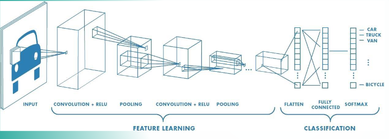

# Deep Learning

## Unterschied zwischen Machine Learning und Deep Learning

- Feature Extraction
  - Machine Learning: manuelle Feature Extraction
  - Deep Learning: automatische Feature Extraction
- Deep Learning ist eine Unterkategorie von Machine Learning

## RoBERTa

- Token: Teil eines Textes als numerischer Wert
- Ziel: 256-dimensionalen Vektor der ein Token in in seinem Kontext repräsentiert
- Output: Kontextabhängige Embeddings als Input für weitere Klassifikation

### Wörterbuch mit Tokenizer (Byte-Pair-Encoding) erstellen und Text in Tokens umwandeln

1. Pre-Tokenization

- Trainingsdaten durch Leerzeichen splitten
- Häufigkeit einzelner Wörter bestimmen

2. Basis Zeichensätze hinzufügen

- Buchstaben und besondere Zeichen dem Wörterbuch hinzufügen
- kann auf Byte-Ebene erfolgen und auch für andere Sprachen verwendet werden

3. Sukzessive Tokens zusammenführen

- häufigste Zeichenkombinationen werden zu neuen Token zusammengefasst

4. Stop

- wenn bestimmte Bedingungen erfüllt sind wie z.B. maximale Anzahl an Tokens oder Häufigkeitsgrenze -> Prozess beenden

> Auch Satzanfang, -ende und Leerzeichen werden als Token erkannt
{.is-info}

### Input Embedding

1. Einbetten des Tokens in den euklidischen Raum über Lookup-Table (kein Kontext enthalten)
2. Überführung des Vektors in eine weitere (trainierte) Lookup-Table die Token in ihrem sprachlichen Kontext darstellt

- word encoding * position encoding = input embedding

3. Berechnung der Self-Attention über den Attention-Score

- Zeigt an jeder Position an, bei welchem Token die Aufmerksamkeit hoch ist

> Jedes Embedding enthält Information von kontextabhängigen Tokens mit einer starken "Attention" => dasselbe Token bekommt in einer anderen Umgebung eine andere Bedeutung
{.is-info}

### Pre-Training BERT

- Trainiere die Gewichte von RoBERTa, dass (natürliche) Sprache auf Basis von großen Datenmengen verstanden werden kann.
- Fehlfunktion: Teile des Satzes werden maskiert und müssen vom Modell vorhergesagt werden

1. Selektiere 15% der Tokens, davon werden

- 80% maskiert
- 10% durch ein anderes Token ersetzt
- 10% bleiben unverändert

2. Berechne kontextabhängige Embeddings der selektierten Tokens
3. Berechne Outputs über den Language-Model-Head
4. Softmax Aktivierungsfunktion
5. Berechnung des Cross-Entropy-Loss und wende Backpropagation an

## Convolutional Neural Networks (CNN)

- Mehrschichtige Modelle mit Feature Learning und anschließender Klassifikation
- erkennt und extrahiert Merkmale aus Bildern mit Hilfe von Filtern
- Erkennung von Strukturen in Bildern (z.B. Kanten, Ecken, Farben)
- lernen von Kombinationen von Merkmalen
- mit zunehmender Tiefe werden immer komplexere Merkmale erkannt
- Daten werden in neuen Ebenen neu abgetastet und gefiltert
- Zuordnung der Ergebnisse zu den Klassen oder Objekten

Vorteile:

- eignet sich für maschinelles Lernen
- Umgang mit großen Datenmengen wie Bildern
- robust gegenüber Verzerrung der Bilder
- Verarbeitung von Bildern in verschiedenen Lichtverhältnissen oder Perspektiven
- Erkennung von typischen Merkmalen

Performance:

- Aufteilung in mehrere lokale, teil-vermaschte Schichten
- geringerer Speicherplatzbedarf im Vergleich zu voll-vermaschten Schichten

### Convolutional Layer

- Filter (Kernel) werden über das Bild geschoben und mit den Pixeln multipliziert

### Pooling Layer

- zusammenfassen von gelernten Informationen
  - max pooling: höchster Wert wird übernommen
  - average pooling: Durchschnittswert wird übernommen

### Fully Connected Layer

- Alle Merkmale und Elemente der vorgelagerten Schichten sind mit jedem Ausgabemerkmal verknüpft

## Entscheidungsbäume

- Knoten repräsentieren Merkmale (Attribute)
- Kante repräsentieren Attributwerte
- Blätter repräsentieren Klassenwerte

Vorteile:

- gewonnenes Wissen ist als Funktion verfügbar
- leicht interpretierbar
- Interpretation des Baums ist einfach
- Effiziente Auswertung des Modells

Nachteile:

- unübersichtlich bei vielen Attributen
- finden des optimalen Baumes ist exponentiell
- Heuristiken finden nur lokale Optima
- anfällig für Overfitting
- nicht immer eindeutig

### Begriffe

- Entropie H = Maß der Unsicherheit
- p den prozentualen Anteil der Variablen von Interesse
- D die Menge der Daten
- I(D) Informationsgewinn
- A ist das Attribut
- a ist die Ausprägung eines Attributs
- i Anzahl der Ausprägungen des Attributs im Datensatz

> Je besser die Daten (D) sich anhand der Ausprägungen einer Variablen unterteilen lassen, desto kleiner die Entropie und desto größer der Informationsgewinn (I(D)) durch die Verzweigung
{.is-info}

### Rechenbeispiel

1. $H(D)$ ausrechnen: $H(D) = -(p_1 \log_2 p_1 + (1 - p_1)\log_2(1-p_1))$
1. $G(D, A)$ ausrechnen: $G(D, A) = H(D) - \sum H(p_{i_a}* H(a))$
1. Für alle Attribute $G(D, A)$ ausrechnen
1. Attribut mit dem höchsten $G(D, A)$ auswählen
1. Baum aufbauen
1. ???
1. Profit

> Für jede Ebene muss H(D) neu berechnet werden und die Daten nach vorheriger Entscheidung gefiltert werden
{.is-info}

### Verbesserung von Entscheidungsbäumen

- Stacking -> unterschiedliche Algorithmen auf den gleichen Datensaetzen kombinieren (Häufigste Entscheidung gewinnt)
- Bagging -> gleicher Algorithmus auf unterschiedlichen Datensätzen (Häufigste Entscheidung gewinnt)
- Boosting -> Training auf initialem Datenset, anschließend werden falsch klassifizierte Daten erneut trainiert (Gewichtung der Entscheidungen; schwer nachvollziehbar)

### Support Vector Machine (SVM)

- versucht eine Trennlinie (Hyperebene) zu finden, die die Klassen voneinander trennt
- Ergebnis:
  - linear trennbar -> Hyperebene
  - nicht linear trennbar -> Kernel-Trick
    1. Daten in höherdimensionalen Raum transformieren
    1. Daten trennen
    1. Daten in ursprünglichen Raum zurück projizieren
    1. nicht lineare Trennlinie im ursprünglichen Raum

<!-- S. 192 -->