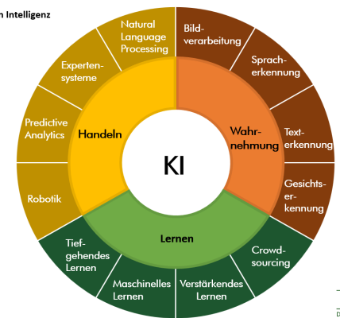
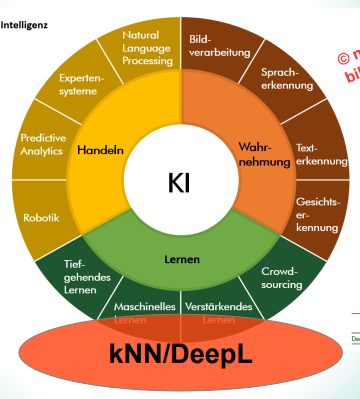
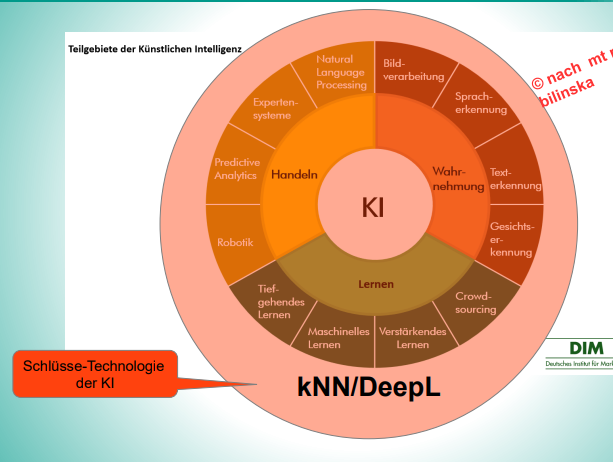
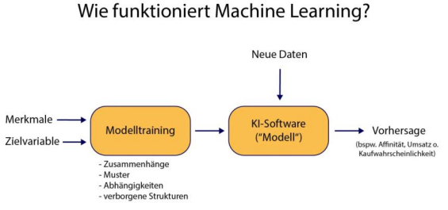
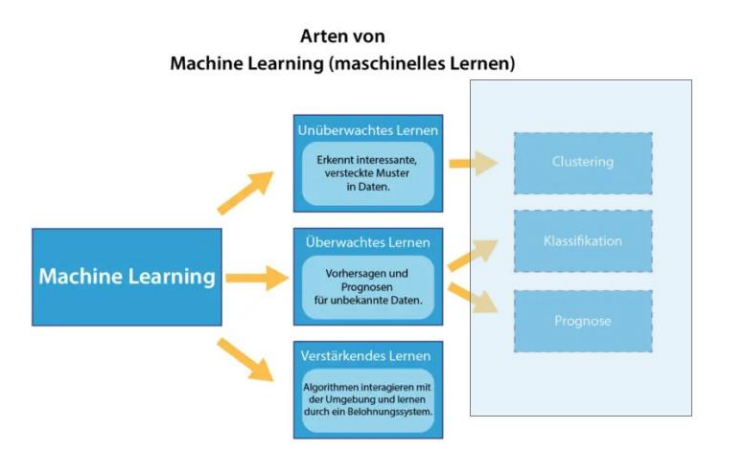
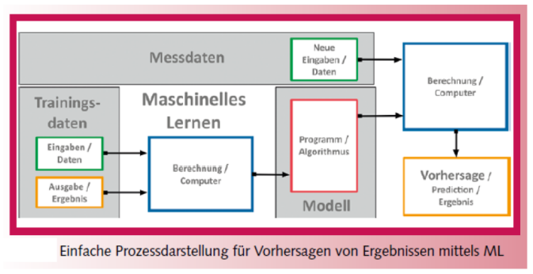
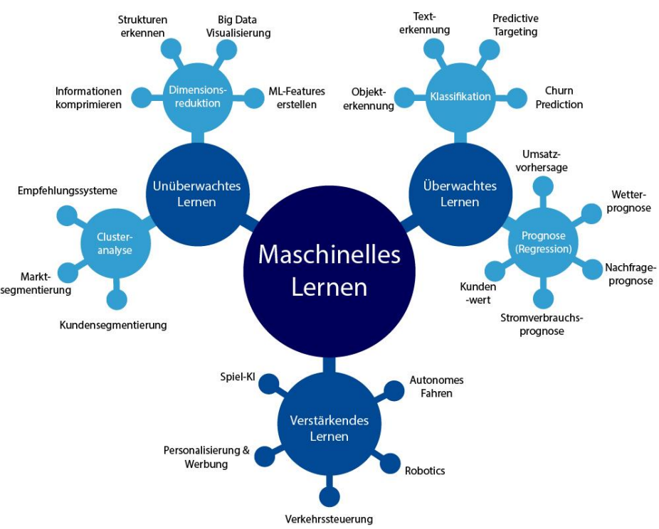

# Einführung

Die 5 Vs von Big Data:

- Volume -> Menge
- Velocity -> Geschwindigkeit
- Variety -> Vielfalt
- Veracity -> Zuverlässigkeit

## Künstliche Intelligenz

> Erweiterung / Verbesserung der menschlichen Sinne mit Lernfähigkeit
{.is-info}

- Einsatz und Analyse menschlicher Sinne (Sprechen, Sehen, Hören, Schreiben)
- Verstehen, Lernen, Adaptieren und Schlussfolgern

Teilgebiete

Nach Anwendung: Neuronale Netze

Nach Anwendung: künstliche Neuronale Netze

## Maschinelles Lernen

- Supervised Learning -> z.B. Objekt Erkennung
  - Lernen der Zusammenhänge
  - Zusammenhang von Input zur Zielvariable
  - Zielvariable ist eine Klasse oder numerischer Wert
- Unsupervised Learning -> z.B. Clustering
  - Muster erkennen
  - Einsatz von Abstandsmaßen
  - keine Zielvariable
- Reinforcement Learning -> z.B. Autonomes Fahren
  - Feedback-gesteuertes Lernen über Kostenfunktion/Belohnung
  - keine Beispieldaten
  - eigene Strategie

