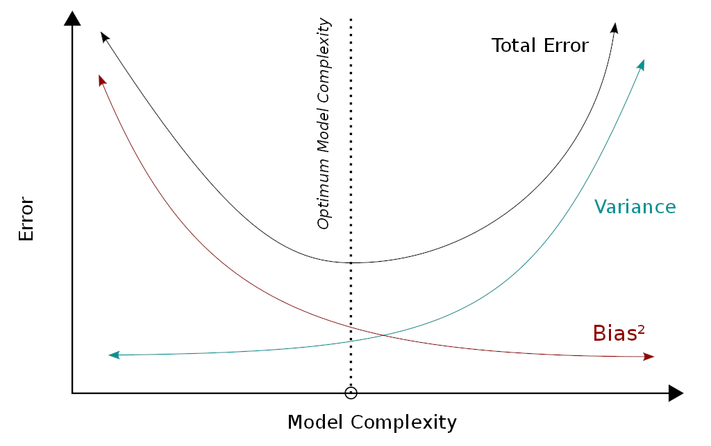
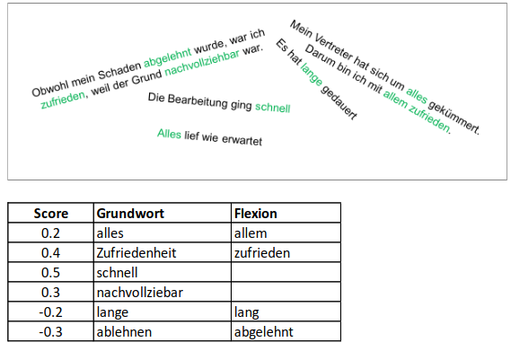
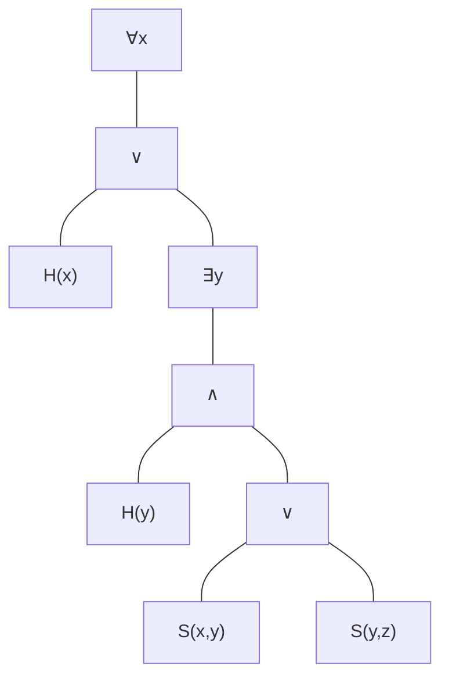
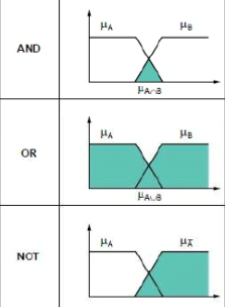
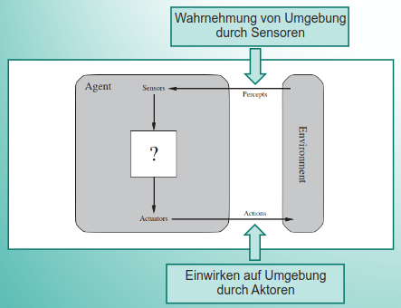

# Fragen Handout

## Künstliche Intelligenz – allgemein

### 1

Erklären Sie beispielhaft die Bedeutung der u.a. Aspekte aus der folgenden Definition von KI:

Einsatz und die Analyse der Anwendung menschlicher Sinne (Lesen, Schreiben, Sehen, Fühlen, Hören, Sprechen):

- OCR, Chatbots, Bilderkennung, Sentimentanalyse, Spracherkennung, Sprachsynthese

Menschliches Verstehen, Lernen, Adaptieren und Schlussfolgern:

Mustererkennung, Konzeptualisierung, Anpassung, Vorhersage

### 2

Der wirtschaftliche und technologische Fortschritt China’s hat sich in den letzten Jahrzehnten rasant entwickelt.
Erläutern Sie China’s strategische Ausrichtung in den letzten Jahren.

- Made in China 2025 -> hochwertige Erzeugnisse aus China
- neue Seidenstraße -> See- und Landwege von China nach Europa
- Aufbau der Infrastruktur -> Einzelschicksale werden nicht beachtet

KI als Schlüsseltechnologie für weiteren Wohlstand und Innovationen spielt hierbei eine zentrale Rolle.
Erläutern Sie die vier Entwicklungswellen von China im Vergleich zu den USA.

- Internet-KI -> mehr Internetnutzer in China
- Business-KI -> mehr KI-Startups in China
- Perception-KI -> verzichten auf Schutz der Privatsphäre für komfortable Nutzung
- Autonome0KI -> USA hat Vorsprung durch Silicon Valley

### 3

Erklären Sie „Push“ und „Pull“ Strategien im Zusammenhang mit den technologischen Innovationen und der Marktentwicklung

- Push: Technologie wird entwickelt und auf den Markt gebracht
  - Digitalisierung
  - Leistungssteigerung im Preisleistungsverhältnis
  - Miniaturisierung
  - Standardisierung
  - Lokalisierung

- Pull: Marktbedarf wird ermittelt und Technologie wird entwickelt
  - Individualisierung
  - einfacher Zugriff
  - Senkung der Transaktionskosten
  - Multimediale Angebotsformen
  - Mobilität

### 4

Erläutern Sie die fünf Fähigkeiten für typisch menschliches Handeln (AI Spektrum): Wahrnehmen, Lernen, Denken, Handeln, Wissen.

- Wahrnehmen: Bilderkennung, Spracherkennung
- Lernen: Mustererkennung, Konzeptualisierung
- Denken: Anpassung, Vorhersage
- Handeln: OCR, Chatbots
- Wissen: Sentimentanalyse, Sprachsynthese

Geben Sie jeweils 2 Beispiele für KI-Technologien, die hier eingesetzt werden und deren Zuordnung zur symbolische bzw. subsymbolischen KI.

- autonomes Fahren: symbolisch, digitaler Assistent (Alexa): subsymbolisch
- Firewall: symbolisch, Textvorhersage: subsymbolisch
- Chatbot: symbolisch, Tradingbot: subsymbolisch
- Dokumentenanalyse: symbolisch, ChatGpt: subsymbolisch
- Review Aggregator: symbolisch, live übersetzen: subsymbolisch

### 5

Erklären Sie die wesentlichen Unterschiede zwischen symbolischer und subsymbolischer Künstlichen Intelligenz (KI) laut AI Spektrum.
Erläutern sie jeweils 2 der existierenden Technologien sowie Methoden.

- Symbolisch
  - regelbasiert (formale Logik)
  - Expertensysteme
- Subsymbolisch
  - neuronale Netze
  - genetische Algorithmen

## Machine Learning

### 6

Erklären Sie folgende Verfahren des Maschinellen Lernens bzgl. Lernverfahren
und Zielfunktion: unüberwacht (unsupervised), überwacht (supervised) und
verstärkend (reinforcement).

- unsupervised:
  - keine Zielvariable
  - Muster / Zusammenhang erkennen
  - Einsatz von Abstandsmaß
- supervised:
  - Zielvariable -> Klasse (Ja/Nein) oder numerischer Wert
  - Erlernen vom Zusammenhang zwischen Input und Zielvariable
  - Lernen anhand von Datensätzen
- reinforcement:
  - keine Zielvariable
  - Lernen durch Feedback
  - keine Beispieldaten sondern Simulationsumgebung
  - Strategie wird über viele Iterationen entwickelt

Geben Sie jeweils Anwendungsbeispiel an und erläutern Sie

- unsupervised -> Erkennen von Objekten wie Hund oder Katze auf einem Bild
- supervised -> Vorhersage von Hauspreisen anhand von Merkmalen wie Größe, Lage, Alter
- reinforcement -> Spielentwicklung wo ein Bot eine Strecke fahren muss, um so weiter er kommt, desto mehr Punkte bekommt er, stößt er an, wird die Strecke zurückgesetzt

### 7

### 8

Wodurch unterscheiden sich unüberwachte und überwachte Lernverfahren?
Erläutern Sie.

Erklären Sie die Unterschiede bzgl. Lernverfahren und
Zielvariablen jeweils anhand eines Beispiels.

### 9

### 10

### 11

### 12

## Data Mining/Big Data

### 13

### 14

### 15

## Künstliche Neuronale Netze (kNN)/ Deep Learning/ CNN

### 16

### 17

Erklären Sie den Unterschied zwischen klassischem Machine Learning und dem
Deep Learning Ansatz.

- Beim Deep Learning entfällt die Feature-Extraktion, da diese automatisch durchgeführt wird.

Erläutern Sie den Grund für den aktuellen Boom der
KI aufgrund des Deep Learning.

- Durch die Erhöhung der Rechenleistung und der Menge an Daten.

### 18

Berechnen Sie für dieses sehr einfache künstliche Neuronalen Netz (kNN) die
Gewichte nach der Vorwärtspropagierung

Annahme:  
$\eta = 0.001$
  
$y = 3$
  
$t = \sum x_i * w_i$

$t = 2,3$

$\Delta w_i = \eta * (y-t) * x_i$  

$\Delta w_1 = 0.0084$

$\Delta w_2 = -0,0056$

$\Delta w_3 = 0.0049$

$w_{i}^{neu} = w_{i}^{alt} + \Delta w_i$

$w_{1}^{neu} = 0.5084$

$w_{2}^{neu} = 0.1944$

$w_{3}^{neu} = -0.2951$

$t_{new} = 2.4799$

### 19

Führen Sie nach der Vorwärtspropagierung bei folgendem mehrschichtigen künstlichen Neuronales Netz (KNN) mit folgender Aktivierungsfunktion $𝑓(𝑥) = \frac{1}{1+ e{-x}}$ die Fehlerberechnung für die Output-Units und Fehlerrückwärtspropagierung (Backpropagation) für die Hidden-Units durch

### 20

Erläutern Sie die Architektur von Convolutional Neural Networks (CNN).

- extrahiert und erkennt Merkmale mit Hilfe von Filtern
- Mehrschichtige Modelle mit Feature Learning und anschließender Klassifikation
  - Feature Learning
    - Convolutional + Relu
    - Pooling
  - Classification
    - Flatten (Vektorisierung)
    - Fully Connected
    - Softmax

Warum können diese als Deep Learning Verfahren bezeichnet werden?

- weil das Feature Learning automatisch durchgeführt wird
- Baut auf mehreren Schichten auf

Erklären Sie wie sich Machine Learning von Deep Learning Verfahren unterscheiden

- Beim Deep Learning entfällt die Feature-Extraktion, da diese automatisch durchgeführt wird.

### 21

Erläutern Sie die allgemeine Architektur einer RoBERTa (RoBERTa: A Robustly
Optimized BERT Pretraining Approach)

1. Input wird in Token zerlegt
2. Input Embedding (kontextunabhängig via lookup table)
3. Positional Encoding (hinzufügen von Position Embeddings)
4. Roberta Layer 4x
    1. Self-Attention: Berechnung der Attention Scores (normiert)
    2. Layer Normalization: Normalisierung der Attention Scores
    3. Feed Forward: Berechnung der Outputs
    4. Layer Normalization: Normalisierung der Outputs

- Multi-Head Attention: Durchführung der Self Attention Operation (Verknüpfung von Input Embedding mit dem Kreuzprodukt)
  
Warum werden diese als Deep Learning Verfahren bezeichnet?

- Da das RoBERTa Konzept mehrmals verketten werden kann

### 22

### 23

## Entscheidungsbäume

### 24

Erläutern Sie den allgemeinen Aufbau von Entscheidungsbäumen.

- Ein Entscheidungsbaum ist ein Baum, dessen innere Knoten Merkmale (Attribute) repräsentieren
- Jede Kante steht für einen Attributwert
- An jedem Blattknoten ist ein Klassenwert angegeben

Um welchen Typ von Lernverfahren handelt es sich hier?

- Supervised Learning weil man gelabelte Daten benötigt, welche Zielvariable enthalten

Erklären Sie den Unterschied zwischen dem einfachen Lernalgorithmus und dem Greedy-Algorithmus.

- Einfacher Lernalgorithmus berechnet alle Bäume (inkl. Anzahl der Fehlklassifikationen) und wählt den Baum mit der geringsten Anzahl an Fehlklassifikationen aus
- Greedy-Algorithmus generiert den Baum schrittweise und wählt bei jedem Schritt die beste Entscheidung (höchste Informationsgewinn) aus

### 25

Erläutern Sie Vor- und Nachteile von Entscheidungsbäume.

Vorteile:

- gewonnenes Wissen ist als Blackbox verfügbar
- Anschauliche nachvollziehbare Entscheidungsregeln
- einfache Interpretation
- effiziente Auswertung des Modells

Nachteile:

- bei vielen Attributen unübersichtlich
- finden des optimalen Baumes ist exponentiell
- Heuristiken finden nur lokale Optima
- anfällig für Overfitting
- nicht immer eindeutig

Um die Prognosegüte von Entscheidungsbäumen zu verbessern, existieren die Verfahren Stacking, Bagging und Boosting. Erklären Sie anhand von Beispielen diese Verfahren

- Stacking
  - unterschiedliche Algorithmen auf den gleichen Datensätzen kombinieren (Häufigste Entscheidung gewinnt)
  - z.B. KNN, SVM, Entscheidungsbäume
- Bagging
  - gleicher Algorithmus auf unterschiedlichen Datensätzen (Häufigste Entscheidung gewinnt)
  - z.B. Random Forest
- Boosting
  - Training auf initialem Datenset, anschließend werden falsch klassifizierte Daten erneut trainiert (Gewichtung der Entscheidungen; schwer nachvollziehbar)

### 26

## Bias / Varianz Tradeoff / Overfitting

### 27

### 28

Der Bias-Varianz-Tradeoff ist ein zentrales Problem beim überwachten Lernen. Erklären Sie das zugrundeliegende Problem.

- Idealerweise möchte man ein Modell wählen, das sowohl die Regelmäßigkeiten in seinen Trainingsdaten genau erfasst, als auch gut auf neue Daten verallgemeinert. Leider ist es normalerweise unmöglich, beides gleichzeitig zu tun.

Erläutern Sie anhand einer Graphik die Methode der Bias-Varianz-Zerlegung

Bias-Error:

- Unterschied zwischen dem erwarteten Wert des Modells und dem wahren Wert
- übermäßige Vereinfachung der Annahmen -> Modell lernt die Muster nicht

Varianz-Error:

- Das Modell lernt die Muster der Trainingsdaten auswendig und kann nicht auf neue Daten verallgemeinern

Bias-Varianz-Tradeoff Methode: Finden des Sweet-Spots zwischen Bias und Varianz.

### 29

## NLP

### 30

Erklären Sie was unter Natural Language Processing (NLP) verstanden wird.

- Verarbeitung und Analyse von natürlicher Sprache durch Computer
- Teilgebiet der KI, Informatik und Linguistik

Geben Sie ein Anwendungsbeispiel aus dem NLP an und erläutern Sie.

- Informationen & Erkenntnisse aus Dokumenten extrahieren

### 31

Erklären Sie das allgemeine Vorgehen bei Text-Mining Anwendungen, bei denen mit Hilfe einer Term-Document-Matrix ein Sentiment-Score ermitteln wird.

1. Kleinschreibung, Stoppworte, Punktation entfernen
1. Jedes Dokument in einzelne Wörter zerlegen
1. Wort mit der Positiv- und Negativliste vergleichen
1. Bei Match wird der Score entsprechend der Positiv- und Negativliste erhöht/reduziert

Führen Sie die einzelnen Schritte anhand des folgenden Beispiels durch und geben Sie an, welches der Aussagen die beste Bewertung erhält.

- "... lange ..." -> -0.2
- "Alles ..." -> 0.2
- "... abgelehnt ... zufrieden ... nachvollziehbar" -> -0.3 + 0.4 + 0.3 = 0.4
- "... schnell" -> 0.5
- "... alles ... allem zufrieden" -> 0.2 + 0.2 + 0.4 = 0.8

Der Satz "... alles ... allem zufrieden" erhält die beste Bewertung.

## Aussagenlogik

### 32

Wie ist die Syntax einer Aussagenlogik formal definiert?

- $A,B,C,...$ sind Aussagen
- $\top, \bot$ sind Aussagen
- Wenn $\phi, \psi$ bereits Aussagen sind, dann sind auch $\neg \phi, (\phi \land \psi), (\phi \lor \psi), (\phi \rightarrow \psi), (\phi \leftrightarrow \psi)$ Aussagen

Welche 5 Operatoren stehen bei der Aussagenlogik zur Verfügung? Geben Sie hier jeweils ein Beispiel an.

- $\neg$ Negation: nicht krank
- $\land$ Konjunktion: Ich bin krank und gehe zum Arzt
- $\lor$ Disjunktion: Ich gehe zum Arzt oder der Arzt kommt zu mir (oder beides)
- $\rightarrow$ Implikation: Wenn ich krank bin, gehe ich zum Arzt
- $\leftrightarrow$ Äquivalenz: Ich gehe zum Arzt, wenn ich krank bin und ich bin krank, wenn ich zum Arzt gehe

### 33

### 34

### 35

### 36

Erläutern Sie warum aussagenlogische Formeln in eine Konjunktive Normalform (KNF) überführt werden und wie diese definiert sind.

- um automaische Beweisverfahren einfach zu halten

1. besteht aus Konjunktionen von Klauseln
1. Klausel besteht aus Disjunktionen

Führen Sie folgende Klauselmenge in eine KNF und geben Sie bei jedem Schritt an welche Operation Sie eingesetzt haben

$(S \lor N) \lor ((\neg S \land N ) \lor (P \land \neg S)) \land (\neg N \lor P)$

1. Distributivgesetz  
$(S \lor N) \lor (\neg S \land (P \lor N)) \land (\neg N \lor P)$

2. Klammer verschieben  
$(S \lor N) \lor (\neg S \land (P \lor N) \land (\neg N \lor P))$

3. Distributivgesetz  
$(S \lor N) \lor (\neg S \land P \lor (\neg N \land N))$

4. Bottom  
$(S \lor N) \lor (\neg S \land P \lor \bot)$

5. Neutrales Element  
$(S \lor N) \lor (\neg S \land P)$

6. Klammern auflösen  
$S \lor N \lor (\neg S \land P)$

7. Distributivgesetz  
$N \lor ((S \lor \neg S) \land (S \lor P)) $

8. Top  
$N \lor (\top \land (S \lor P)) $

9. Neutrales Element  
$N \lor (S \lor P) $

10. Klammern auflösen  
$(N \lor S \lor P)$

### 37

Logikrätsel: Genau eine Person lügt. Wer?  

Simon: "Mindestens einer von Julien und Felix lügt."
Julien: "Cheng und Felix lügen nicht beide."  
Cheng: "Von Simon und Felix lügt genau einer."  
Felix: "Julien lügt."  

1. Überführen Sie die Aussagen in eine aussagenlogische Formel durch Formalisierung
1. Transformieren Sie diese in ein Konjunktive Normalform
1. Führen Sie die Resolution durch einen Widerspruchbeweis durch
1. Überprüfen Sie Ihr Ergebnis durch die Aufstellung einer Wahrheitstabelle.

(J = Julien, S = Simon, C = Cheng, F = Felix)

Wahrheitstabelle:

$(S \leftrightarrow (\neg J \lor \neg F)) \land (J \leftrightarrow ( C \lor  F)) \land ( C \leftrightarrow \neg(S \leftrightarrow  F)) \land (F \leftrightarrow \neg J)$

KNF:

$(C) \land (\neg F) \land (J) \land (S)$

## Prädikatenlogik

### 38

### 39

### 40

Erstellen Sie für folgende Formel in der Prädikatenlogik 1. Ordnung einen Syntaxbaum auf und bestimmen Sie die Semantik durch Auswertung der Teilformeln in wahr oder falsch

$\forall x (H(x) \lor (\exists y (H(y) \land (S(x,y) \lor S(y,z)))))$

### 41

### 42

### 43

## Fuzzy Logik/ Wissensbasierte Systeme /Expertensysteme

### 44

Erläutern Sie warum die Fuzzylogik in den letzten Jahren einen Aufschwung erfahren hat?

- Fuzzylogik ist eine Erweiterung der klassischen Aussagenlogik

Welche Vorteile bieten sich hier gegenüber den anderen Logiken?

- Geben mehrere Zustände an
- Geben unscharfe Trennmenge zurück

Zeichnen Sie Fuzzy-Funktionen für die Operationen AND, OR und NOT

### 45

### 46

Erläutern Sie den Begriff Inferenz bei wissensbasierten Systemen

- Aus Fakten und Regeln lassen sich Schlüsse ziehen

Erklären Sie den Unterschied zwischen induktiver und deduktiver Inferenz

- induktiv: Zusammenhang aus Beobachtungen
- deduktiv: Vom Allgemeinen auf das Spezielle

### 47

Erläutern Sie den Aufbau eines Expertensystems mit seinen Komponenten

- Wissensbasis
- Datenbasis
- Inferenzkomponente
- Erklärungskomponente
- Benutzerschnittstelle
- Wissenskomponente

Erklären Sie die Unterschiede zwischen klassischen Softwareprogrammen und Expertensystemen

- Probleme werden nicht nach vordefinierten Regeln gelöst
- können einfach mit neuen Wissen erweitert werden
- verwenden KI Methoden
- verwenden Heuristiken

### 48

## Agenten

### 49

Erklären Sie das allgemeine Funktionsprinzip eines Agenten.

- nutzen Sensoren um die Umgebung zu beobachten
- verarbeiten die Informationen und führen Aktionen aus
- nutzen Aktuatoren (Aktoren) um die Umgebung zu beeinflussen

Erläutern Sie weiterhin, was in der KI unter einem intelligenten Agenten verstanden wird.

- werden Vorkenntnisse vermittelt & Fähigkeit zu lernen
- nach ausreichender Erfahrung wird Verhalten immer unabhängiger von Vorkenntnissen (Wichtigkeit von Vorkenntnisse gehen zurück, Wichtigkeit von Erfahrung geht hoch)
- ist befähigt, sich an größere Vielfalt von Umgebungen anzupassen

### 50

Erläutern Sie den allgemeinen Aufbau eines Agenten anhand einer Graphik

- Sensoren: Umweltbeobachtung
- Percepts: Wahrgenommene Umwelt (aktuell & vergangen)
- Aktoren: Beeinflussung der Umwelt
- Aktionen: Ausgeführte Aktionen
- Agentfunction: Zugordnung von Wahrnehmungssequenzen zu Aktion (via externer Tabelle oder internem Programm)

Erläutern Sie den Unterschied zwischen menschlichen Agenten, Robotern und Softwareagenten bzgl. Sensoren und Aktoren.

- menschliche Agenten: Sinnesorgane & Muskeln
- Roboter: Kameras, Mikrofone, Greifarme
- Softwareagenten: Tastatur, Maus, Bildschirm

### 51

### 52

Erläutern Sie die Begriffe Rational Agents und AI Agents.

- Performance Measure: Bewertung der Umgebung
- Rationality: Maximierung der erwarteten Performance
- Information Gathering: Umgebung beobachten
- Learning: Vorkenntnisse werden angepasst und ergänzt
- Autonomy: unvollständiges oder falsches Wissen ausgleichen

Wodurch unterscheiden sie sich. Erläutern Sie

- Rational Agents:
  - wählen die Aktion mit dem höchsten Nutzen

- AI Agents:
  - baut Wichtigkeit der Vorkenntnisse ab und Wichtigkeit der Erfahrung auf

### 53

### 54

### 55

Erläutern Sie den Aufbau und Funktionsweise von Softwareagenten.

- Softwareagenten sind Programme, die autonom handeln und vom Anwender delegierte Aufgaben erledigen

Erklären Sie die Begriffe Delegation, Kommunikationsfähigkeit, Autonomie, Überwachung, Aktion und Intelligenz von Softwareagenten.

- Delegation: führt im Auftrag des Anwenders Aufgaben aus
- Kommunikationsfähigkeit: kommuniziert mit dem Anwender
- Autonomie: führt Aufgaben selbstständig aus
- Überwachung: überwacht die Umgebung
- Aktion: beeinflusst die Umgebung
- Intelligenz: überwacht Ergebnisse und trifft notwendige Entscheidungen
