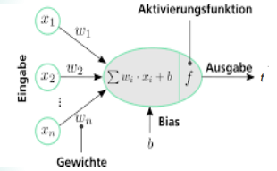

# Künstliche Neuronale Netze (kNN)

> Abstrahiertes mathematisches Modell des menschlichen Gehirns
{.is-info}

- Zielvariable $t$ ist bekannt
- Zielvariable ist eine Klasse oder numerischer Wert
- Aktivierungsfunktion -> Schwellenwertfunktion
  - linear oder nicht-linear
  - Beispiel:
    - Sigmoid Funktion: bringt Werte verhältnismäßig zwischen 0 und 1
    - Relu Funktion: schneidet negative Werte ab

## Delta-Regel (Widrow-Hoff-Regel)

- Verfahren zur Anpassung der Gewichte
- Änderung der Gewichte im Verhältnis zur Differenz zwischen erwartetem und tatsächlichem Wert
- Inkrementelle Anpassung der Gewichte

$$\Delta w_{i} = \eta * (y - t) * x_{i} $$

$$w_{i}^{neu} = w_{i}^{alt} + \Delta w_{i}$$

$x_{i}$: Input-Vektor / Trainingsbeispiel

$y$: gewünschter Output / Zielausgabe

$t$: Antwort des Netzes / berechnete Ausgabe

$\eta$: Lernrate

Berechnung zur Anpassung der Gewichte:

$n$: Anzahl der Gewichte
$\delta$: Abweichung zwischen gewünschtem und berechnetem Wert

1. Vorwärtspropagierung: $t = f(\sum_{i=1}^{n} w_{i} * x_{i})$
1. Fehlerberechnung: $\delta = y - t$
1. Gewichtsanpassung: $\Delta w_{i} = \eta * (y - t) * x_{i}$
1. Berechnung der neuen Gewichte: $w_{i}^{neu} = w_{i}^{alt} + \Delta w_{i}$

Lernrate $\eta$:

- zu klein -> langsame Konvergenz
- zu groß -> Oszillationen
- Lernrate kann sich im Laufe des Lernprozesses ändern
- Lernrate startet hoch und wird im Laufe des Lernprozesses kleiner
- Momentum: Lernrate kann von vorhergehenden Lernraten-Änderungen abhängig gemacht werden
- Nach jedem Training Zufallswerte auf Gewichte addieren

## Backpropagation

- Training eines kNN mit mehreren Schichten
- Übertragung der Delta-Regel auf mehrere Schichten
- Gardientenabstiegsverfahren
- Generalisierung / Overfitting
- Bias-Varianz-Tradeoff

Für Sigmoide Aktivierungsfunktion:
$ f(x) = \frac{1}{1 + e^{-x}} $

Ableitung:

$ f'(x) = f(x) * (1 - f(x)) $

- Anpassung der Gewichte erfolgt wie bei der Delta-Regel
- Rückwärtspropagierung des Fehlers an die hidden Units

$$\delta_{i} = {\begin{cases}
    f'(netzinput_{i}) * (y_{i}^{soll} - t_{i}^{ist}), \space \text{Output-Units} \\
    f'(netzinput_{i}) * (\displaystyle\sum_{L}^{n-1}(\delta_{L} * w_{Li})), \space \text{Hidden-Units}
  \end{cases}
}$$

- $f'(netzinput_{i})$: Input aus der vorherigen Schicht mit Aktivierungsfunktion
- $f'()$: Gradientenfunktion auf $netzinput_{i}$
- $L$: für den Output relevante Gewichte
- $t_{ist}^{ist}$: berechneter Output
- $y_{i}^{soll}$: gewünschter Output
