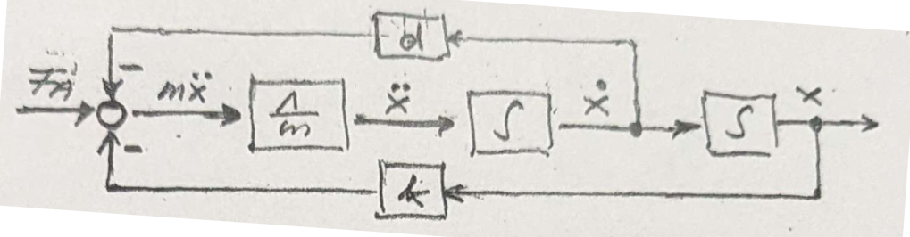
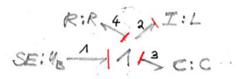

# Das Blatt

## Einmassenschwinger

### Definitionen

$F_T$ = Trägheitskraft  
$F_d$ = Dämpfungskraft  
$F_k$ = Federkraft  
$F_A$ = Antriebskraft  
$F_G$ = Gravitationskraft  
$F_B$ = Beschleunigungskraft / Antriebskraft  
$m$ = Masse  
$d$ = Dämpfungskonstante  
$k$ = Federkonstante  
$p$ = Impuls  
$\dot{p} = e$ = effort  
$x = q$ = Auslenkung  
$\dot{x} = v = \dot{q} = \frac{p}{m} = f$ = Geschwindigkeit (flow)  
$\ddot{x} = \dot{v} = \ddot{q} = \dot{\frac{p}{m}}$ = Beschleunigung  

### Kräfte

$ \vec{0} = \vec{F_T} + \vec{F_d} + \vec{F_k} + \vec{F_A}$  

$0 = -m \vec{\ddot{x}} - d \vec{\dot{x}} - k\vec{x}+ \vec{F_A}$

$\vec{F_B} = \vec{F_A} + \vec{F_d} + \vec{F_k} $

### Differentialgleichung 2. Ordnung (2 Speicher)

$m \ddot{x} + d \dot{x} + kx = F_A$

oder

$m \ddot{x} = F_A - d \dot{x} - kx$

> $ \sum{\vec{F_i}} = \vec{0} $ Die Summe aller Kräfte ist Null
{.is-info}

> $ \vec{F_B} =  -\vec{F_T} $ Die Beschleunigungskraft entspricht der negativen Trägheitskraft
{.is-info}

### Blockschaltbild

### DGL 1.0 im Zustandsraum

2 Zustandsvariablen:

- $z_1 = x(t)$
- $z_2 = v(t) = \dot{x}(t) = \dot{z_1}$

$\dot{Z_1} = Z_2$  
$\dot{Z_2} = \ddot{x} = \frac{F_A}{m} - \frac{d}{m} * Z_2 - \frac{k}{m} * Z_1$

$\dot{x} = v$  
$\dot{v} = \frac{F_A}{m} - \frac{d}{m} * v + \frac{k}{m} * x$  

### Bondgraph

### DGL System im Zustandsraum

1 Frage: Welche Informationen liefern die Elemente an das System?

- B1: $e_1 = F_A$
- B2: $f_2 = \frac{\large\textcircled{p_2}}{m}$
- B3: $e_3 = k * \large\textcircled{q_3}$
- B4: $e_4 = d * f_4$

e/f - Bilanz:

- $e_1 = e_2 + e_3 + e_4$  (1a)  
- $f_1 = f_2 = f_3 = f_4$  (1b)  

2 Frage: Welche Informationen gibt das System an die Speicherelemente zurück?

#### B2

$e_2 = \dot{p_2}$ -> [Tetraeder](/fom/semester-5/mechatronik/modellbildung.md#zustands-tetraeder)  
$\dot{p_2} \stackrel{1a}{=} e_1 - e_3 - e_4$  -> e/f - Bilanz  
$e_1 - e_3 - e_4 = F_A - k * q_3 - d * f_4$ -> Anwendung von Frage 1  
$F_A - k *q_3 - d* f_4 \stackrel{1b}{=} F_A - k *q_3 - d* f_2$ -> e/f - Bilanz  
$\dot{p_2} \stackrel{B2}{=} F_A - k *q_3 - d* \frac{p_2}{m}$ -> Anwendung von Frage 1  
$F_A - k *q_3 - d* \frac{p_2}{m} = F_A - k *q_3 - \frac{d}{m} * p_2$ -> Umformung

#### B3

$f_3 = \dot{q_3}$ -> [Tetraeder](/fom/semester-5/mechatronik/modellbildung.md#zustands-tetraeder)  
$f_3 \stackrel{1b}{=} f_2$ -> e/f - Bilanz  
$f_2 \stackrel{B2}{=} \frac{p_2}{m}$ -> Anwendung von Frage 1
$\frac{p_2}{m} = \frac{1}{m} * p_2$ -> Umformung

#### Vektor Matrix Schema

B2: $\dot{p_2} = F_A - k *q_3 - \frac{d}{m} * p_2$  
B3: $\dot{q_3} = \frac{1}{m}*p_2$  

$\begin{pmatrix} \dot{p_2} \\ \dot{q_3} \end{pmatrix} = \begin{pmatrix} -\frac{d}{m} & -k \\ \frac{1}{m} & 0 \end{pmatrix} * \begin{pmatrix} p_2 \\ q_3 \end{pmatrix} + \begin{pmatrix} 1 \\ 0 \end{pmatrix} * F_A$

## Einmassenschwinger -> Schwingkreis

### Variablen

$F$ Kraft -> $U$ Spannung = $e$ Effort  
$v$ Geschwindigkeit -> $I$ Strom = $f$ Flow  
$p$ Impuls -> $\lambda$ Windungsfluss = $p$  
$x$ Auslenkung -> $q$ Ladung  = $q$  
$d$ Dämpfungskonstante -> $R$ Wiederstand = R-Element  
$k$ Federkonstante -> $\frac{1}{C}$ Kapazität = C-Element  
$m$ Masse -> $L$ Induktivität = I-Element  

## Schwingkreis

### Definitionen

$U_L$ = Spannung an der Spule  
$U_R$ = Spannung am Wiederstand  
$U_C$ = Spannung am Kondensator  
$U_B$ = Batteriespannung

$L$ = Induktiviät (Spule)  
$R$ = Wiederstand  
$C$ = Kapazität (Kondensator)

$U = e$ = Spannung (effort)  
$p = \lambda$ = Windungsfluss (Implus)  
$q$ = Ladung (Verschiebung)  
$\dot{q} = I = f$ = Stromfluss (flow)  
$\ddot{q}$ = Stromflussänderung

### Kräfte

Kirchhoffsche Maschenregel:  
$ \vec{0} = \vec{U_L} + \vec{U_R} + \vec{U_C}$  

$0 = L \vec{\ddot{q}} + \vec{R \dot{q}} +  \vec{\frac{1}{C} q}$

$\vec{U_B} = \vec{U_L} + \vec{U_R} + \vec{U_C}$

### DGL 1.0 im Zustandsraum

- $z_1 = q$
- $z_2 = \dot{q}(t) = \dot{z_1}$

### Blockschaltbild

### Bondgraph

### DGL System im Zustandsraum

1 Frage: Welche Informationen liefern die Elemente an das System?

B1: $e_1 = U_B$  
B2: $f_2 = \frac{\large\textcircled{p_2}}{L}$  
B3: $e_3 = \frac{1}{C} * \large\textcircled{q_3}$  
B4: $e_4 = R * f_4$

e/f - Bilanz:

$e_1 = e_2 + e_3 + e_4$  (1a)  
$f_1 = f_2 = f_3 = f_4$  (1b)  

2 Frage: Welche Informationen gibt das System an die Speicherelemente zurück?

#### B2

$e_2 = \dot{p_2}$  
$e_2 \stackrel{1a}{=} e_1 - e_3 - e_4$  
$e_2 \stackrel{B1, B3, B4}{=} U_B - \frac{1}{C} * \large\textcircled{q_3} - R * f_4$  
$e_2 \stackrel{1b}{=} U_B - \frac{1}{C} * \large\textcircled{q_3} - R * f_2$  
$e_2 \stackrel{B2}{=} U_B - \frac{1}{C} * \large\textcircled{q_3} - R * \frac{\large\textcircled{p_2}}{L}$

#### B3

$f_3 = \dot{q_3}$  
$f_3 \stackrel{1b}{=} f_2$  
$f_3 \stackrel{B2}{=} \frac{\large\textcircled{p_2}}{L}$

#### Vektor Matrix Schema

B2: $\dot{p_2}= U_B - \frac{1}{C} * \large\textcircled{q_3} - R * \frac{\large\textcircled{p_2}}{L}$  
B3: $\dot{q_3} = \frac{\large\textcircled{p_2}}{L}$

$\begin{pmatrix} \dot{p_2} \\ \dot{q_3} \end{pmatrix} = \begin{pmatrix} - \frac{1}{C} & -\frac{R}{L} \\ 0 & \frac{1}{L} \end{pmatrix} * \begin{pmatrix} q_3 \\ p_2 \end{pmatrix} + \begin{pmatrix} 1 \\ 0 \end{pmatrix} *U_B
$
