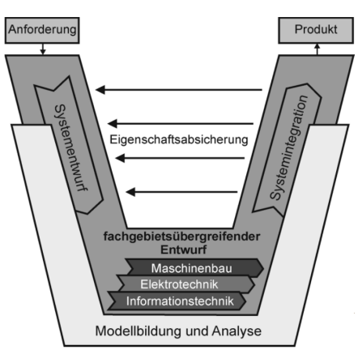

# Einführung

## Begriffe

- Mechatronik -> Zusammenwirken von Mechanik, Elektronik und Informatik
  - Beispiel: ABS-Bremssystem, Einspritzanlage
- Fluidik -> Zusammenwirken von strömungsmachanischen Strömungselementen (Hydraulik, Pneumatik)
  - Beispiel: Hydraulikbagger, Pneumatikzylinder
- Viskosität -> Zähigkeit eines Fluids
- Strecke -> kürzester Weg, der zwischen zwei Punkten zurückgelegt wird
- Materialbasierte Systeme -> Stoffe gewinnen (z.B. Produktionsanlage)
- Energiebasierte Systeme -> Energie umwandelnd (z.B. Generator)
- Informationsbasierte Systeme -> Informationen generieren (z.B. DVD-Player)

## Historie

- Mechanische Produktionsanlagen -> Dampfmaschine, Webstuhl
- Elektromechanik -> Elektromotor, Fließband
- Mechatronik -> Systemtechnische Kombination Elektromechanik, Elektronik und Informatik -> SPS
- Cyber-physische Systeme -> Mechatronik + Internet -> Industrie 4.0

## V-Modell des Entwicklungsprozesses

## Funktionalitäten

### BlackBox

[BlackBox](/fom/semester-2/digitale-regelungstechnik/einleitung_grundlagen.md#technisches-system)
