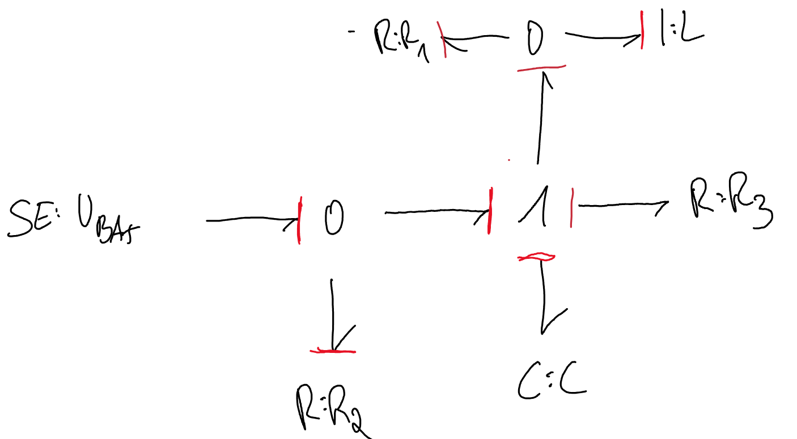

# Klausurvorbereitung 2

## 1 (5 Punkte) Entwicklungsprozess mechatronischer Systeme

a)

b)

- 4 Fachgebietsübergreifender Entwurf: Auslegung der Teilsysteme
- 9 Systementwurf: Lösungskonzept & Zerlegung in Teilfunktionen
- 10 Systemintegration: Untersuchung des Zusammenwirkens

## 2 (4 Punkte) Grundstruktur eines mechatronischen Systems

## 3 (10 Punkte) Bondgraph ermitteln

A: Es gibt eine Algebraische Rückkopplung da es verschiedene Kausalitätsauszeichnungen gibt.

## 4 (22 Punkte) Moell-Gleichung 1-Massen-Schwinger

a) Geben Sie die verktorielle Kräfte-Bilanz sowie die DGL an und nennen Sie den Grund weshalb Sie eine DGL 2. Ordnung erhalten.

Kräfte Vektoren:

$F_T = -F_B$

$ \vec{0} = \vec{F_T} + \vec{F_d} + \vec{F_k} + \vec{F_A}$  

$\vec{0} = -m\vec{a} - d\vec{v} - k\vec{x} + \vec{F_A}$

DGL:  

$0 = -m \ddot{x} - d \dot{x} - kx + F_A$  

Es handelt sich um eine DGL 2. Ordnung, da es 2 Speicherelemente (Masse, Feder) gibt.

b)

Zeichnen sie das Blockschaltbild des Systems.

Umstellung für DGL:

$F_A - d \dot{x} + kx = m \ddot{x}$

c) Zeichnen Sie den Bondgraphen, leiten Sie aus Frage 1 & Frage 2 den Zustandsraum-Vektor & System-  Steuermatrix her.

Frage 1 (Was gibt die Komponente ans System):

- B1: $e_1 = F_A$
- B2: $f_2 = \frac{\large\textcircled{p_2}}{m}$
- B3: $e_3 = k * \large\textcircled{q_3}$
- B4: $e_4 = d * f_4$

e/f Bilanz

- $e_1 = e_2 + e_3 + e_4$  (1a)
- $f_1 = f_2 = f_3 = f_4$  (1b)

Frage 2:

B2:

$e_2 = \dot{p_2}$ -> [Tetraeder](/fom/semester-5/mechatronik/modellbildung.md#zustands-tetraeder)  
$e_2 \stackrel{1a}{=} e_1 - e_3 - e_4$  -> e/f - Bilanz  
$e_1 - e_3 - e_4 = F_A - k * q_3 - d * f_4$ -> Anwendung von Frage 1  
$F_A - k *q_3 - d* f_4 \stackrel{1b}{=} F_A - k *q_3 - d* f_2$ -> e/f - Bilanz  
$\dot{p_2} \stackrel{B2}{=} F_A - k *q_3 - d* \frac{p_2}{m}$ -> Anwendung von Frage 1  
$F_A - k *q_3 - d* \frac{p_2}{m} = F_A - k *q_3 - \frac{d}{m} * p_2$ -> Umformung

B3:

$f_3 = \dot{q_3}$ -> [Tetraeder](/fom/semester-5/mechatronik/modellbildung.md#zustands-tetraeder)  
$f_3 \stackrel{1b}{=} f_2$ -> e/f - Bilanz  
$f_2 \stackrel{B2}{=} \frac{p_2}{m}$ -> Anwendung von Frage 1  
$\frac{p_2}{m} = \frac{1}{m} * p_2$ -> Umformung

Vektor-Matrix:

B2: $\dot{p_2} = F_A - k *q_3 - \frac{d}{m} * p_2$  
B3: $\dot{q_3} = \frac{1}{m}*p_2$  

$\begin{pmatrix} \dot{p_2} \\ \dot{q_3} \end{pmatrix} = \begin{pmatrix} -\frac{d}{m} & -k \\ \frac{1}{m} & 0 \end{pmatrix} * \begin{pmatrix} p_2 \\ q_3 \end{pmatrix} + \begin{pmatrix} 1 \\ 0 \end{pmatrix} * F_A$

$\text{System-Matrix} * \text{Zustandsvariablen} + \text{Steuermatrix} * \text{Eingangsgröße}$

d)
Wandeln Sie die DGL in den Zustandsraum-Vektor um.

Zustandsvariablen:

- $z_1 = x(t)$
- $z_2 = v(t) = \dot{x}(t) = \dot{z_1}$

$\dot{Z_1} = Z_2$  
$\dot{Z_2} = \ddot{x} = \frac{F_A}{m} - \frac{d}{m} * \dot{x} - \frac{k}{m} * x$

$\dot{x} = v = \frac{1}{m}p$  (1)  
$\dot{v} = \frac{\dot{p}}{m} = \frac{F_A}{m} - \frac{d}{m} * \dot{x} + \frac{k}{m} * x$  (2)  

Verallgemeinerte Variablen:

(1) => $\dot{q} = \frac{1}{m}p$  
(2) => $\dot{p} = F_A - d\dot{q} - kq = F_A - df - kq = F_A - \frac{d}{m}p - kq$

$\begin{pmatrix} \dot{p} \\ \dot{q} \end{pmatrix} = \begin{pmatrix} -\frac{d}{m} & -k \\ \frac{1}{m} & 0 \end{pmatrix} * \begin{pmatrix} p \\ q \end{pmatrix} + \begin{pmatrix} 1 \\ 0 \end{pmatrix} * F_A$

e)
Welches elektrische Modell entspricht dem Bondgraphen?

Elektrischer serieller Schwingkreis

## 5 (4 Punkte) System-Sicherheit

Zeichnen sie für beide Sicherheitskritischen Fälle hinter dem Normalbetriebsfall jeweils die verändert liegende Wahrscheinlichkeits-Kurve ein wodurch das erhöhte Ausfall-Wahrscheinlichkeit durch Schraffierung gekennzeichnet ist.

## 6 (3 Punkte) Wirkungsweise eines mechatronischen Systems

Flugzeug mit E-Motor

- Nach der 1. Phase des Climb-Modus ist der Akku leer
- Beim Sinkflug wird der Gyrator E-Motor- auf Generator-Betrieb gewechselt, wodurch der Akku auflädt.
- Am Boden wieder als E-Moter tätig, die Energie reicht beim finalen Taxiing zum totalen Vorschub.
- Lärmbelästigung wird durch den E-Motor beim Taxiing reduziert.

## 7 (5 Punkte) Verallgemeinerte Variablen

a) Tetraeder

b)
Domäne | e | f | p | q
--- | --- | --- | --- | ---
Mechanik (translation) | Kraft $\vec{F}$ | Geschwindigkeit $\vec{v}$ | Impuls $\vec{p}$ | Auslenkung $\vec{x}$
Mechanik (rotation) | Drehmoment $\vec{M}$ | Winkelgeschwindigkeit $\vec{\omega}$ | Drehimpuls $\vec{D}$ | Drehwinkel $\vec{\phi}$
Elektrik (Kondensator) | Spannung $U$ | Stromstärke $I$ | \\\\ | Ladung $q$
Fluidik | Druck $p$ | Volumenstrom $\dot{V}$ | \\\\ | Volumen $V$

## 8 (5 Punkte) Transformer

Bestimmen Sie jeweils den  Transformer-Bondgraphen mit Kausalitätsauszeichnungen, sowie den jeweiligen Wert des Transformatorfaktors $m$.
