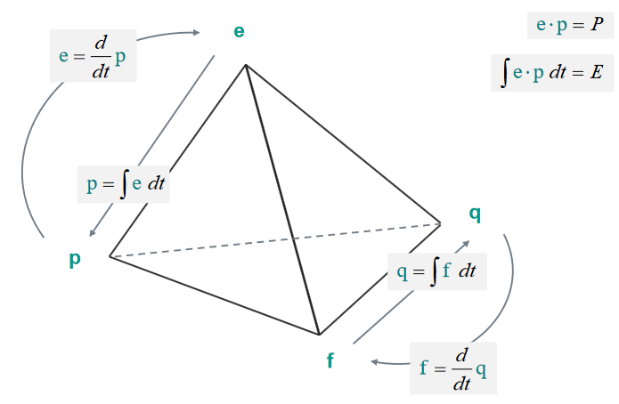

# Klausurvorbereitung

## Sensorik

Bezeichnung (physisch) | Kategorie

- Beschleunigungssensoren erarbeiten oft durch Messung einer veränderten **Kapazität-Differenz**
- Zur Messung flächenhafter Dehnungen wird **DMS Rosette** eingesetzt
- Drehzahl-Sensoren arbeiten z.b mit der Messung von $U_induktiv = f(n)$
- Schleuder-Sensor im Kfz:
  - In ihm wirken 2 **Piezo** Elemente zusammen, wobei das eine als **Aktor** arbeitet und das andere als **Sensor**
- Oberflächen-Rauigkeiten/Topologien werden ausgemessen mit **Rasterkraftmikroskop**

### Variablen & Kategorien

Sensor|Variable|Funktion|Kategorie
---|---|---|---
Hall-Plättchen|Q|f(B)|Weg|Galvanisch-Resistiv
Gauss-Plättchen|R|f(B)|Weg|Magneto-Resistiv
Piezo-Element|Q|f($\epsilon$)|Kraft, Druck|Piezo-Rezistiv
Photo-Zelle|R|f(Lichteinfall)|Weg, Abdeckung|Opto-Rezistiv
Lichtwellenleiter|LZ (Laufzeit)|f($\epsilon$)|Dehnung|Faser-Optisch
Drehzahlmesser|n (Drehzahl)|f(U_induktiv)|Drehzahl|Induktiv

## Mechatronisches Systeme

- Entwicklungsprozess: **V-Modell**

- Grundstruktur

### Modell-Gleichungen Einmassenschwinger

#### Kräfte Vektoren  

$ \vec{0} = \vec{F_T} + \vec{F_d} + \vec{F_k} + \vec{F_A}$  

$0 = -m\vec{a} - d\vec{v} - k\vec{x} + \vec{F_A}$

- DGL:  

$0 = -m \ddot{x} - d \dot{x} - kx + F_A$  

Umgestellt:

$F_A - d \dot{x} + kx = m \ddot{x}$

#### Blockschaltbild

#### Bondgraphen

#### DGL für Zustandsraum

Frage 1 (Was gibt die Komponente ans System):

- B1: $e_1 = F_A$
- B2: $f_2 = \frac{\large\textcircled{p_2}}{m}$
- B3: $e_3 = k * \large\textcircled{q_3}$
- B4: $e_4 = d * f_4$

e/f Bilanz

- $e_1 = e_2 + e_3 + e_4$  (1a)
- $f_1 = f_2 = f_3 = f_4$  (1b)

Frage 2:

B2:

$e_2 = \dot{p_2}$ -> [Tetraeder](/fom/semester-5/mechatronik/modellbildung.md#zustands-tetraeder)  
$e_2 \stackrel{1a}{=} e_1 - e_3 - e_4$  -> e/f - Bilanz  
$e_1 - e_3 - e_4 = F_A - k * q_3 - d * f_4$ -> Anwendung von Frage 1  
$F_A - k *q_3 - d* f_4 \stackrel{1b}{=} F_A - k *q_3 - d* f_2$ -> e/f - Bilanz  
$\dot{p_2} \stackrel{B2}{=} F_A - k *q_3 - d* \frac{p_2}{m}$ -> Anwendung von Frage 1  
$F_A - k *q_3 - d* \frac{p_2}{m} = F_A - k *q_3 - \frac{d}{m} * p_2$ -> Umformung

B3:

$f_3 = \dot{q_3}$ -> [Tetraeder](/fom/semester-5/mechatronik/modellbildung.md#zustands-tetraeder)  
$f_3 \stackrel{1b}{=} f_2$ -> e/f - Bilanz  
$f_2 \stackrel{B2}{=} \frac{p_2}{m}$ -> Anwendung von Frage 1  
$\frac{p_2}{m} = \frac{1}{m} * p_2$ -> Umformung

#### Vektor-Matrix

B2: $\dot{p_2} = F_A - k *q_3 - \frac{d}{m} * p_2$  
B3: $\dot{q_3} = \frac{1}{m}*p_2$  

$\begin{pmatrix} \dot{p_2} \\ \dot{q_3} \end{pmatrix} = \begin{pmatrix} -\frac{d}{m} & -k \\ \frac{1}{m} & 0 \end{pmatrix} * \begin{pmatrix} p_2 \\ q_3 \end{pmatrix} + \begin{pmatrix} 1 \\ 0 \end{pmatrix} * F_A$

$\text{System-Matrix} * \text{Zustandsvariablen} + \text{Steuermatrix} * \text{Eingangsgröße}$

#### Zustandsraum

- $z_1 = x(t)$
- $z_2 = v(t) = \dot{x}(t) = \dot{z_1}$

<!-- TODO -> Fehler im Blatt? -->

#### Welches elektrische System passt zum Bond-Graph?

- Serieller Elektrischer Schwingkreis

## Tetrader

## Physikalische Variablen

Domäne | e | f | p | q
--- | --- | --- | --- | ---
Mechanik (translation) | Kraft $\vec{F}$ | Geschwindigkeit $\vec{v}$ | Impuls $\vec{p}$ | Auslenkung $\vec{x}$
Mechanik (rotation) | Drehmoment $\vec{M}$ | Winkelgeschwindigkeit $\vec{\omega}$ | Drehimpuls $\vec{D}$ | Drehwinkel $\vec{\phi}$
Elektrik | Spannung $U$ | Stromstärke $I$ | Windungsfluss $\vec{\lambda}$ | Ladung $q$
<!-- TODO Hier muss was mit delta rein? Fluidik | Druck $p$ | Volumenstrom $\dot{V}$ | $p$ | Volumen $V$ -->

## Effort Sensor Bondgraph

## Operationsverstärker

## Äquivalentz Bondegraphen <-> Blockschaltbild

1 Junction

0 Junction

Gyrator

- $e_2 = r * f_1$
- $f_2 = r * e_1$

## Übertragungsfunktion im Frequenzbereich

$G(s) = G_1(s) + G_2(s)$  
$(X(s)*G_1)+(X(s)*G_2) = Y(s)$  
$X(s) * (G_1 + G_2) = Y(s) | /X(s)$  
$G_1+G_2 = Y(s) / X(s)$  
$G(s) = Y(s) / X(s)$  

## Simulation

- Systeme, die mit BondGraphen arbeiten, sind klassifizierbar als energieorientierte Systeme
- Systeme, die mit Blockschaltbildern arbeiten, sind klassifizierbar als signalorientierte Systeme.
- Die wichtigsten Vertreter beider Kategorien sind resprektive Mechatronik und Regelungstechnik.
- Vorteile & Nachteile des Integrationsverfahrens nach Runge-Kutta-Fehlberg

- Vorteile
  - keine Startrechnung
- Nachteile
  - hoher Rechenaufwand

## Bernoulli-Gleichung

$p * g * h + \frac{1}{2} * p * v^2 +p$

## Kontinuitätsgleichung

$p_1 * v_1 * A_1 = p2 * v_2 * A_2$

$ P $ = Druck  
$ v $ = Geschwindigkeit  
$ A $ = Fläche  

## Abnutzung

