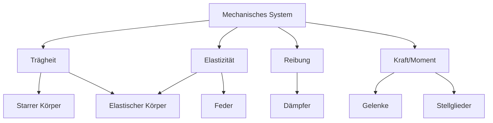

# Modellbildung

Prozess der Modellbildung:

1. Beschreibung des Systems (Systemfunktionen, Systemstruktur)
2. Modellbildung
3. mathematische Modellbeschreibung

Anforderungen an ein Modell:

- physikalische Transparenz
- Modellgültigkeit
- Effizienz

Eigenschaften eines Modells:

- Abbild / Repräsentation der Realität
- wesentliche Eigenschaften des Originals
- eingeschränkte Gültigkeit

## Symbolische Elemente eines Mechanischen Systems

## Einmassenschwinger (ein Freiheitsgrad)

> Speicher sind Feder und bewegte Masse
{.is-info}

## Generalisierte Variablen

- Systeme sind Aufnehmer für Leistung
- Leistung: $P$
- Effort: $e$
- Flow: $f$
- $P = e \cdot f$

- Elektrische Leistung: $P = U \cdot I$
  - Effort: $U$ (Spannung => Potentialdifferenz)
  - Flow: $I$ (Strom)
- Mechanische Leistung (Translation): $P = F \cdot v$
  - Effort: $F$ (Kraft)
  - Flow: $v$ (Geschwindigkeit)
- Mechanische Leistung (Rotation): $P = M \cdot \omega$
  - Effort: $M$ (Drehmoment)
  - Flow: $\omega$ (Winkelgeschwindigkeit)
- Hydraulische Leistung / Fluidik: $P = \Delta p \cdot \dot{V}$
  - Effort: $\Delta p$ (Druckdifferenz)
  - Flow: $\dot{V}$ (Volumenstrom)
- Thermische Leistung: $P = \Delta T \dot{S}$
  - Effort: $\Delta T$ (Temperaturdifferenz)
  - Flow: $\dot{S}$ (Entropiestrom)

## Zustands-Tetraeder

- $e$ = Effort
- $f$ = Flow
- $p$ = Impuls
- $q$ = Verschiebung
