# Modellbildung

Prozess der Modellbildung:

1. Beschreibung des Systems (Systemfunktionen, Systemstruktur)
2. Modellbildung
3. mathematische Modellbeschreibung

Anforderungen an ein Modell:

- physikalische Transparenz
- Modellgültigkeit
- Effizienz

Eigenschaften eines Modells:

- Abbild / Repräsentation der Realität
- wesentliche Eigenschaften des Originals
- eingeschränkte Gültigkeit

## Symbolische Elemente eines Mechanischen Systems

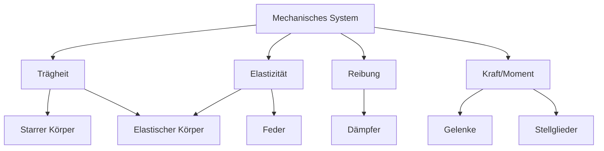

## Einmassenschwinger (ein Freiheitsgrad)

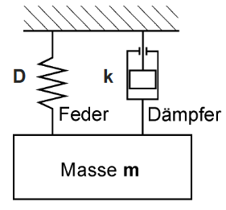

> Speicher sind Feder und bewegte Masse
{.is-info}

## Generalisierte Variablen

- Systeme sind Aufnehmer für Leistung
- Leistung: $P$
- Effort: $e$
- Flow: $f$
- $P = e \cdot f$
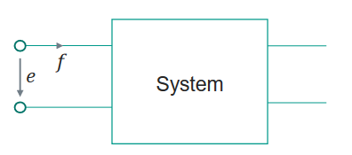

- Elektrische Leistung: $P = U \cdot I$
  - Effort: $U$ (Spannung => Potentialdifferenz)
  - Flow: $I$ (Strom)
- Mechanische Leistung (Translation): $P = F \cdot v$
  - Effort: $F$ (Kraft)
  - Flow: $v$ (Geschwindigkeit)
- Mechanische Leistung (Rotation): $P = M \cdot \omega$
  - Effort: $M$ (Drehmoment)
  - Flow: $\omega$ (Winkelgeschwindigkeit)
- Hydraulische Leistung / Fluidik: $P = \Delta p \cdot \dot{V}$
  - Effort: $\Delta p$ (Druckdifferenz)
  - Flow: $\dot{V}$ (Volumenstrom)
- Thermische Leistung: $P = \Delta T \dot{S}$
  - Effort: $\Delta T$ (Temperaturdifferenz)
  - Flow: $\dot{S}$ (Entropiestrom)

Verschiebungen:

- KFZ (Translation): -> Strecke
- Rad (Rotation): -> Winkel
- Kondensator (Elektrik): -> Ladung
- Hydraulik: -> Volumen

> Energie $= \int Leistung * Zeit $
{.is-info}
&nbsp;
> Kontinuitätsgleichung = $A_1 * V_1 = A_2 * V_2$

## Zustands-Tetraeder

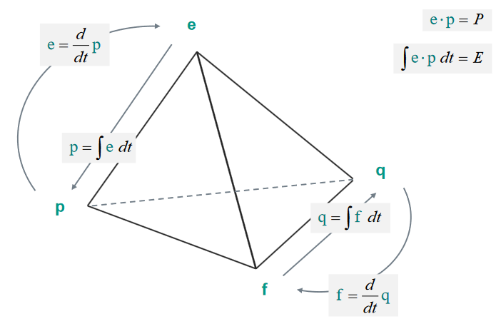

- $e$ = Effort
- $f$ = Flow
- $p$ = Impuls
- $q$ = Verschiebung

## Bondgraph

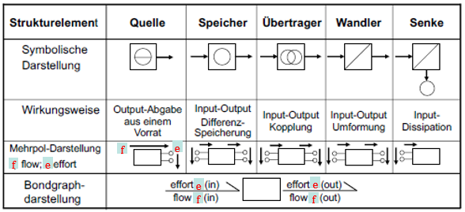

### 1-Port Elemente

#### C-Element

- Speicher: Compliance (Energie bleibt erhalten)
- z.B. Feder, Kondensator, Hydraulikspeicher

$$
\xrightharpoondown[f]{e}{\large\textcircled{\normalsize \texttt{C}}}
$$
&nbsp;
$$
e = \frac{1} {\large\textcircled{\normalsize \texttt{C}}} * q
$$
&nbsp;

#### I-Element

- Speicher: Inertia (Trägheit)
- z.B. Masse, Spule, hydraulische Trägheit

$$
\xrightharpoondown[f]{e}{\large\textcircled{\normalsize \texttt{I}}}
$$
&nbsp;

$$
e = {\large\textcircled{\normalsize \texttt{I}}} * \dot{f}
$$
&nbsp;

$$
p = {\large\textcircled{\normalsize \texttt{I}}} * f
$$
&nbsp;

#### R-Element

- Widerstand: Resistor (Energie wird dissipiert)
- z.B. Dämpfer, Elektrischer Widerstand, hydraulischer Widerstand

$$
\xrightharpoondown[f]{e}{\large\textcircled{\normalsize \texttt{R}}}
$$
&nbsp;

$$
e = {\large\textcircled{\normalsize \texttt{R}}} * f
$$
&nbsp;

#### S-Element

- Quelle: Source (Energie wird zugeführt)
- Effort-Quelle: SE
- Flow-Quelle: SF

$$
SE \xrightharpoondown[f]{e}
$$
&nbsp;

$$
SF \xrightharpoondown[f]{e}
$$
&nbsp;

### 2-Port Elemente

#### Transformator

- z.B. Getriebe, Hebel, Trafo
- Verhältnis von Effort und Flow verändert sich proportional
- Transformerfaktor gibt Verhältnis an
- Einheiten verändern sich nicht (z.B. Spannung bleibt Spannung, Strom bleibt Strom)

$$
\xrightharpoondown[f1]{e1}\ddot{TF}^{m} \xrightharpoondown[f2]{e2}
$$
&nbsp;

$$
e_1 = {\large\textcircled{\normalsize \texttt{m}}} e_2
$$
&nbsp;

$$
f_1 = {\large\textcircled{\normalsize \texttt{m}}} f_2
$$
&nbsp;

#### Gyrator

- z.B. Gleichstrommotor, Generator
- Wandelt Effort in Flow um
- Leistung bleibt gleich
- Einheiten verändern sich (z.B. Spannung wird zu Drehmoment, Strom wird zu Winkelgeschwindigkeit)

$$
\xrightharpoondown[f1]{e1}\ddot{GY}^{r} \xrightharpoondown[f2]{e2}
$$
&nbsp;

$$
e_1 = {\large\textcircled{\normalsize \texttt{r}}} f_2
$$
&nbsp;

$$
e_2 = {\large\textcircled{\normalsize \texttt{r}}} f_1
$$
&nbsp;

### 3-Port Elemente

### Reihenschaltung

- Transformer wird an Transformator angeschlossen

### Gemischte Schaltung

- Transformer wird an Gyrator angeschlossen

### Multiport Elemente

- MP-Junctions sind prinzipiell Leistungsknoten
  - Gerichte Leistungsbilanz => Leistung einer Komponente = Summe andere Teil-Leistungen
  - Ungerichtete Leistungsbilanz => Summe aller Leistungen = 0

#### 0 Junction

- Flow Junction
- Parallelschaltung
  - Effort ist immer gleich (z.B. Spannung)
  - Flow wird aufgeteilt

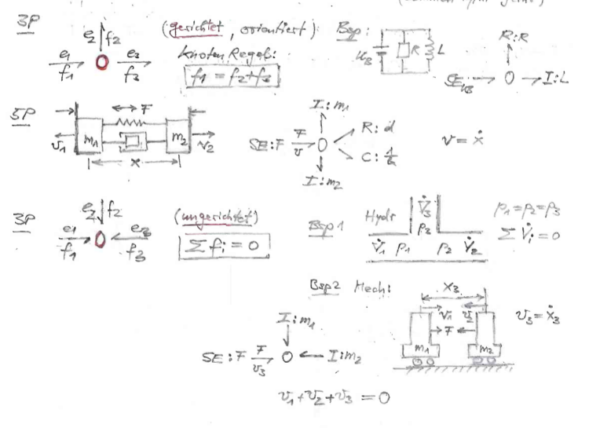

#### 1 Junction

- Effort Junction
- Maschen-Regel -> eingehender Effort werden auf alle ausgehenden Efforts aufgeteilt
- Reihenschaltung/Serienschaltung
  - Flow ist immer gleich (z.B. Strom)

#### Bondrichtung

Bond- Halbpfeile:

- gibt die Richtung des Leistungsflusses an
- in Pfeilrichtung ist P-Fluss positiv

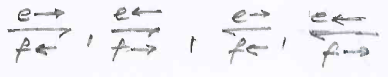

> e und f haben entgegengesetzte Richtungen
{.is-info}

Kausalitätsbit:

- bit Position (am Anfang oder Ende des Bonds)
- gibt Richtung der Effort Information an
- Richtungspfeile von e und f werden überflüssig

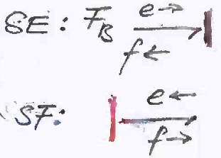

[1-Port-Elemente](#1-port-elemente):

- [I-Element](#i-element)
  - Kausalitätsbit auf der I-Element Seite  
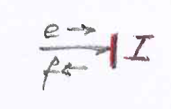
- [C-Element](#c-element)
  - Kausalitätsbit nicht auf der C-Element Seite  
  
- [R-Element](#r-element)
  - Kausalitätsbit kann auf einer von beiden Seiten sein  
  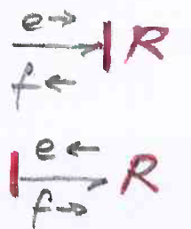

[2 Port Elemente](#2-port-elemente):

- [Transformator](#transformator)
  - Eingang und Ausgang nicht festgelegt
  - Kausalitätsbit entweder 2x links oder 2x rechts  
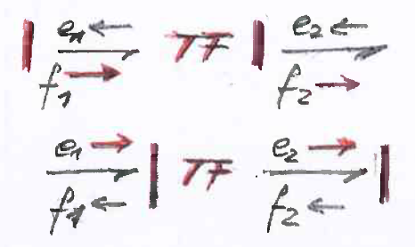

- [Gyrator](#gyrator)
  - TODO eingang und Ausgang
  - Kausalitätsbit entweder innen oder außen  
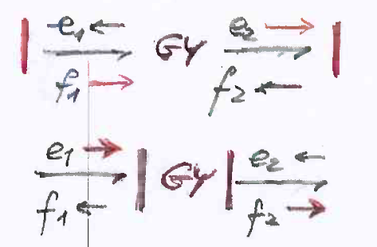

[Multiport Elemente](#multiport-elemente):

- [0 Junction](#0-junction)
  - effort ist immer gleich
  - Summe aller flows ist 0
  - flow wird aufgeteilt  
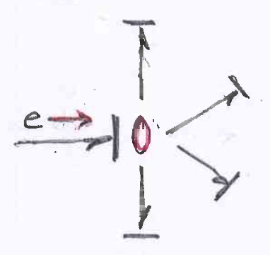

- [1 Junction](#1-junction)
  - flow ist immer gleich
  - Summe aller efforts ist 0
  - effort wird aufgeteilt  
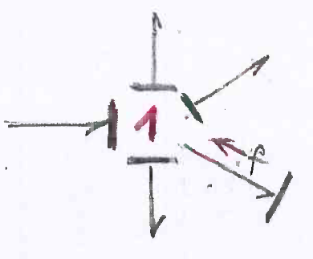

### Beispiele

- Einmassenschwinger  
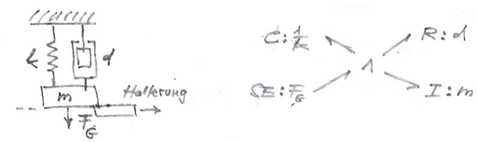

## Mathematisches Modell
