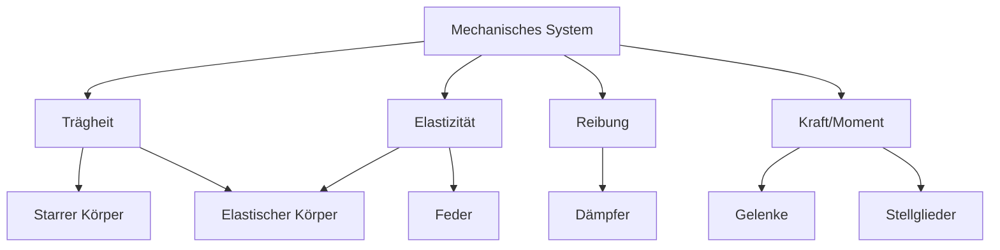

# Modellbildung

Prozess der Modellbildung:

1. Beschreibung des Systems (Systemfunktionen, Systemstruktur)
2. Modellbildung
3. mathematische Modellbeschreibung

Anforderungen an ein Modell:

- physikalische Transparenz
- Modellgültigkeit
- Effizienz

Eigenschaften eines Modells:

- Abbild / Repräsentation der Realität
- wesentliche Eigenschaften des Originals
- eingeschränkte Gültigkeit

## Symbolische Elemente eines Mechanischen Systems

## Einmassenschwinger (ein Freiheitsgrad)

> Speicher sind Feder und bewegte Masse
{.is-info}

## Generalisierte Variablen

- Systeme sind Aufnehmer für Leistung
- Leistung: $P$
- Effort: $e$
- Flow: $f$
- $P = e \cdot f$

- Elektrische Leistung: $P = U \cdot I$
  - Effort: $U$ (Spannung => Potentialdifferenz)
  - Flow: $I$ (Strom)
- Mechanische Leistung (Translation): $P = F \cdot v$
  - Effort: $F$ (Kraft)
  - Flow: $v$ (Geschwindigkeit)
- Mechanische Leistung (Rotation): $P = M \cdot \omega$
  - Effort: $M$ (Drehmoment)
  - Flow: $\omega$ (Winkelgeschwindigkeit)
- Hydraulische Leistung / Fluidik: $P = \Delta p \cdot \dot{V}$
  - Effort: $\Delta p$ (Druckdifferenz)
  - Flow: $\dot{V}$ (Volumenstrom)
- Thermische Leistung: $P = \Delta T \dot{S}$
  - Effort: $\Delta T$ (Temperaturdifferenz)
  - Flow: $\dot{S}$ (Entropiestrom)

Verschiebungen:

- KFZ (Translation): -> Strecke
- Rad (Rotation): -> Winkel
- Kondensator (Elektrik): -> Ladung
- Hydraulik: -> Volumen

> Energie $= \int Leistung * Zeit $
{.is-info}
&nbsp;
> Kontinuitätsgleichung = $A_1 * V_1 = A_2 * V_2$

## Zustands-Tetraeder

- $e$ = Effort
- $f$ = Flow
- $p$ = Impuls
- $q$ = Verschiebung

## Bondgraph

### 1-Port Elemente

- Speicher (C-Element) -> Compliance (Energie bleibt erhalten)
  - z.B. Feder, Kondensator, Hydraulikspeicher

$$	\xrightharpoondown[f]{e}{\large\textcircled{\normalsize \texttt{C}}}$$

$$e = \frac{1} {\large\textcircled{\normalsize \texttt{C}}} * q$$

***

- Speicher (I-Element) -> Inertia (Trägheit)
  - z.B. Masse, Spule, hydraulische Trägheit

$$	\xrightharpoondown[f]{e}{\large\textcircled{\normalsize \texttt{I}}}$$

$$e = {\large\textcircled{\normalsize \texttt{I}}} * \dot{f}$$

$$p = {\large\textcircled{\normalsize \texttt{I}}} * f$$

***

- Widerstand (R-Element) -> Resistor (Energie wird dissipiert)
  - z.B. Dämpfer, Elektrischer Widerstand, hydraulischer Widerstand

$$	\xrightharpoondown[f]{e}{\large\textcircled{\normalsize \texttt{R}}}$$

$$e = {\large\textcircled{\normalsize \texttt{R}}} * f$$

***

- Quelle (S-Element) -> Source
  - Effort-Quelle: SE
  - Flow-Quelle: SF

$$ SE \xrightharpoondown[f]{e}$$

$$ SF \xrightharpoondown[f]{e}$$

### 2-Port Elemente

- Transformator
  - z.B. Getriebe, Hebel, Trafo

$$	\xrightharpoondown[f1]{e1}\ddot{TF}^{m} \xrightharpoondown[f2]{e2}$$

$$ e_1 = {\large\textcircled{\normalsize \texttt{m}}} e_2$$

$$ f_1 = {\large\textcircled{\normalsize \texttt{m}}} f_2$$
***

- Gyrator
  - z.B. Gleichstrommotor, Generator

$$	\xrightharpoondown[f1]{e1}\ddot{GY}^{r} \xrightharpoondown[f2]{e2}$$

$$ e_1 = {\large\textcircled{\normalsize \texttt{r}}} f_2$$

$$ e_2 = {\large\textcircled{\normalsize \texttt{r}}} f_1$$
***

### 3-Port Elemente

### Reihenschaltung

- Transformer wird an Transformator angeschlossen

### Gemischte Schaltung

- Transformer wird an Gyrator angeschlossen

### Multiport Elemente

- MP-Junctions sind prinzipiell Leistungsknoten
  - Gerichte Leistungsbilanz => Leistung einer Komponente = Summe andere Teil-Leistungen
  - Ungerichtete Leistungsbilanz => Summe aller Leistungen = 0

#### 0 Junction

- Flow Junction
- Parallelschaltung
  - Effort ist immer gleich (z.B. Spannung)  

//TODO Screenshot

#### 1 Junction

- Effort Junction
- Maschen-Regel -> eingehender Effort werden auf alle ausgehenden Efforts aufgeteilt
- Reihenschaltung/Serienschaltung
  - Flow ist immer gleich (z.B. Strom)
