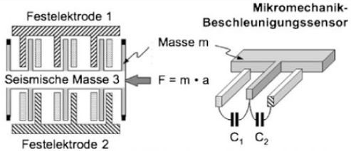
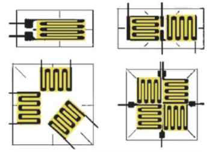
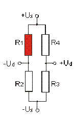

# Sensoren

## Wegsensoren

### Kapazitiver Weg-Sensor

- Masse wird durch eine Kraft (Gravitation) bewegt
- Plattenabstand ändert sich -> Kapazität ändert sich
- linearer Zusammenhang zwischen Kapazität und Weg

### Dehnungsmessstreifen

- erfassen von Drehung oder Stauchung
- Widerstand ändert sich bei Verformung
- Brückenschaltung:
  - erst auf Null normieren -> dann bei Dehnung erhält man Ausschlag

Rosette-Muster von Dehnungs-Messstreifen fürs Messen von Flächen-Dehnung

> Alls Dehnungsmessstreifen sind als Mäander ausgeführt

#### Viertelbrücke

- 1 aktiver Dehnungsmessreifen & 3 passive Widerstände

Temperaturkompensation:

- einer der passiveren Widerstände durch passiven DMS ersetzen für Temperatur-Messung
- Temperaturkompensation durch Messung der Verformung durch Temperatur am passiven DMS

#### Halbbrücke

- 2 aktive DMS & 2 passive Widerstände
- doppelte Präzision
- kompensiert Temperatur

#### Vollbrücke

DMS Vollbrücke: 4 aktive Dehnungsmessreifen

- bestmögliche Kompensation Temperatur- und Mechanischen-Störeinflüssen

<!-- Wofür wird Rosette gebraucht (Dehnungsstreifen/wie vermesse ich das)

Anordnung von Dehnungsmessstreifen angeben. -->

## Hall

### Feldplättchen

Volt-Plättchen/Gauss-Plättchen (Hall- und Gauss-Effekt)

1. Strom verläuft durch Feldplättchen
1. Ohne Magnetfeld verläuft Strom gerade
1. Durch Magnetfeld wird Strom abgelenkt
1. Stärke der Ablenkung ist proportional zur Stärke des Magnetfeldes
1. Wegveränderung führt zu Erhöhung des Widerstandes -> Widerstand steigt mit Magnetfeldstärke

[Quelle](https://www.elektronik-kompendium.de/sites/bau/0110302.htm)

> Eignet sich zur kontaktlosen Signalisierung
{.is-info}

## Piezo

- Erzeugung von elektrischer Ladung durch Einwirkung von einer Kraft auf ein Piezoelement
- Sensor: kinetische Energie -> elektrische Energie
- Aktor: elektrische Energie -> kinetische Energie

### Schleuder-Sensor (Automobil)

- elastische Aufhängung aus einem Feder-Dämpfer-System
- Beschleunigung -> Auslenkung der Feder -> Magnet bewegt sich -> Hall-Sensor misst Magnetfeld -> Spannung proportional zur Beschleunigung
    Schwingen senkrecht zur Fahrrichtung bei Schleuder-Vorgang
