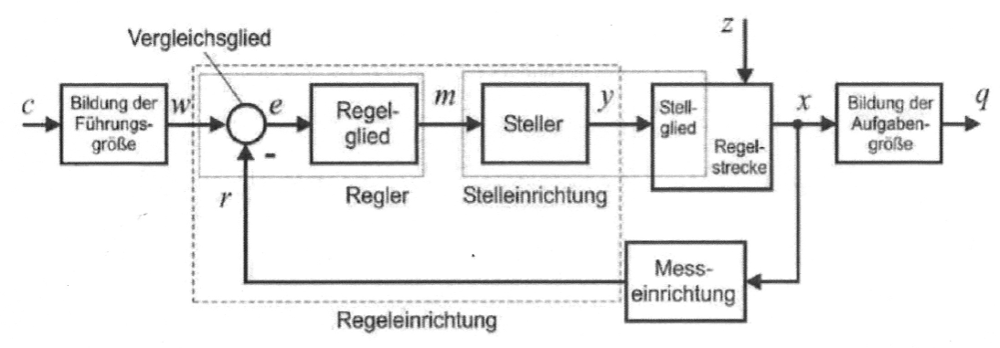

# Steuern und Regeln

## Wirkungsplan

- $c$ - Zielgröße
- $w$ - Führungsgröße (Sollwert)
- $e$ - Regelabweichung
- $m$ - Regler-Ausgangsgröße
- $y$ - Stellgröße
- $z$ - Störgröße
- $r$ - Rückführungsgröße
- $q$ - Aufgabengröße

