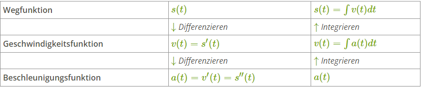

# Wiederholung

## Begriffe

- Mechatronik -> Zusammenwirken von Mechanik, Elektronik und Informatik
    - Beispiel: ABS-Bremssystem, Einspritzanlage
- Fluidik -> Zusammenwirken von strömungsmachanischen Strömungselementen (Hydraulik, Pneumatik)
    - Beispiel: Hydraulikbagger, Pneumatikzylinder
- Viskosität -> Zähigkeit eines Fluids
- Strecke -> kürzester Weg, der zwischen zwei Punkten zurückgelegt wird

## Geometrie

### Kreis
- Radius: $r$
- Durchmesser: $d = 2 * r$
- Umfang: $u = 2 * \pi * r$
- Fläche: $A = \pi * r^2$
- Winkel: $\alpha$
- Kreissegmente (Anzahl): $n$
- Kreisbogen: $b$
- Bogenmaß: $arc \alpha_{DEG} = \frac{b}{r} = \frac{\pi}{180^\circ} * \alpha_{DEG}$
    - Umrechnung Bogenmaß in Gradmaß: $\alpha_{DEG} = \frac{b}{r}$
    - Umrechnung Gradmaß in Bogenmaß: $\alpha_{RAD} $
- Vollkreis
    - Bogenmaß: $\frac{\pi}{180^\circ} * 360^\circ$
    - Gradmaß: $360^\circ$
- Innenwinkel: $\alpha_{DEG} = \frac{360^\circ}{n}$

### Zylinder

- Höhe: $h$
- Grundfläche: $A$
- Volumen: $V = A * h$
- Mantelfläche: $M = 2 * \pi * r * h$
- Oberfläche: $O = 2 * A + M$

### Kugel

Oberfläche: $O = 4 * \pi * r^2$
Volumen: $V = \frac{4}{3} * \pi * r^3$

### Rechteck

- Länge: $l$
- Breite: $b$
- Umfang: $u = 2 * (l + b)$
- Fläche: $A = l * b$
- Diagonale: $d = \sqrt{l^2 + b^2}$
- Innenwinkelsumme: $\alpha_{DEG} = 360^\circ$

### Quader

- Höhe: $h$
- Grundfläche: $A$
- Volumen: $V = A * h$
- Mantelfläche: $M = 2 * (l + b) * h$
- Oberfläche: $O = 2 * A + M$

### Dreieck

- Höhe: $h$
- Grundseite: $g$
- Fläche: $A = \frac{g * h}{2}$
- Innenwinkelsumme: $\alpha_{DEG} = 180^\circ$

> Gleischschenkliges Dreieck -> mindestens zwei Seiten gleich lang -> zwei Winkel gleich groß
{.is-info}
> Gleischseitiges Dreieck -> jeder Winkel: $60^\circ$
{.is-info}

## Ableitungen

- Beschleunigung: $a$
- Geschwindigkeit: $v$
- Weg: $s$
- Zeit: $t$

## Kräfte

- Kraft: $F$
- Masse: $m$
- Beschleunigung: $\vec{a}$
- Federkonstante: $k$
- Dämpfungskonstante: $d$
- Reibungskoeffizient: $\mu$
- Auslenkung: $\vec{x}$
- Normalkraft/Gegenkraft zur Gewichtskraft: $\vec{F_N}$ 
- Trägheitskraft/Fliehkraft: $\vec{F_T} = m * \vec{a}$
- Gewichtskraft/Gravitation: $\vec{F_G} = m * g$
- Reibungskraft: $\vec{F_R} = \mu * \vec{F_N}$
- Rückstellkraft: $\vec{F_R} = -k * \vec{x}$
- Federkraft (Sonderform der Rückstellkraft): $\vec{F_k} = -k * \vec{x}$
- Hubkraft: $\vec{F_H} = -m * g$
- Dämpfungskraft: $\vec{F_d} = -c * \vec{d}$
- Antriebskraft: $\vec{F_B} = m * \vec{a}$