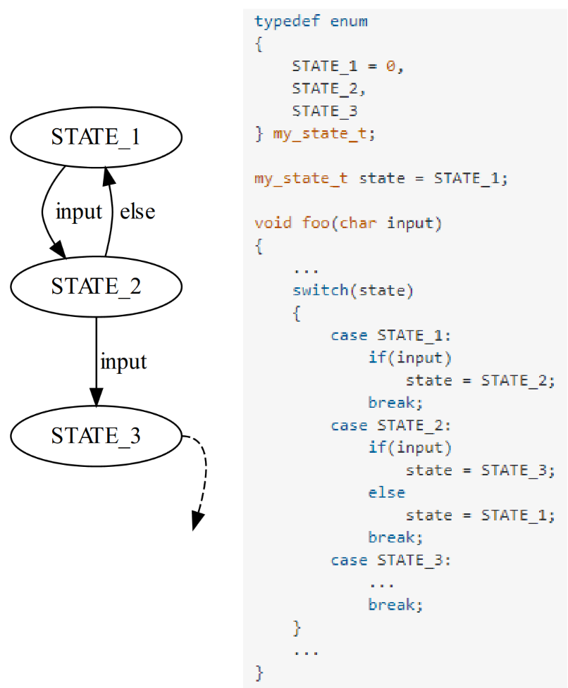
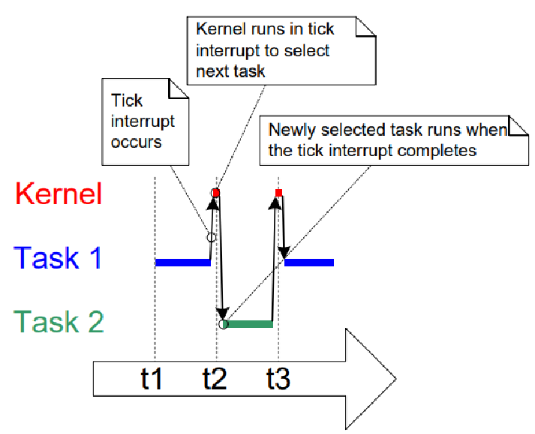

# Firmware

## Einfache Firmware

- Typische Struktur
  - Initialisierung
  - Endlosschleife
- zeitliche Verzahnung
- Scheduling muss berücksichtigt werden
- Struktur von Subroutinen muss reentrant (wiedereintrittsfähig) sein
- Lange Berechnungen in Abschnitte aufteilen

Automatenstruktur:

- lässt sich in Programmcode umsetzen
- enum erhöht die Lesbarkeit

### Reentranz – Wiedereintrittsfähigkeit

Problem:

- Globale Variablen -> Wert kann sich vor Verwendung ändern

Lösung:

- Lokale Variablen (Stack)
- keine gemeinsamen Daten -> keine Race Conditions

> Interrupt-Service-Routinen (ISR) sollten reentrant sein und keine Interrupts zu verlieren
{.is-info}

## RTOS – Real-Time Operating System

- Real-Time Betriebssystem
- Anstatt von Endlosschleifen wird auf Tasks zurückgegriffen
- Verschiedene Tasks laufen im Zeitmultiplex (nebenläufig)
- Hardware-Interrupts als zentraler Synchronisationspunkt
- Timer-ISR sehr kurz halten
- kennt vier vier Zustände für Tasks
  - Running - Task wartet auf Zuteilung der CPU
  - Ready - Der aktuell arbeitende Task
  - Blocked - Task wartet auf Event
  - Suspended - Task arbeitet aktuell nicht und kann Ressourcen freigeben
- kennt verschiedene Task-Arten
  - Idle - Task läuft immer, wenn kein anderer Task läuft
  - Periodisch
  - Event
  - Statisch - Task hat eine Endlosschleife, ähnlich zu Idle, aber mit höherer Priorität

> Tasks sind aufgrund fehlender MMU (Memory Management Unit) typischerweise als Threads implementiert
{.is-info}
> Bei Inter-Task-Kommunikation ist eine Synchronisation notwendig (Queue, Semaphore, Mutex)
{.is-warning}

|Real-Time Operating System|General Purpose Operating System|
|---|---|
|Deterministischer Task Scheduler|Nicht-deterministischer Task Scheduler|
|Deterministisch|Zufälliges Ausführungsmuster|
|Vorausschauende Antwortzeiten|Reaktionszeiten nicht garantiert|
|Zeitkritische Anwendungen|Hoher Durchsatz|
|Weniger Speicherbedarf|Höherer Speicherbedarf|

FreeRTOS:

- Open Source
- Mikrokernel-Struktur
