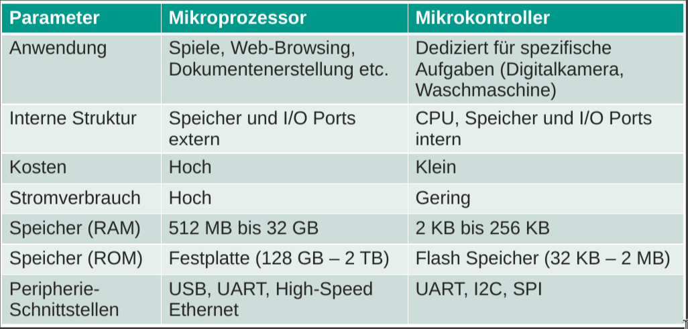
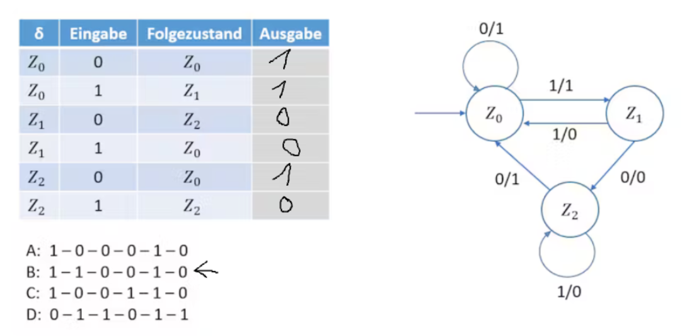
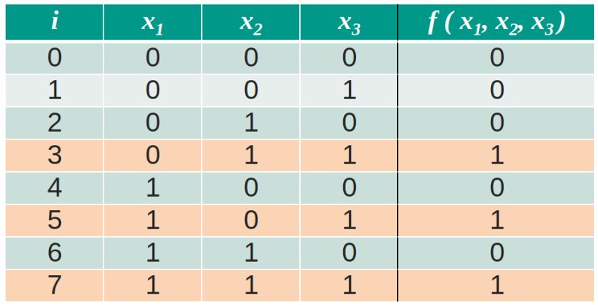
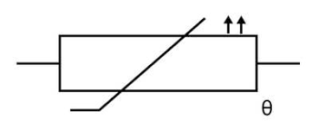

# Klausurvorbereitung

## Welche IOT Sektoren gibt es?

- Buildings & Construction
- Energy
- Consumer & Home
- Health & Life Science
- Industrial
- Transport & Logistics
- Retail
- Security & Public Safety
- ICT (Information and Communication Technology)

## Welches Jahr gilt als Startjahr des IOT?

2008/2009

## Wofür steht Industry 3.0?

Einsatz von Elektronik und IT in der Produktion

## Wofür steht Industry 4.0?

Cyber-Physische Systeme

## Was ist die Besonderheit von RISC?

wenige Befehle, schnelle Ausführung, Load/Store Architektur

## Wer ist Marktführer für Mikrochips im Automotive Bereich?

Infineon

## Nennen Sie ein Cyper-Physisches System

Produktionsanlage mit Robotern

## Was ist der Unterschied zwischen von Neumann und Harvard Architektur?

Von Neumann liegen die Programm und Laufzeitdaten auf einem gemeinsamen Speicher der durch einen gemeinsamen Bus mi der CPU verbunden ist.

Harvard hat getrennte Busse und getrennte Speicher für Programm und Laufzeitdaten.

## Wodurch unterscheiden sich Mikrocontroller und Mikroprozessoren?

## Was ist eine Output-Compare-Register?

Speichert den Soll-Wert, mit dem der Timer verglichen wird.
Bei Übereinstimmung wird eine Aktion ausgelöst und der Timer zurückgesetzt.

## Wie kommt ein PWM Signal zustande?

Durch das Verhältnis von An- und Ausschaltzeit (Duty Cycle)

## Was macht ein Vorteiler?

Ein Multiplikator für die Taktfrequenz des Timers

## Wie wandelt ein ADC ein Analoges Signal in ein Digitales um?

Misst mit Abtastrate den Spannungswert und wandelt diesen in einen digitalen Wert um. Abtastrate und Auflösung bestimmen die Genauigkeit.

## Welche Übertragungsarten gibt es bei USB?

- Bulk
- Interrupt
- Isochronous
- Control

## Welche Art von USB-Verbindungen gibt es?

- Device to Host: Dynamischer wechsel des Hosts
- OTG (On-The-Go): Host wird via Protokoll bestimmt

## Nennen Sie Peripherieeinheiten eines Mikrocontrollers

Timer, SPI, Interrupt Controller, ADC

## Typische Mikrocontroller Taktfrequenz

1 - 200 Mhz

## Wie viele Knoten bei einer Standard I2C Kommunikation maximal?

128

## Wie wird SPI Bus noch genannt

4 Wire serial bus

## Welche der folgenden Methoden zur Ablesung von Daten dient zur Schonung wertvoller Rechenzeit des CPUs?

DMA

## Wie wird standard Baudrate einer UART Kommunikation angegeben?

bits per second

## Wie viele Bits UART für Übertragung eines Bytes?

10 Bit

## Wie viele Leitungen für Realisierung I2C Kommunikation

2 (ohne Stromversorgung)

## Wie viel Strom kann Arduino-Ausgangsport maximal zur Verfügung stellen?

- Prot: 40 mA
- Gesamt: 200 mA

## Wie verhindert Beschädigung einer LED in einer Schaltung

korrekt dimensionierter Widerstand

## Welcher ist der maximale Wert eines 8-Bit Timers, bevor es einen Überlauf gibt?

255

## Welche der Methoden ist bestens geeignet um die steigende Flanke eines Eigengassignals zu detektieren?

Externer Interrupt da dieser auf low oder high Pegelwechsel reagieren kann

## Wie viele Sekunden beträgt die Int-Periode eines 16-Bit Timers mit einem Vorteiler von 1024 und einem OCR Registerwert von 7812 bei einem Atmel mit 16Mhz?

Taktfrequenz / Vorteiler ist die Zeit bis sich der Timer-Wert um 1 erhöht.

OCR Registerwert / (Taktfrequenz / Vorteiler) = Periode

$7812 / (16.000.000 / 1024) = 500 ms$

## Was sind typische und realsichtasche 16-Bit Timer Vorteiler Wertebereiche?

Typisch & Realistisch: 2er Potenzen oder verdoppeln oder 1er Schritte

> Sinnvolle Zahlenreihen
{.is-info}

## Wie viel Zeit beträgt ein Tick eines Atmel 16-Mhz Mikrocontrollers?

$1 / 16.000.000 = 62,5 ns$

## Welcher UML Diagrammtyp ist Teil der Strukturdiagramme?

Klassendiagramme

## Welcher Beziehungen sind typisch für Klassendiagramme?

- Assoziation
- Aggregation
- Komposition
- Vererbung

## Welche Bestandteile hat ein Anwendungsfalldiagramm?

- Akteure
- Anwendungsfälle
- System

## Welches Verhaltensdiagramm eignet sich zur Darstellung eines zeitlichen Ablaufs?

- Sequenzdiagramm

## Was sind wichtige Regeln bei Petri-Netzen?

- Kanten führen nur von einem Elementtyp zum anderen
- Kanten haben Gewichtung

## Wie sieht die Ausgabe bei dem folgenden Mealy-Automaten aus?

## Wodurch unterscheiden sich Moore und Mealy Automaten?

- Mealy-Automaten haben Ausgaben, die von den Eingaben und dem Zustand abhängen.

- Moore-Automaten haben Ausgaben, die nur vom Zustand abhängen.

## Was ist ein Minterm im Kontext der Booleschen Algebra?

- Ausdruck, der genau eine Kombination von Variablen in der Form von deren Produkten darstellt
- Wahrheitstabelle ist nur für diese Kombination wahr

## Wie wird die Konjunktion in der Booleschen Algebra bezeichnet?

- UND-Verknüpfung
- $\land$

Was ist die DNF für die folgende Wahrheitstabelle?

$DNF:f =(\bar x_1 x_2 x_3) + (x_1 \bar x_2 x_3) + (x_1 x_2 x_3)$

> Summe der Minterme bildet die DNF
{.is-info}

## Was beschreibt die Reentrancy (Wiedereintrittsfähigkeit) einer Routine in der Programmierung?

Die Fähigkeit einer Routine, sicher von mehreren Threads gleichzeitig aufgerufen zu werden.

## Wie vermeidet man eine Race Condition mit globalen Variablen?

Globalen Variablen durch lokale Variablen ersetzen

## Was macht ein PTC Widerstand?

PTC (Positive Temperature Coefficient) Widerstand

Mit steigender Temperatur steigt der Widerstand (beim NTC sinkt er)

## Wie funktioniert eine Viertelbrücke mit Dehnungsmessstreifen?

Durch Messung des Widerstandsunterschieds kann die Dehnung gemessen werden.

## Auf welchem physikalischen Effekt basiert der Magnetfeldsensor?

Hall-Effekt

## Was zeichnet einen Scheuduler bei einem GPOS aus?

- auf Durchsatz optimiert
- nicht deterministisch

## Wofür ist ein RTOS für embedded Systeme ausgelegt?

- Echtzeitfähigkeit
- Ressourcenbeschränkung

## Über welche Funktionen verfügt ein RTOS?

- Task-Scheduling
- Ressourcenverwaltung
- Gerätetreiber

> Kein Memory Management(MMO) da wenig Speicher
{.is-info}

> Bei Bare-Bone RTOS nur Task-Scheduling(Rest ist nach Bedarf zu implementieren)
{.is-info}

## Welche Komponente benötigt den meisten Speicher in einem RTOS?

- Wifi/Bluetooth

## Für welche Entdeckung erhielt Einstein den Nobelpreis für Physik im Jahr 1921?

Photoelektrischer Effekt

## Was sind die Hauptmerkmale eines ADC?

- Referenzspannung, Abtastgeschwindigkeit, Auflösung

## Nennen Sie vier Peripherieeinheiten eines Mikrocontrollers

- Timer, SPI, Interrupt Controller, ADC

## Was ist eine typische RAM Speichergröße eines Mikrocontrollers?

- Kilobyte bis Megabyte

## Was ist die Rolle des ALUs in einer von Neumann Architektur?

- Ausführung von Rechenoperationen

## Nennen Sie alle Parameter einer DMA Konfiguration

- Quelle, Ziel, Größe des Transfers, Inkrement

## In was wird die Standard Baudrate bei einer UART Kommunikation angegeben?

- Bits pro Sekunde

## Wie verhindert man die Beschädigung einer LED in einer Schaltung? Durch

Einbau eines Vor-Widerstands

## Welcher ist der maximale Wert eines 8-Bit Timers, bevor es einen Überlauf passiert?

- 255 (2^8 - 1)

## Welche der Methoden ist bestens geeignet, um die steigende Flanke eines Eingangssignals zu detektieren?

- Externer Interrupt

## Wv. Sekunden beträgt die Int-Periode eines 16-Bit Timers mit einem Vorteiler von 1024 und einem OCR Registerwert von 7812? Atmel mit 16MHz?

- 125 ns

## Wie heißt die erste Objektorientierte Programmiersprache?

- Simula

## Wer sind die Gründer der UML Systemmodellierung auch bekannt als die Three Amigos?

- Grady Booch, Ivar Jacobson, James Rumbaugh

## Mit welchem Design Pattern wird die Baumstruktur realisiert?

- Composite

## Welche Nachrichten werden bei Sequenzdiagrammen dargestellt?

- asynchron
- synchron
- verlorene
- gefundene
- neue

## Welche Zugriffsmodifikatoren gibt es in OOP?

- default
- public
- private
- protected

## Besonderheiten von Petrinetze & Endliche Automaten

- hohes Abstraktionsniveau
- erklären Verhalten von Systemen
- berücksichtigen keine zeitlichen Aspekte

## Was sind Unterschiede zwischen Petrinetzen & Endlichen Automaten?

- EA ist ein Modell welches eine lokale Aktivität beschreibt
- PN beschreiben mehrere Aktivitäten
- EA stellen nur eine sequentielle Abfolge dar

## Was ist das Workflow Grundelement bei Petrinetzen?

- AND-join

## Worauf Basieren Petri Netze?

- Endlichen Automaten

## Was modelliert ein Endlicher Automat?

- Ein Verhalten

## Minterme einer DNF

## Was ist ein Minterm?

- Das Produkt ais mehreren Elementen ist gleich 1

## Welche physischen Übertragungstechnologien?

- Narrow Band -IOT
- Zigbee
- BTLE

## Welche Übertragungsart hat die größte Reichweite?

- LoRa

## Welches ist der führende, leichtgewichtige Kommunikationsstandard?

- MQTT

## Welche Grade der Zuverlässigkeit (QoS) gibt es bei dem Nachrichtenprotokoll MQTT?

- QoS:0
- QoS:1
- QoS:2

## In welchem Jahr wurde das MQTT Protokoll entwickelt?

- 1999

## Welche Peripherieeinheiten nutzt der Ultraschallsensor um die Entfernung zu messen?

- Input Capture Compare

## Welche Frequenz hat das Triggersignal des Ultraschallsensors?

- 40 kHz

## Wie lautet die korrekte Formel zur Berechnung der Entfernung des Ultraschallsensors?

- $Entfernung = (Zeit * Schallgeschwindigkeit) / 2$

## Welche Spannungen stellt ein ESP32 zur Verfügung?

- 3.3V
- 5V -> kommt direkt vom USB

## Warum benötigt ein ESP32 den CP2102 USB-Treiber?

- Kommunikation mit dem PC
- wandelt USB in UART/Serial um
