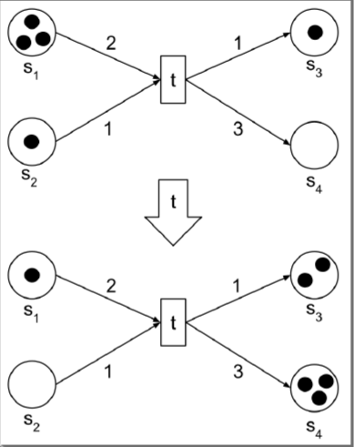

# Modellierung

## [UML](/fom/semester-3/software-engineering/analyse-entwurf.md#einführung-uml)

- [Klassendiagramm](/fom/semester-3/software-engineering/analyse-entwurf.md#klassendiagramme)
- [Anwendungsfalldiagramm](/fom/semester-3/software-engineering/analyse-entwurf.md#anwendungsfalldiagramme)
- [Sequenzdiagramm](/fom/semester-3/software-engineering/analyse-entwurf.md#sequenzdiagramme)
- [Zustandsautomaten](/fom/semester-3/software-engineering/analyse-entwurf.md#zustandsdiagramme)
- [Aktivitätsdiagramm](/fom/semester-3/software-engineering/analyse-entwurf.md#aktivitätsdiagramme)

## Petrinetze

- weiterentwicklung von endlichen Automaten
- Beschreibung von nebenläufigen Schaltvorgängen

Kernelemente:

- Bedingung (erfüllt/nicht erfüllt)
- Transition (findet statt wenn die Bedingung erfüllt ist)
- Flussbeziehung (verbindet Bedingen mit Ereignissen)

Anwendungsgebiete:

- Mathematische Anwendungen
- Betriebswirtschaftliche Modellierung
- Simulation

> wird als bipartiter Graph dargestellt
{.is-info}
> Fokus auf die Modellierung kausaler Abhängigkeiten
{.is-info}
> keine globale Synchronisation vorausgesetzt
{.is-info}

### Typen

#### Condition/Event Netze (S/T-Netz = Stellen/Transitionen Netz)

Stellen (conditions) repräsentieren Zustände oder Bedingungen und die Transitionen (events) Ereignisse, die diese Bedingungen ändern.

#### Place/Transition Netze

Erweiterung der Condition/Event-Netze und ermöglichen eine komplexere Interaktion durch das Halten mehrerer gleichartiger Tokens in den Stellen

#### Predicate/Transition Netze (High-Level Peri-Netz)

erweitern die Place/Transition-Netze, indem sie komplexere Datenstrukturen für Tokens zulassen und Bedingungen (Prädikate) für die Transitionen einführen

#### Hierarchical Petri Netze

Methode, um komplexe Petri-Netze durch die Verschachtlung von kleineren Netzen zu strukturieren

### Dynamik

Aktiviertheit => Transition ist aktiviert, wenn:

- alle Eingangsstellen ausreichend Marken haben
- Kapazität jeder Ausgangsstelle nicht überschritten wird

Schalten => Transition wird geschaltet. Dabei werden:

- Marken von Eingangsstellen entfernt
- Marken zu Ausgangsstellen hinzugefügt

### Regeln

- Kanten können nur von Stellen zu Transitionen oder umgekehrt führen
- Kanten zeigen Gewichtung an (keine Gewichtung = 1)
- bei einer Transition muss mindestens eine Marke von einer Eingangsstelle kommen
- Zustand ist n-sicher, wenn höchstens n Marken in der Stelle sind (vergleichbar mit Sicherheit gegen Memory-Leak)
- Netz ist n-sicher, wenn alle Zustände n-sicher sind
- Zustand ist erreichbar, wenn es eine Schaltfolge gibt, die zu diesem Zustand führt (kein isolierter Graph)
- Beschränktheit: Anzahl der Marken im gesamten Netz ist beschränkt

## Endliche Automaten

[siehe formale Beschreibungsverfahren](/fom/semester-1/formale-beschreibungsverfahren/formaleSprachen/finite-automaton.md)

## Boolesche Algebra

- nur Elemente 0 und 1
- Operationen: AND, OR, NOT

Eine boolsche Algebra ist eine Menge $B$ mit zwei Verknüpfungen auf $B$, so dass für alle Elemente $a \in B, b \in B$ und $c \in B$

Geschlossenheit:

$$ \text{für alle:} \space a, b \in B: a \land b \in B, a \lor b \in B$$

Kommutativität:
$$(a \land b = b \land a), (a \lor b = b \lor a)$$

Distributivität:
$$(a \land (b \lor c) = (a \land b) \lor (a \land c)), (a \lor (b \land c) = (a \lor b) \land (a \lor c))$$

Existenz neutraler Elemente:

$$\text{es existiert ein} \space \exists 1 \in B \space \text{und} \space \exists 0 \in B, \text{so dass} \space (a \land 1 = a), (a \lor 0 = a)$$

Existenz von Komplementen:

$$\text{zu jedem} \space a \in B \space \text{existiert ein} \space \bar a \in B, \text{so dass} \space (a \land \bar a = 0), (a \lor \bar a = 1)$$

> Erster Ansatz zur Modellierung von Schaltkreisen
{.is-info}
